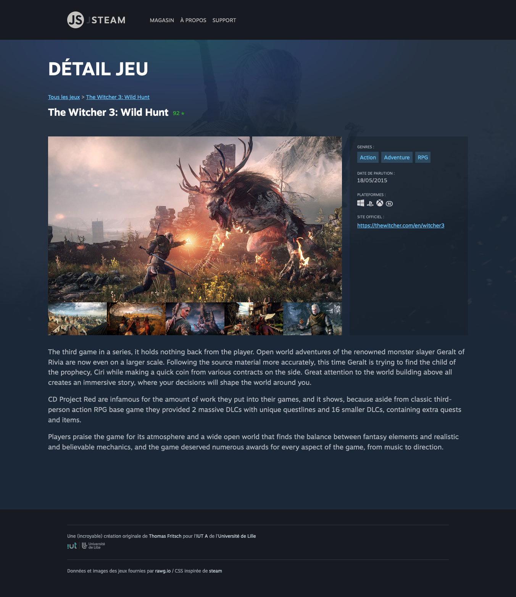

# A. Préparatifs <!-- omit in toc -->

## Sommaire <!-- omit in toc -->
- [A.1. Récupération du projet](#a1-récupération-du-projet)
- [A.2. Lancement de l'application](#a2-lancement-de-lapplication)
- [A.3. Solution du TP4](#a3-solution-du-tp4)

## A.1. Récupération du projet

**Ce repo contient une solution commentée du précédent TP.** <br>
Il va vous servir de base pour ce nouveau TP.

1. **Commencez par faire un fork du TP en vous rendant directement sur https://gitlab.univ-lille.fr/js/tp5/-/forks/new**

	Pour le `namespace` choisissez de placer le fork dans votre profil utilisateur.\
	Pour `Visibility Level` sélectionnez le **mode "private"**

	> _**NB :** Comme ce nouveau TP est lui-même un fork du TP précédent, vous êtes obligé.e de passer par le lien que j'ai fourni ci-dessus, le bouton "Fork"/"Créer une divergence" ne fonctionnera pas dans ce cas et vous redirigera bêtement sur votre propre fork du précédent TP._

2. **Ajoutez-votre encadrant de TP en tant que "reporter" pour qu'il ait accès à votre code :**
	- dans le menu de gauche, cliquez sur **`Project information`** > **`Members`**
	- cliquez sur le bouton en haut à droite **`"Invite members"`**
	- entrez comme **nom d'utilisateur** celui de votre encadrant de TP (`@patricia.everaere-caillier` ou `@thomas.fritsch`)
	- ... et `"reporter"` comme **rôle**.

3. **Ouvrez ensuite un terminal et récupérez les fichiers de ce TP grâce à Git en clonant votre fork dans un dossier de votre choix** (_dans mon exemple ~/tps-js_) :
	```bash
	mkdir ~/tps-js
	git clone https://gitlab.univ-lille.fr/<votre-username>/tp5.git ~/tps-js/tp5
	```

	> _**NB1 :** si ce n'est pas déjà fait, il faut que vous renseigniez un mot de passe dans votre compte gitlab ([`Preferences` > `Password`](https://gitlab.univ-lille.fr/-/profile/password/edit)) pour pouvoir cloner en http_

	> _**NB2 :** ici je clone dans mon dossier `/home/thomas/tps-js/tp5`. **Si vous êtes sous windows faites attention au sens des slashs et au caractère `"~"`** qui représente le dossier de l'utilisateur sur système unix : utilisez **Git bash** (qui comprend cette syntaxe) ou si vous tenez vraiment à utiliser **cmd** ou **powershell** pensez à adapter la commande !_

	> _**NB3 :** si vous préférez **cloner en SSH** pour ne pas avoir à taper votre mot de passe à chaque fois que vous clonerez un TP, renseignez votre clé SSH dans votre [compte utilisateur gitlab](https://gitlab.univ-lille.fr/-/profile/keys) et clonez à partir de cette URL : `git@gitlab-ssh.univ-lille.fr:votre-username/tp5.git`_


4. **Ouvrez le projet dans VSCodium/VSCode** (pour les différentes façon d'ouvrir le projet relisez les [instructions du TP1](https://gitlab.univ-lille.fr/js/tp1/-/blob/main/A-preparatifs.md#a5-ouvrir-le-projet-dans-vscodium) )
	```bash
	codium ~/tps-js/tp5
	```
	> _**ATTENTION :** J'insiste ici : ouvrez bien **LE DOSSIER DU TP**, c'est à dire le dossier `tp5` et pas le dossier parent qui contient tous les tps (`tps-js`). C'est important pour que vscode puisse fonctionner correctement dans notre projet et notamment pour le debug et le fonctionnement de prettier ! Il a en effet besoin que le fichier `.prettierrc` et que le dossier `.vscode` se trouvent à la racine du dossier qu'on ouvre !_

5. **Installez les paquets npm nécessaires au projet** notamment le compilateur [Babel](https://babeljs.io).<br>
	Ouvrez un terminal intégré à VSCodium (<kbd>CTRL</kbd>+<kbd>J</kbd> *(PC)* / <kbd>CMD</kbd>+<kbd>J</kbd> *(Mac)*) et tapez juste :
	```bash
	npm i
	```

	> _**NB :** Vous noterez qu'on ne précise pas les paquets à installer comme on l'avait fait dans le TP2 (`npm install @babel/core`, `@babel/cli`, etc.). npm va en effet tous les récupérer **automatiquement** en parcourant le fichier `package.json` et plus particulièrement les sections `"dependencies"` et `"devDependencies"` qui indiquent quels sont les paquets qui ont été installés précédemment._
	>
	> **Magique !** 🙌

## A.2. Lancement de l'application

1. **Lancez webpack dev server** dans un terminal intégré de VSCodium (<kbd>CTRL</kbd>+<kbd>J</kbd> *(PC)* / <kbd>CMD</kbd>+<kbd>J</kbd> *(Mac)*) :
	```bash
	npm start
	```

2. **Pour afficher votre site, plutôt que d'ouvrir vous-même votre navigateur, utilisez la fonctionnalité de debug dans VSCode testée lors du précédent TP :**

	> _Si vous n'aviez pas pu faire cette partie pour des questions de compatibilité de Firefox, je vous invite à :_
	> 1. _suivre le tutoriel spécifique à Firefox ici : https://gitlab.univ-lille.fr/js/tp3/-/blob/main/B-debug-vscode-firefox.md_
	> 2. _prendre connaissance des différentes possibilités offertes par le debug dans vscode ici : https://gitlab.univ-lille.fr/js/tp3/-/blob/main/B-debug-vscode.md#b2-utilisation-du-mode-debug_

	Pour lancer votre site en mode "debug dans vscode", tapez <kbd>CTRL</kbd>+<kbd>SHIFT</kbd>+<kbd>P</kbd> puis sélectionnez "Debug: Select and start debugging" ou simplement <kbd>F5</kbd>

	Choisissez le navigateur que vous souhaitez lancer (Firefox ou Chrome), une nouvelle fenêtre de votre navigateur doit s'ouvrir (_on considérera pour la suite que c'est Chrome que vous avez choisi_).

4. **Vérifiez dans le navigateur qui s'est ouvert que la page `index.html` s'affiche correctement** :

	

	> _**NB : Si la page ne s'affiche pas correctement**, vérifiez que vous avez bien lancé la commande `npm start` dans le dossier du projet, c'est à dire celui où se trouve le fichier `index.html`. Puis vérifiez dans la `Debug Console` de vscode qu'il n'y a pas d'erreur JS lorsque la page se charge._

## A.3. Solution du TP4

**Avant de vous lancer dans ce TP, prenez 5 à 10 minutes pour lire le code contenu dans le dossier `/src`** et comparez le avec votre code du précédent TP.

**C'est important de bien comprendre le code qui vous est fourni car vous allez avoir à le modifier dans ce TP** : si des points ne sont pas clairs interrogez votre encadrant.e de TP !

**Attention : si vous n'aviez pas eu le temps de terminer le TP4**, portez une attention toute particulière aux classes :
- `Router`
- et `GameDetailView`

qui permettent maintenant d'afficher la page de détail d'un jeu :




## Étape suivante <!-- omit in toc -->
Maintenant que tout est clair et que votre site est lancé, passons au premier exercice : [B. jQuery : les bases](B-jquery-bases.md)