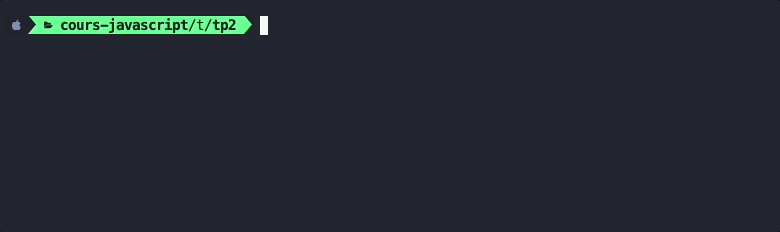
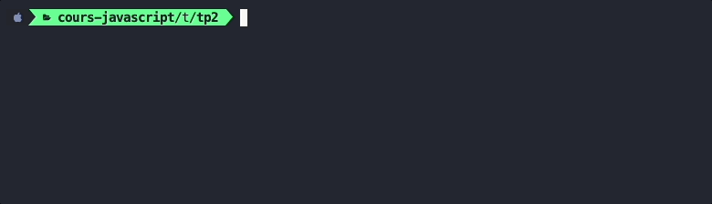

# A. Préparatifs <!-- omit in toc -->

## Sommaire <!-- omit in toc -->
- [A.1. Récupération du projet](#a1-récupération-du-projet)
- [A.2. Configuration de Prettier](#a2-configuration-de-prettier)
- [A.3. Lancement de l'application](#a3-lancement-de-lapplication)
- [A.4. Le fichier `package.json`](#a4-le-fichier-packagejson)
- [A.5. Créer un script de build personnalisé](#a5-créer-un-script-de-build-personnalisé)

## A.1. Récupération du projet

**Ce repo contient une solution commentée du précédent TP.** <br>
Il va vous servir de base pour ce nouveau TP.

1. **Commencez par faire un fork du TP :**
	- soit en cliquant sur le bouton `"Créer une divergence"` (_`"Fork"` sur la version anglaise de gitlab_)
	- soit en vous rendant directement sur https://gitlab.univ-lille.fr/js/tp1/-/forks/new

	Pour le `namespace` choisissez de placer le fork dans votre profil utilisateur.\
	Pour `Visibility Level` selectionnez le **mode "private"**

2. **Ajoutez-votre encadrant de TP en tant que "reporter" pour qu'il ait accès à votre code :**
	- dans le menu de gauche, cliquez sur **`Project information`** > **`Members`**
	- cliquez sur le bouton en haut à droite **`"Invite members"`**
	- entrez comme **nom d'utilisateur** celui de votre encadrant de TP (`@patricia.everaere-caillier` ou `@thomas.fritsch`)
	- ... et `"reporter"` comme **rôle**.

3. **Ouvrez ensuite un terminal et récupérez les fichiers de ce TP grâce à Git en clonant votre fork dans un dossier de votre choix** (_dans mon exemple ~/tps-js_) :
	```bash
	mkdir ~/tps-js
	git clone https://gitlab.univ-lille.fr/<votre-username>/tp1.git ~/tps-js/tp1
	```

	> _**NB1 :** si ce n'est pas déjà fait, il faut que vous renseigniez un mot de passe dans votre compte gitlab ([`Preferences` > `Password`](https://gitlab.univ-lille.fr/-/profile/password/edit)) pour pouvoir cloner en http_

	> _**NB2 :** ici je clone dans mon dossier `/home/thomas/tps-js/tp1`. **Si vous êtes sous windows faites attention au sens des slashs et au caractère `"~"`** qui représente le dossier de l'utilisateur sur système unix : utilisez **Git bash** (qui comprend cette syntaxe) ou si vous tenez vraiment à utiliser **cmd** ou **powershell** pensez à adapter la commande !_

	> _**NB3 :** si vous préférez **cloner en SSH** pour ne pas avoir à taper votre mot de passe à chaque fois que vous clonerez un TP, renseignez votre clé SSH dans votre [compte utilisateur gitlab](https://gitlab.univ-lille.fr/-/profile/keys) et clonez à partir de cette URL : `git@gitlab-ssh.univ-lille.fr:votre-username/tp1.git`_


4. **Ouvrez le projet dans VSCodium/VSCode** (pour les différentes façon d'ouvrir le projet relisez les [instructions du TP1](https://gitlab.univ-lille.fr/js/tp1/-/blob/main/A-preparatifs.md#a5-ouvrir-le-projet-dans-vscodium) )
	```bash
	codium ~/tps-js/tp2
	```

5. **Installez les paquets npm nécessaires au projet** notamment le compilateur [Babel](https://babeljs.io).<br>
	Ouvrez un terminal intégré à VSCodium (<kbd>CTRL</kbd>+<kbd>J</kbd> *(PC)* / <kbd>CMD</kbd>+<kbd>J</kbd> *(Mac)*) et tapez juste :
	```bash
	npm install
	```

	> _**NB :** Vous noterez qu'on ne précise pas les paquets à installer comme on l'avait fait dans le précédent TP (`npm install @babel/core`, `@babel/cli`, etc.). npm va en effet tous les récupérer **automatiquement** en parcourant le fichier `package.json` et plus particulièrement les sections `"dependencies"` et `"devDependencies"` qui indiquent quels sont les paquets qui ont été installés précédemment._
	>
	> **Magique !** 🙌

## A.2. Configuration de Prettier


_**Lors du précédent TP, vous avez en principe installé l'extension Prettier dans VSCodium** (Si ce n'est pas le cas, installez la maintenant en suivant le précédent TP : [TP1 / A.4. VSCod\[e/ium\]](https://gitlab.univ-lille.fr/js/tp1/-/blob/main/A-preparatifs.md#a4-vscodeium))_

Prettier est un formateur de code automatique qui est le plus populaire à l'heure actuelle dans l'écosystème JavaScript.

**C'est le moment de configurer cette extension** pour l'utiliser dans notre projet.

1. **Créez un dossier nommé `/.vscode` à la racine du TP** (_au même niveau que le `package.json` et le `index.html`_)
2. **Dans ce dossier `.vscode`, créez un fichier nommé `settings.json`** avec le contenu suivant :

	```json
	{
		"[javascript]": {
			"editor.formatOnSave": true,
			"editor.defaultFormatter": "esbenp.prettier-vscode"
		}
	}
	```
3. **Créez ensuite un fichier `.prettierrc`** à la **racine** du TP :
	```json
	{
		"singleQuote": true,
		"trailingComma": "es5",
		"endOfLine": "lf",
		"useTabs": true,
		"arrowParens": "avoid"
	}
	```
4. **Enfin, installez le paquet npm `prettier` dans le projet** (_nécessaire pour que l'extension vscodium fonctionne_) :
	```bash
	npm install --save-dev prettier
	```
	Avec cette configuration, vos fichiers JS seront maintenant automatiquement formatés à chaque sauvegarde ! Plus besoin de vous tracasser avec les retours à la ligne, les tabulations, les espaces, tout sera géré automatiquement par Prettier !

	> _**NB :** si vous souhaitez en savoir plus sur la liste des configurations possibles, rendez vous sur https://prettier.io/docs/en/options.html_

## A.3. Lancement de l'application

Comme dans le précédent TP lancez un serveur HTTP et la compilation du projet **dans deux terminaux côte à côte** ([terminaux splittés](https://code.visualstudio.com/docs/editor/integrated-terminal#_terminal-splitting)) :

1. **Lancez un serveur http** dans un terminal intégré de VSCodium (<kbd>CTRL</kbd>+<kbd>J</kbd> *(PC)* / <kbd>CMD</kbd>+<kbd>J</kbd> *(Mac)*) :
	```bash
	npx serve -l 8000
	```

2. **Lancez la compilation de votre projet** dans un **deuxième** [terminal splitté](https://code.visualstudio.com/docs/editor/integrated-terminal#_terminal-splitting) (*le `watch` et `npx serve` doivent tourner en parallèle*) :
	```bash
	./node_modules/.bin/babel src -d build --verbose --watch --source-maps
	```

3. **Vérifiez dans le navigateur que la page `index.html` s'affiche correctement** en ouvrant l'url http://localhost:8000.

	Le résultat attendu est le suivant :

	

	> _**NB : Si la page ne s'affiche pas correctement**, vérifiez que vous avez bien lancé le serveur http dans le dossier du projet, c'est à dire celui où se trouve le fichier `index.html`. Puis vérifiez dans la `Console` ou dans l'onglet `Sources` (Chrome) ou `Debugger` (Firefox) qu'l n'y a pas d'erreur JS lorsque la page se charge._


## A.4. Le fichier `package.json`

**Lors du précédent TP nous avons créé un fichier `package.json` dans le projet grâce à la commande `npm init`.**

Ce fichier sert à plusieurs choses et notamment :
1. **Il permet de conserver l'historique de tous les paquets qui sont installés dans le projet.** C'est en quelque sorte l'équivalent du fichier `pom.xml` en JAVA ou encore du `composer.json` en PHP. Vérifiez que dans la section `devDependencies` sont bien listés les paquets suivants :
	- `@babel/cli`
	- `@babel/core`
	- `@babel/preset-env`
	- `prettier`

	À chaque fois qu'on installe un paquet npm :

	1. le paquet en question se télécharge dans le dossier `node_modules`
	2. puis le nom du paquet ainsi que sa version sont automatiquement ajoutés dans le fichier `package.json`.

	> _**NB :** Le dossier **`node_modules` n'est jamais versionné** (c'est en général un dossier relativement volumineux) mais le **`package.json` lui l'est** car il servira de "recette" pour indiquer aux développeurs qui rejoindraient le projet quels sont les paquets nécessaires._
	>
	> _En effet, grâce au `package.json`, un nouveau développeur n'a qu'à exécuter la commande `npm install` (sans préciser de nom de paquet) pour installer automatiquement toutes les dépendances du projet (c'est d'ailleurs ce que vous avez fait au début du TP) !_

2. **Dans ce fichier on va également pouvoir ajouter des "scripts personnalisés" que l'on pourra lancer à l'aide de la commande `npm run xxxxx`.** C'est cette dernière possibilité que l'on va maintenant exploiter pour nous simplifier la vie dans la suite du TP.

## A.5. Créer un script de build personnalisé
Jusque là pour lancer la compilation avec [Babel](https://babeljs.io), nous lancions un des deux commandes suivantes :

```bash
./node_modules/.bin/babel src -d build
```
ou
```bash
./node_modules/.bin/babel src -d build --verbose --watch --source-maps
```

Grâce au `package.json` **on va créer des "raccourcis" pour lancer ces commandes plus facilement.**
1. **Stoppez d'abord la commande "./node_modules/.bin/babel ... --watch ..." que vous aviez lancée au point A.3.2.**
2. Dans VSCodium, **ouvrez le fichier `package.json`** en tapant <kbd>CTRL</kbd>+<kbd>P</kbd> puis le nom du fichier ( <kbd>Enter</kbd> _pour ouvrir le fichier_)
3. **Localisez la section "scripts" du fichier**. Elle doit ressembler à :
	```json
	"scripts": {
		"test": "echo \"Error: no test specified\" && exit 1"
	},
	```
4. **Cette section permet d'indiquer des tâches qui pourront être lancées à l'aide de la commande `npm run <nom-du-script>`.** Par défaut le `package.json` contient une tâche `"test"`. Lancez donc ce script `"test"` en tapant :
	```bash
	npm run test
	```
	Vous verrez la commande `"echo \"Error: no test specified\" && exit 1"` s'exécuter dans le terminal :

	

	`"test"` est donc une sorte d'**alias**, de **"raccourci"**, permettant de lancer une commande plus complexe.
5. **Ajoutez maintenant dans le `package.json` un nouveau script qu'on appellera "build"** et qui permettra de lancer la compilation Babel :
	```json
	"scripts": {
		"test": "echo \"Error: no test specified\" && exit 1",
		"build": "babel src -d build"
	},
	```
	> _**NB :** Vous noterez que **le chemin `./node_modules/.bin/`** que l'on utilisait jusque là dans notre commande de compilation **n'est ici plus nécessaire** : en effet, comme l'on se trouve dans un script npm, node va aller chercher les exécutables directement dans le dossier `./node_modules/.bin/`, plus besoin donc de le préciser !_

6. **Lancez la commande `npm run build`** et constatez avec émerveillement que la compilation babel se lance !

	

	> _**NB :** Si la compilation ne se lance pas, plusieurs raisons sont possibles :_
	> - _soit Babel n'est pas correctement installé,_
	> - _soit la section "scripts" n'est pas correctement formatée (pensez qu'il s'agit d'un fichier JSON, par conséquent l'oubli d'une **virgule** entre chaque script ou au contraire l'ajout d'une virgule à la fin du dernier script, sont considérés comme des **erreurs** de syntaxe)._

7. **Ajoutez un nouveau script nommé `"watch"`** qui permettra de lancer la commande :
	```bash
	./node_modules/.bin/babel src -d build --verbose --watch --source-maps
	```

	> _**NB :** Inspirez-vous de la commande que l'on a tapée pour le "build" : comme on est dans un script npm, il y a moyen de simplifier la commande ! Si vous ne voyez pas où je veux en venir, relisez donc le **NB** du point A.5.5. ..._

	Lancez la commande `npm run watch` dans votre terminal et vérifiez que lorsque vous modifiez le fichier `src/main.js`, le fichier `build/main.js` est bien mis automatiquement à jour.

	

	Vous voyez que le watch ne vous rend pas la main sur le terminal, il faut en effet le laisser ouvert car il va permettre de recompiler automatiquement à chaque fois que vous modifierez un fichier ! Essayez de modifier le contenu du fichier main.js, vous verrez que la compilation se relance toute seule !


## Étape suivante <!-- omit in toc -->
Maintenant que votre code compile, vous pouvez passer à l'étape suivante : [B. Les bases de l'API DOM](B-les-bases.md)