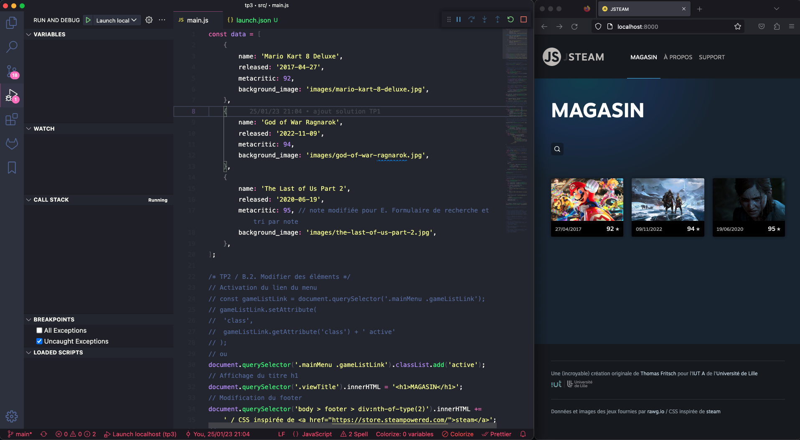

# B. Debugger dans vscode : avec Firefox <!-- omit in toc -->

_**Si vous n'avez pas Chrome sur votre poste, vous pouvez aussi utiliser Firefox pour profiter du debugger de vscodium mais la configuration est plus complexe, d'où ce readme spécifique.**_

La configuration diffère un peu selon que vous utilisez VSCodium ou VSCode :

## B.1. Installer l'extension "Debugger for Firefox"

L'extension "Debugger for Firefox" permet de connecter VSCodium/VSCode à Firefox.

Attention : VSCodium utilise un store d'extension différent de celui de VSCode : https://open-vsx.org.

Malheureusement la version publiée sur open-vsx (https://open-vsx.org/extension/firefox-devtools/vscode-firefox-debug) n'est [pas à jour _(issue github)_](https://github.com/EclipseFdn/open-vsx.org/issues/966), la procédure pour installer l'extension est donc différente selon que vous utilisez VSCode ou VSCodium :

### sur VSCodium
1. **Téléchargez l'extension au format VSIX** depuis le marketplace de microsoft en cliquant sur ce lien : https://marketplace.visualstudio.com/_apis/public/gallery/publishers/firefox-devtools/vsextensions/vscode-firefox-debug/2.9.8/vspackage
2. **Dans VSCodium ouvrez la palette de commande** en tapant sur <kbd>CTRL</kbd>+<kbd>SHIFT</kbd>+<kbd>P</kbd> puis tapez "VSIX" dans le champ de recherche, vous devriez voir apparaître une option `"Extensions: Install from VSIX..."`. Sélectionnez cette option.
4. **Dans la fenêtre qui s'est ouverte, sélectionnez le fichier** que vous avez téléchargé à l'étape 1. puis validez
5. **Une notification en bas à droite de VSCodium** doit vous demander de recharger VSCodium, **cliquez sur le bouton "Reload Now"**

	> _si vous avez raté la notification, vous pouvez la ré-afficher en cliquant sur le bouton en forme de cloche tout à droite de la status bar en bas de l'écran_
	>
	> _Si la notification n'est pas là, vous pouvez forcer le rafraîchissement en tapant "Developer: Reload window" dans la palette de commande (<kbd>CTRL</kbd>+<kbd>SHIFT</kbd>+<kbd>P</kbd>)_
7. L'extension est en principe maintenant installée et visible dans le panneau des extensions (_tapez <kbd>CTRL</kbd>+<kbd>SHIFT</kbd>+<kbd>x</kbd> pour vérifier_)

### sur VSCode
1. **Ouvrez le panneau des extensions** de vscode en tapant <kbd>CTRL</kbd>+<kbd>SHIFT</kbd>+<kbd>X</kbd>
2. Recherchez `"Debugger for Firefox"`
3. **Cliquez sur "Install"**


## B.1.bis Configuration

**Pour pouvoir debugger directement dans vscode (ou vscodium), vscode a besoin d'une instance de Firefox en mode debug, ce qui va lui permettre de communiquer avec les devtools. On peut s'amuser à lancer Firefox en mode debug en le lançant en ligne de commande, mais le plus simple c'est de laisser vscode lancer Firefox tout seul, comme un grand.**

Il y a plusieurs techniques pour configurer tout ça dans vscode mais la solution que je vous propose est la suivante :
1. **Créez un fichier `/.vscode/launch.json` dans votre TP**
2. **Dans ce fichier `launch.json` collez le code suivant :**

	```json
	{
		// Use IntelliSense to learn about possible attributes.
		// Hover to view descriptions of existing attributes.
		// For more information, visit: https://go.microsoft.com/fwlink/?linkid=830387
		"version": "0.2.0",
		"configurations": [
			{
				"name": "Launch localhost",
				"type": "firefox",
				"request": "launch",
				"reAttach": true,
				"port": 8008,
				"timeout": 25,
				"url": "http://localhost:8000",
				"webRoot": "${workspaceFolder}",
				"pathMappings": [
					{
						"url": "webpack://jsteam/src",
						"path": "${workspaceFolder}/src"
					},
					{ "url": "http://localhost:8000/build", "path": null }
				]
			},
		]
	}
	```

	> _Notez qu'on a précisé l'URL de notre application JSteam (http://localhost:8000) dans la clé `"url"`._

5. **Vous pouvez maintenant lancer la session de debug, en appuyant simplement sur <kbd>F5</kbd>**

	Une nouvelle fenêtre de Firefox s'ouvre alors avec JSteam :

	

	> _**NB :** cette fenêtre de Firefox est ouverte en mode debug et avec un compte utilisateur "vide", c'est donc normal que vous ne retrouviez pas vos extensions et paramétrages_


**Maintenant que l'extension Debugger for Firefox est configurée, revenez au readme précédent, directement à la partie : [B.2. Utilisation du mode debug](B-debug-vscode.md#b2-utilisation-du-mode-debug)**
