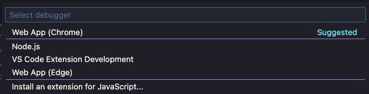
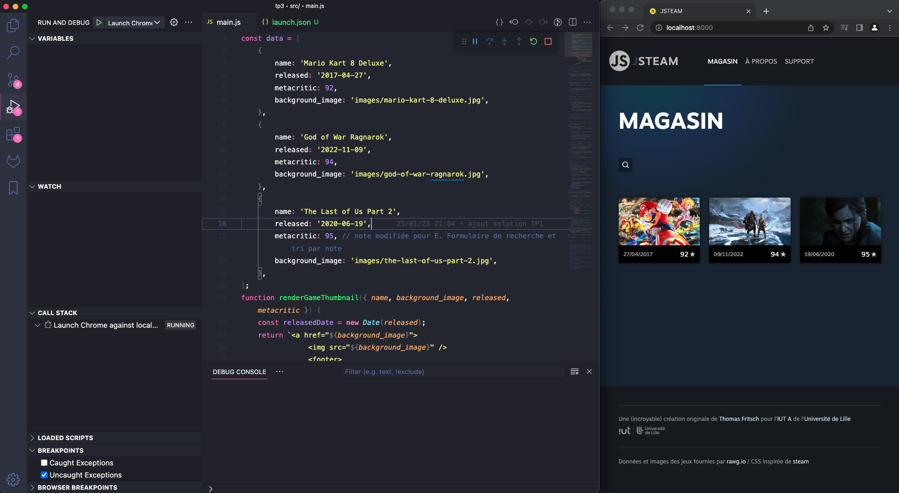
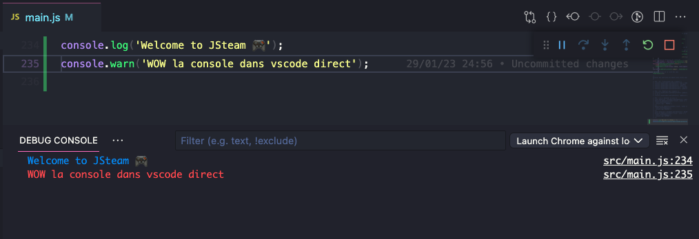
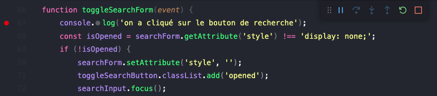
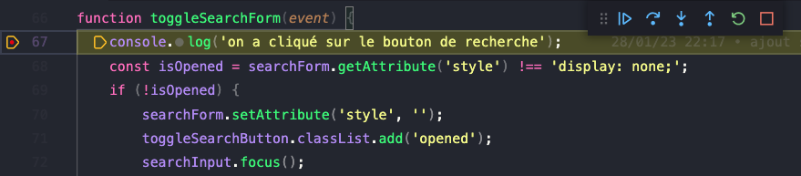
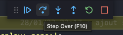
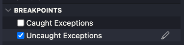
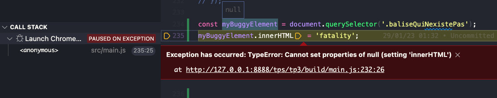

# B. Debugger dans vscode <!-- omit in toc -->

_**Pour débugger notre code, on a jusqu'ici toujours utilisé les devtools intégrés dans notre navigateur. Mais il faut admettre que ce n'est pas très pratique de devoir passer d'une fenêtre à l'autre notamment quand on utilise les points d'arrêt car on a le _MÊME_ code affiché à 2 endroits différents :**_
- **dans vscode** (_le code qu'on édite_)
- **dans les devtools** (_dans l'onglet "Sources"/"Debugger"_)

**Dans ce TP nous allons découvrir comment debugger notre code DIRECTEMENT DANS VSCODE 😱 sans utiliser les devtools !**

## Sommaire <!-- omit in toc -->
- [B.1. Configuration](#b1-configuration)
- [B.2. Utilisation du mode debug](#b2-utilisation-du-mode-debug)
	- [B.2.1. La Debug console](#b21-la-debug-console)
	- [B.2.2. Les points d'arrêt](#b22-les-points-darrêt)

## B.1. Configuration

**Pour pouvoir debugger directement dans vscode, vscode a besoin d'une instance de Chrome en mode debug, ce qui va lui permettre de communiquer avec les devtools.**

> _**NB :** Il est aussi possible d'utiliser Firefox mais la configuration du debug dans Firefox est plus complexe et peut prendre du temps. Si vous n'y êtes pas allergique, je vous conseille d'utiliser chrome qui est configuré par défaut dans vscode._
>
> _Si vous n'avez pas Chrome et que vous souhaitez utiliser Firefox, alors suivez donc les instructions du fichier [B. Débugger dans vscode : Firefox](./B-debug-vscode-firefox.md) avant de revenir ici_

**On peut s'amuser à lancer Chrome en mode debug en le lançant en ligne de commande, mais le plus simple c'est de laisser vscode lancer Chrome tout seul, comme un grand.**

Il y a plusieurs techniques pour configurer tout ça dans vscode mais la solution la plus simple est la suivante :
1. **Ouvrez le fichier `src/main.js` dans vscode** (avec <kbd>CTRL</kbd>+<kbd>P</kbd>)
2. **Lancez une session de Debug :**
	- soit en appuyant sur la touche <kbd>F5</kbd>
	- soit en ouvrant le menu 'Run' > 'Start Debugging'
	- soit en lançant la Command palette avec <kbd>CTRL</kbd>+<kbd>SHIFT</kbd>+<kbd>P</kbd> et en sélectionnant 'Debug: Start Debugging'
3. **Vscode vous affiche une liste déroulante avec les différents types de debugger supportés, ici sélectionnez le debugger nommé "Web App (Chrome)"** :

	

	À ce stade, vscode crée un fichier `/.vscode/launch.json` avec une configuration par défaut. Ce fichier doit ressembler à ceci :

	```json
	{
		// Use IntelliSense to learn about possible attributes.
		// Hover to view descriptions of existing attributes.
		// For more information, visit: https://go.microsoft.com/fwlink/?linkid=830387
		"version": "0.2.0",
		"configurations": [
			{
				"type": "chrome",
				"request": "launch",
				"name": "Launch Chrome against localhost",
				"url": "http://localhost:8080",
				"webRoot": "${workspaceFolder}"
			}
		]
	}
	```
	Tout est presque bon, seule l'URL n'est pas correcte car le port indiqué n'est pas celui que l'on utilise (_`8080` au lieu de `8000`. Souvenez-vous : notre site est lancé avec la commande `npx serve -l 8000` !_)
3. **Corrigez donc le numéro de port dans le fichier `launch.json` :**
	```json
	"url": "http://localhost:8000",
	```
4. **Vous pouvez maintenant lancer la session de debug, en appuyant simplement sur <kbd>F5</kbd>**

	Une nouvelle fenêtre de Chrome s'ouvre alors avec JSteam :

	

	> _**NB :** cette fenêtre de Chrome est ouverte en mode debug et avec un compte utilisateur "vide", c'est donc normal que vous ne retrouviez pas vos extensions et paramétrages_

## B.2. Utilisation du mode debug

Cette nouvelle fenêtre de Chrome (ou Firefox) communique maintenant avec vscode. C'est ce qui va permettre à vscode d'offrir plusieurs fonctionnalités de debug intéressantes :

### B.2.1. La Debug console
**La "Debug console" qui s'affiche en bas, correspond plus ou moins à la "Console" de Chrome.**



La principale différence avec la console de Chrome, c'est que quand on **clique** sur un nom de fichier (_comme à droite sur la capture d'écran ci-dessus_) vscode affiche directement le fichier et la ligne responsable du `console.log` ! \
Pratique !

### B.2.2. Les points d'arrêt
**Vous pouvez maintenant mettre vos points d'arrêt (_breakpoints_) directement dans l'interface de vscode et y faire exactement ce que vous faisiez avec l'onglet "Sources" de Chrome !**

Cliquez simplement à gauche d'un numéro de ligne, et une puce rouge s'affiche indiquant qu'un point d'arrêt a été ajouté !



1. **Pour tester ça, ajoutez un point d'arrêt ligne 67 comme sur la capture ci-dessus.**

2. **Dans Chrome, cliquez sur le bouton "loupe"** (_celui qui doit afficher le formulaire de recherche_).

	À ce stade Chrome se met en pause et l'interface de vscode change pour passer en mode "exécution pas à pas".
3. **Pour indiquer la ligne sur laquelle se trouve l'exécution pas à pas, un petit triangle s'est affiché autour de la puce rouge à côté du numéro de ligne :**

	

4. **Vous pouvez maintenant utiliser la barre d'exécution pas à pas** (_en haut à droite dans la capture ci-dessus_) : **cliquez sur le bouton "Step Over (F10)" pour passer à l'instruction suivante** : vous devez voir le message `'on a cliqué sur le bouton de recherche'` dans la "Debug Console" de vscode.

	

5. **Cliquez à nouveau sur le bouton "Step Over (F10)", la valeur de isOpened est maintenant calculée, survolez le nom de la constante directement dans vscode pour voir sa valeur en live !**

6. **Dans le panneau de gauche** (_affiché automatiquement mais qu'on peut refaire apparaître en tapant <kbd>CTRL</kbd>+<kbd>SHIFT</kbd>+<kbd>P</kbd> puis `View: Show Run and Debug`_) **vous pouvez aussi voir toutes les variables locales**, la call stack, etc. exactement comme dans l'onglet "Sources" des devtools de Chrome !

	**Continuez** de cliquer sur le bouton "Step Over (F10)" pour suivre le flux d'exécution du code JS.

5. **Activez l'ajout de points d'arrêt automatiques en cas d'erreur JS dans votre code :** plutôt que d'avoir juste un message dans la console lorsque votre code plante, vscode va automatiquement mettre en pause l'exécution sur la ligne qui a planté ! Pratique parce que vous pourrez voir les valeurs de chaque variable directement sans avoir besoin de mettre un point d'arrêt manuel puis de rafraîchir la page : \
	**Dans le panneau "breakpoints" cochez la case _"Uncaught Exceptions"_**

	

	Pour le tester, ajoutez dans votre fichier `main.js` le code suivant :
	```js
	const myBuggyElement = document.querySelector('.baliseQuiNexistePas');
	myBuggyElement.innerHTML = 'fatality';
	```
	Rafraîchissez la page (soit dans le navigateur, soit en cliquant sur le bouton "Restart" de la debug toolbar) et constatez avec émerveillement qu'un point d'arrêt a été ajouté automatiquement sur la ligne `myBuggyElement.innerHTML = 'fatality';` :

	

	Vous pouvez ainsi survoler la constante `myBuggyElement` pour constater qu'elle vaut `null` et que c'est la raison du plantage !

**Une fois que vous avez testé ça, pensez à enlever le point d'arrêt de la ligne 67 !**

> _**NB1 :** même si vous utilisez le debug dans vscode, **les devtools de Chrome continuent de fonctionner** et sont même **synchronisés avec vscode** (les actions dans une interface se répercutent dans l'autre !)_

> _**NB2 :** Si vous souhaitez plus d'informations sur les possibilités offertes par ce mode debug, je vous invite à faire un tour sur la **doc officielle** ici : https://code.visualstudio.com/docs/nodejs/browser-debugging_

## Étape suivante <!-- omit in toc -->
Vscode étant maintenant configuré pour vous permettre de débugger plus facilement, entrons dans le vif du sujet avec la partie [C. les modules](C-modules.md)