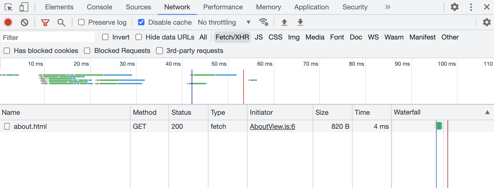
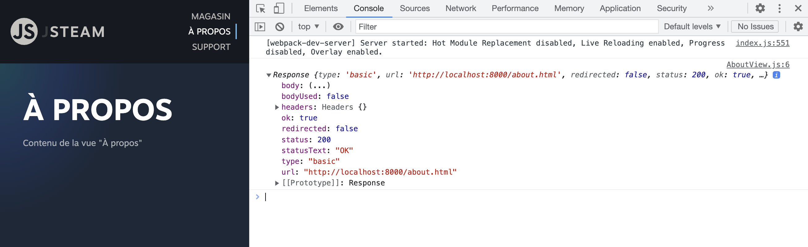
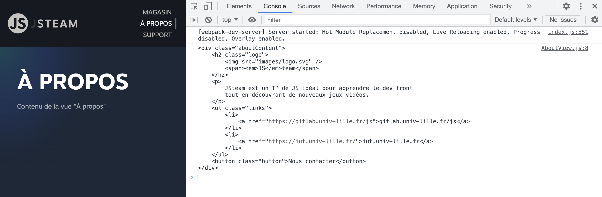
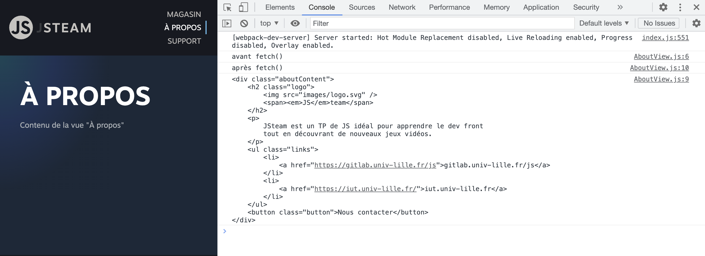
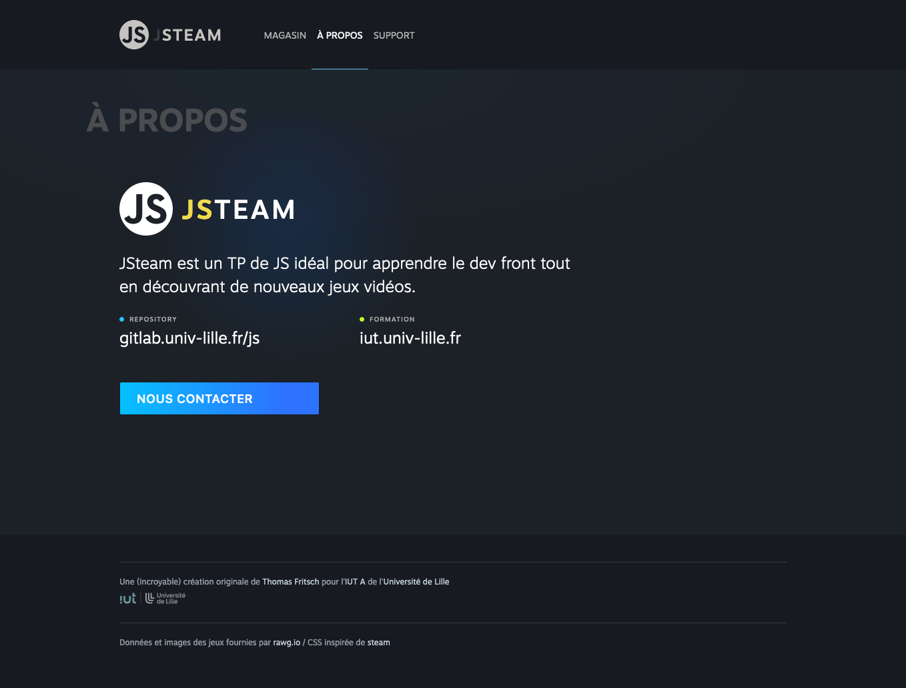

# B. Charger un fichier statique <!-- omit in toc -->

_**Dans cette partie du TP nous allons voir comment utiliser AJAX pour charger en JS un fichier statique.**_


## Sommaire <!-- omit in toc -->
- [B.1. XMLHttpRequest vs fetch](#b1-xmlhttprequest-vs-fetch)
- [B.2. Charger un fichier statique](#b2-charger-un-fichier-statique)
- [B.2. Exploiter les données chargées](#b2-exploiter-les-données-chargées)


## B.1. XMLHttpRequest vs fetch
Comme vu en cours (_récupérez si ce n'est pas déjà fait le pdf !_) il existe deux méthodes pour charger/envoyer des données en JS : [XMLHttpRequest](https://developer.mozilla.org/fr/docs/Web/API/XMLHttpRequest) et l'[API fetch](https://developer.mozilla.org/fr/docs/Web/API/Fetch_API/Using_Fetch)

**C'est l'API fetch que nous utiliserons dans ce TP.** \
En effet, elle dispose d'une syntaxe plus concise, avec laquelle il est plus facile de chaîner les traitements grâce aux [Promises](https://developer.mozilla.org/fr/docs/Web/JavaScript/Guide/Utiliser_les_promesses).

Pour rappel, le support navigateur de l'API fetch est plutôt bon :

<a href="http://caniuse.com/#feat=fetch">
	<picture>
		<source type="image/webp" srcset="https://caniuse.bitsofco.de/image/fetch.webp">
		
	</picture>
</a>

> _**NB :** Comme on peut le voir, **aucune version d'Internet Explorer n'est compatible avec l'API fetch**. C'est aussi le cas des versions d'android 4.4.4 et inférieures. Heureusement, un [polyfill](https://fr.wikipedia.org/wiki/Polyfill) développé par Github est disponible ici : https://github.com/github/fetch. Sur un projet réel, si vous aviez besoin de supporter ces navigateurs anciens, vous devriez mettre en place ce polyfill. Pour gagner du temps nous ignorerons cette problématique dans ce TP._


## B.2. Charger un fichier statique
**Pour faire nos premiers pas avec AJAX, nous allons nous commencer par essayer de charger un fichier statique.**

Le but de la manipulation sera de charger un fichier html, d'en récupérer le contenu, et de l'injecter dans la vue "À propos" à la place du texte `'Contenu de la vue "À propos"'`.

On pourrait coder ça directement dans le fichier `main.js` mais comme vu lors du précédent TP, on va essayer de ranger "proprement" notre code et de mettre ça dans un module réutilisable pour la vue "À propos".

1. **Commencez par créer une classe spéciale pour la vue "À propos" :** créez un fichier `src/AboutView.js` et codez-y une classe `AboutView` qui hérite de la classe `View`.

2. **Dans le `main.js` modifiez la déclaration de la constante `helpView` :** plutôt que d'instancier la classe `View`, instanciez votre nouvelle classe `HelpView`.

	Testez le changement de page dans le navigateur, vérifiez que la page http://localhost:8000/about fonctionne toujours :

	

3. **Créez un fichier `about.html` à la racine (au même niveau que le `index.html`) avec le code html suivant** :
	```html
	<div class="aboutContent">
		<h2 class="logo">
			
			<span><em>JS</em>team</span>
		</h2>
		<p>
			JSteam est un TP de JS idéal pour apprendre le dev front
			tout en découvrant de nouveaux jeux vidéos.
		</p>
		<ul class="links">
			<li>
				<a href="https://gitlab.univ-lille.fr/js">gitlab.univ-lille.fr/js</a>
			</li>
			<li>
				<a href="https://iut.univ-lille.fr/">iut.univ-lille.fr</a>
			</li>
		</ul>
		<button class="button">Nous contacter</button>
	</div>
	```

4. **Dans la classe `HelpView`, surchargez la méthode `show` et lancez le chargement du fichier `about.html` avec fetch :**
	```js
	fetch('./about.html');
	```

	> _**NB :** Souvenez-vous que quand on surcharge une méthode, si l'on veut conserver le fonctionnement de base de la méthode parente, alors il faut l'invoquer avec l'instruction `super.maMethode()`_

	Rechargez la page html dans le navigateur et vérifiez dans l'onglet Network/Réseau des devtools que votre page lance bien le chargement du fichier `about.html`.

	

	Notez qu'il s'agit bien d'une requête HTTP et pas d'un appel à un fichier local : l'URL de la requête est bien http://localhost:8000/about.html c'est donc bien le serveur HTTP (lancé par webpack et le `npm start`) qui génère la réponse HTTP retournée au navigateur.

	Maintenant que l'on arrive à lancer la requête, reste à exploiter la réponse renvoyée par le serveur et les données qu'elle contient !

5. **Commencez par inspecter la réponse retournée par `fetch()` grâce à la méthode `.then()`** :
	```js
	fetch('./about.html')
		.then( response => console.log(response) );
	```

	Rechargez la page et regardez ce qui s'affiche dans la console : il s'agit d'un objet de type [Response](https://developer.mozilla.org/fr/docs/Web/API/Response) retourné par l'API fetch.

	

	Comme vu en cours, cet objet contient notamment des propriétés `ok`, `status` et `statusText` qui permettent d'en savoir plus sur la réponse HTTP retournée par le serveur.

6. **On va maintenant pouvoir récupérer les données brutes contenues dans la réponse HTTP grâce à la méthode [response.text()](https://developer.mozilla.org/en-US/docs/Web/API/Response/text)** :
	```js
	fetch('./about.html')
	  .then( response => response.text() )
	  .then( responseText => console.log(responseText) );
	```
	Vérifiez que la console affiche bien le contenu HTML du fichier `about.html`

	

	_Maintenant que l'on est capable de récupérer le contenu du fichier `about.html` sous forme de chaîne de caractères, il ne reste plus qu'à **l'injecter dans la page HTML** !_

7. **Pour bien comprendre l'ordre d'exécution d'un code asynchrone comme cet appel AJAX, ajoutons des instructions `console.log()` dans le code précédent** :
	```js
	console.log('avant fetch()');
	fetch('./about.html')
	  .then( response => response.text() )
	  .then( responseText => console.log(responseText) );
	console.log('après fetch()');
	```
    Regardez dans quel ordre s'affichent les log dans la console

	

	Est-ce que cela vous semble normal ? \
	Non ? **C'est pourtant logique :** la fonction qui est passée au deuxième `.then()` n'est exécutée qu'une fois que la requête http est terminée (_càd. une fois que le fichier est fini de télécharger_). Le reste du code **continue de s'exécuter en attendant que la requête se termine** ! \
	Cela signifie que si l'on met du code en dessous du fetch, en dehors des `.then`, il sera exécuté AVANT que la requête AJAX ne soit terminée !

	Si vous avez compris, vous pouvez effacer les `console.log` inutiles et passer à la suite. Sinon appelez votre professeur.e !

## B.2. Exploiter les données chargées

Maintenant que l'on a réussi à charger le contenu du fichier `about.html`, il nous reste à en faire quelque chose ! On va simplement essayer d'injecter le code HTML du fichier `about.html` dans la page pour l'afficher aux utilisateur.rices !

1. **Avant d'injecter le code HTML dans la page, vous allez devoir faire un peu de ménage :** dans le fichier `index.html`, supprimez le **contenu** de la balise `<article class="about">Contenu de la vue "À propos"</article>` (la balise doit toujours exister dans la page mais elle doit être vide). Vous devez obtenir :

	```html
	<article class="about"></article>
	```

	La page "À propos" est maintenant vide :

	

2. **À l'aide de l'API DOM injectez le contenu du fichier `about.html` dans la balise `<article class="about"></article>`.** Plutôt que de tout coder dans le `.then()` on va passer par une nouvelle méthode de notre classe `AboutView` :

	Ajoutez une méthode `showFileContent` :
	```js
	showFileContent(html) {
		//..
	}
	```
	Puis appelez cette méthode à la fin du fetch :
	```js
    fetch('./about.html')
	    .then( response => response.text() )
	    .then( responseText => this.showFileContent(responseText) );
	```
	Codez ensuite la méthode `showFileContent` : injectez le contenu du fichier téléchargé dans la balise `this.element`.

	

3.  **Faites en sorte que le clic sur le bouton `<button class="button">Nous contacter</button>` redirige l'utilisateur (_SANS RECHARGEMENT DE PAGE_) vers la page "SUPPORT"**.


## Étape suivante  <!-- omit in toc -->
Maintenant que l'on est capable de charger un fichier "en dur", nous allons voir dans le prochain exercice comment connecter notre application à des webservices : [C. Interroger une API REST](C-api-rest.md).