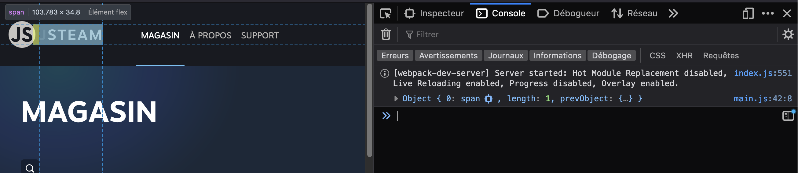
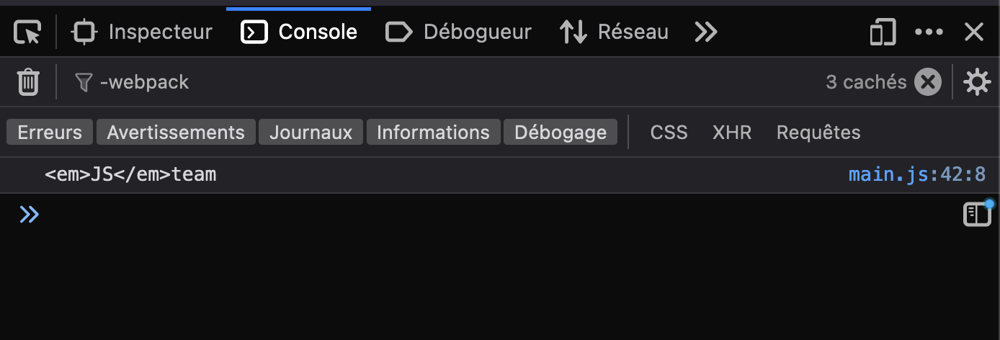
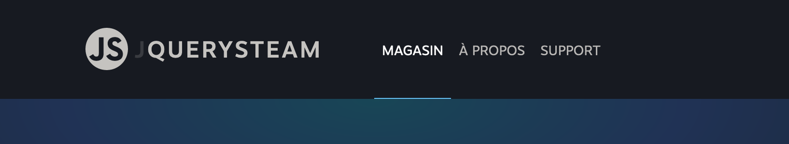
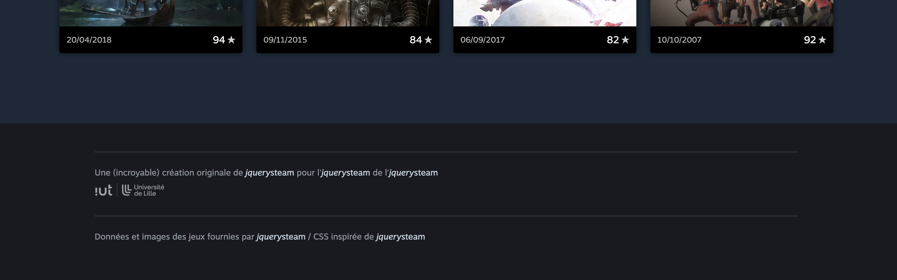
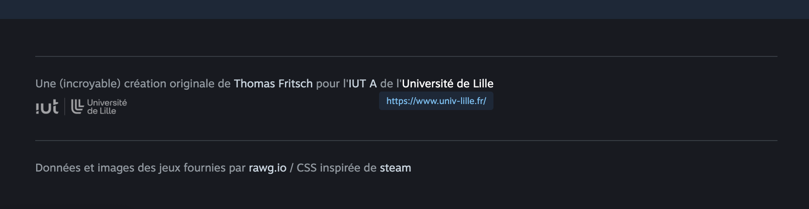

# B. JQUERY <!-- omit in toc -->

_**jQuery doit permettre de simplifier notre code, voyons dans cette partie du TP comment l'utiliser**_

## Sommaire <!-- omit in toc -->
- [B.1. Installation de jQuery](#b1-installation-de-jquery)
- [B.2. La fonction $()](#b2-la-fonction-)
- [B.3. la méthode `.html()`](#b3-la-méthode-html)
- [B.4. addClass() / removeClass()](#b4-addclass-removeclass)
- [B.5. les événements avec jQuery](#b5-les-événements-avec-jquery)

## B.1. Installation de jQuery
1. Avant d'installer jQuery, **stoppez la compilation du code : arrêtez la commande `npm start`** en tapant <kbd>CTRL</kbd>+<kbd>C</kbd> dans le terminal
2. **Installez maintenant la dernière version stable de jQuery** avec npm :
	```bash
	npm i jquery
	```
	> _**NB :** comme expliqué dans les précédents TPs, `npm i ...` est un raccourci pour la commande `npm install ...`_

3. **Ouvrez le fichier `package.json` et constatez que jQuery a été ajouté à la liste des dépendances du projet :**
	```bash
	"dependencies": {
	  "jquery": "^3.6.3"
	}
	```
	> _**NB :** vous avez peut-être remarqué que contrairement aux autres packages que l'on avait installé jusque là (`babel`, `webpack`, etc.), **`jquery` a été ajouté dans la section `"dependencies"` et pas `"devDependencies"`.**_
	>
	> _En effet, tous les paquets que l'on a installé précédemment ne sont utilisés que pendant la **phase de développement** (pour la compilation ou le formatage de code source) mais ne contiennent rien qui soit vraiment utilisé "dans" notre code. C'est la raison pour laquelle on avait installé tous ces paquets avec **l'option `--save-dev`** (par exemple dans le TP1, on avait fait : `npm install --save-dev @babel/core @babel/cli`, vous vous souvenez ?_ :thinking: _) ce qui avait pour conséquence d'ajouter ces paquets dans les **`"devDependencies"`**._
	>
	> _**Pour jQuery, on n'a pas utilisé l'option `--save-dev` car on va utiliser jQuery dans notre code, de fait il est installé dans la section `"dependencies"`.**_
	>
	> _Documentation officielle :_
	> - _dependencies : https://docs.npmjs.com/cli/v7/configuring-npm/package-json#dependencies_
	> - _devDependencies : https://docs.npmjs.com/cli/v7/configuring-npm/package-json#devdependencies_


4. **Une fois tout installé, vous pouvez relancer la compilation à l'aide de la commande :**
	```bash
	npm start
	```
	Vérifiez ensuite que la page s'affiche toujours correctement dans le navigateur.

## B.2. La fonction $()
**Comme vu en cours, jquery met à notre disposition une fonction "magique" `$()` qui permet notamment de sélectionner des éléments HTML puis d'y appliquer des modifications.**
1. **Dans le fichier main.js, importez jQuery** :
	```js
	import $ from 'jquery';
	```

	Vous noterez que cette instruction `import` est un peu différente de celles que l'on avait faites jusque là : en effet, **quand on importe un paquet npm, on indique après le `from` juste son nom** (_et pas un chemin relatif `./xxxx.js` comme pour les modules que l'on développe nous-mêmes_).

2. Maintenant que jQuery est importé dans notre `main.js`, **utilisez la fonction `$()` pour sélectionner le texte du logo et affichez le contenu dans la console**, à la fin du fichier `main.js` ajoutez :
	```js
	console.log( $('.logo span') );
	```

	

	**La valeur retournée par `$()` est un [objet jQuery](http://api.jquery.com/Types/#jQuery).** \
	Il s'agit d'un **objet** qui contient la liste de **tous** les éléments HTML correspondant au sélecteur CSS (_ici nous n'en avons qu'un seul, d'où le `length = 1`_) et des méthodes qui vont permettre de les manipuler.

## B.3. la méthode `.html()`
Comme vu en cours, la méthode [`.html()` (_documentation_)](https://api.jquery.com/html/) est plus ou moins l'équivalent de la propriété `.innerHTML` mais en version "jQuery" : elle permet (_comme innerHTML_) non seulement de récupérer le contenu d'une balise mais aussi de le modifier !

La principale différence niveau syntaxe, c'est que `.innerHTML` est une propriété, alors que `.html` est une méthode !

Voyons comment l'utiliser :

1. **Avec la méthode `.html()` affichez le contenu texte du logo** :
	```js
	console.log( $('.logo span').html() );
	```
	


2. **La méthode `.html()` peut aussi servir à modifier le contenu d'une balise : remplacez le contenu du logo par `'<em>jquery</em>steam'` à l'aide de la méthode `.html()`**.

	

3. Comme expliqué plus haut, jQuery retourne un objet qui peut contenir **une collection d'éléments HTML**. Si le sélecteur CSS que l'on passe à la fonction `$()` correspond à plusieurs éléments de la page, les méthodes que l'on appellera ensuite sur l'objet jQuery s'appliqueront **automatiquement à tous les éléments correspondant** !

	**Remplacez par exemple le sélecteur CSS précédent `'.logo span'` par `'a'`** (_pour sélectionner tous les liens de la page_) :

	

	<br/>

	

	Voyez comment avec **une seule instruction** on a pu modifier **TOUS** les liens de la page (_tout du moins tous ceux qui existaient au moment où l'on a exécuté l'instruction_) : les liens du header et du footer ont tous été remplacés ! \
	Pas besoin de `forEach` ou de boucle `for`, elle est en fait inclue dans chaque méthode de l'objet jQuery retourné par `$()` !

	En revanche vous voyez que les `<a href>` des vignettes de la `GameListView` n'ont pas été transformés ! C'est normal car **au moment où notre code s'exécute** (_à la fin du `main.js`_) ces liens **n'existent pas encore dans la page**, puisque l'appel AJAX qui les génère (_le `fetch()` dans la méthode `GameListView::renderGameList()`_) n'est pas encore terminé ! Si ce n'est pas clair n'hésitez pas à demander des explications à votre professeur.e car c'est un point très important à bien comprendre !!

4. **Effacez le code précédent de manière à revenir à un contenu de page normal** et passons à la suite.

## B.4. addClass() / removeClass()

On vient de voir comment modifier le contenu d'une balise, mais on n'a pas encore essayé de **modifier des attributs** et notamment les classes CSS d'une balise.

Pour s'y entrainer, je vous propose d'essayer d'améliorer l'expérience utilisateur (UX) de notre page "A propos" en ajoutant un feedback visuel lorsque l'appel AJAX qui permet de récupérer le contenu du fichier `about.html` est en cours (_exactement comme on le fait dans la `GameListView` et dans la `GameDetailView`_).

1. **Dans la classe `AboutView`, juste avant de lancer l'appel AJAX, ajoutez la classe CSS `is-loading` sur la balise stockée dans `this.element` de classe CSS `'pageContent'` à l'aide de la méthode [`.addClass()`](https://api.jquery.com/addClass/)** :

	

	> _**NB :** pour convertir un élément HTML (comme `this.element`) en objet jQuery, vous pouvez simplement passer cet élément à la fonction `$` comme ceci : `$(monElement)` (cf. https://api.jquery.com/jQuery/#jQuery-element)._ \
	> _Cela aura pour effet d'"entourer" ("wrapper") l'élément DOM dans un objet jQuery, qui disposera lui de toutes les méthodes qu'on a vu jusque là et notamment de la méthode `addClass()` !_

6. **Une fois l'appel AJAX terminé et le fichier `about.html` téléchargé, retirez la classe CSS 'is-loading' de la balise 'pageContent'** à l'aide de la méthode [`.removeClass()`](https://api.jquery.com/removeClass/) :

	Comme le fichier `about.html` se trouve en local sur notre machine, le délai de chargement est très rapide, on a donc à peine le temps de voir le loader apparaître.

	> _Comme vu lors du TP4, la solution dans ce genre de situations est d'utiliser le système de **bridage de bande passante** intégré aux devtools du navigateur. Par exemple sur Firefox :_
	>
	> 
	>
	> _Sélectionnez `Regular 2G`, allez sur la page "Support" puis revenez sur la page "A propos" pour voir le loader apparaître pendant le chargement du fichier `about.html`._
	>
	> _**Astuce :** Une fois vos tests terminés, pensez à désactiver le bridage !!!_ 😉

	Sélectionnez `Fast 3G` ou `Slow 3G` et rechargez la page pour voir l'impact sur l'affichage.

	> _**NB :** Une fois vos tests terminés, pensez à désactiver le bridage !_ :wink:

## B.5. les événements avec jQuery
Dernier point à connaître pour pouvoir travailler avec jQuery, la gestion des événements.

En effet, jQuery propose un équivalent de la méthode `.addEventListener()` qui est la méthode [`.on()` (_documentation_)](https://api.jquery.com/on).

> _**Attention :** vous trouverez sans doute sur les Internets, des sites, tutos, posts stackoverflow, etc. qui parlent de méthodes **`.click()`, `.hover()`, `.submit()`, etc.**. Ce sont des méthodes qui servaient de "raccourcis" pour ajouter des écouteurs d'événement plus rapidement qu'avec `.on()`._
>
> _Hors depuis la version 3.3.0 sortie début 2018, ces méthodes sont considérées comme **dépréciées**. L'information n'est pas indiquée de manière claire ni sur la doc de ces méthodes (https://api.jquery.com/click) ni dans la liste des features deprecated (https://api.jquery.com/category/deprecated/deprecated-3.3/) mais c'est précisé sur le blog de jQuery : https://api.jquery.com/category/deprecated/deprecated-3.3/ et dans les issues de leur repo github : https://github.com/jquery/jquery/issues/3214_

1. **A l'aide de la méthode [`.on()`](https://api.jquery.com/on/) détectez le clic sur le logo** et faites en sorte de rediriger l'utilisateur vers la page d'accueil du site (_la `GameListView`_) lorsque l'on clique dessus mais **SANS** rechargement de page (_utilisez l'onglet Network/Réseau des devtools pour vérifier_).

	> _**NB :** la fonction de callback passée à `.on()` reçoit en paramètre un objet de type [jQuery.Event](http://api.jquery.com/category/events/event-object/) avec (comme dans l'API DOM) une méthode [`preventDefault()`](http://api.jquery.com/event.preventDefault/) qui permet **d'empêcher le comportement par défaut du navigateur**._

2. **Utilisez maintenant la méthode `.on()` pour détecter le survol (événement `mouseover`) sur chaque lien du footer** et ajoutez la classe "hover" au lien survolé. A l'événement `mouseout` retirez la classe "hover".

	le fait d'ajouter la classe hover, doit activer une règle CSS qui affiche en dessous du lien l'URL du lien survolé. Si vous ouvrez le fichier `css/footer.css` vous remarquerez ligne 15 le code suivant :

	```css
	body > footer a.mouseover:before {
		content: attr(href);
		...
	}
	```

	cette règle génère un pseudo-element `:before` qui récupère l'attribut `href` du lien ayant la classe '.hover' et l'affiche sous forme d'info-bulle :

	

	> _**NB :** il y a différentes façons de résoudre cet exercice, mais sachez que l'objet `event` envoyé à votre fonction de callback par `.on()`, dispose (en plus de `.preventDefault()`) d'une propriété [`currentTarget` (_documentation_)](http://api.jquery.com/event.currentTarget/) qui est une référence vers l'élément qui a déclenché l'événement._

	> _**NB2 :** dans la vraie vie on ne passerait pas par du JS pour afficher/masquer cet élément, un pseudo-sélecteur :hover à la place de notre classe `.mouseover` aurait été suffisant ! Ici on fait ça de cette manière pour s'entraîner._


## Étape suivante <!-- omit in toc -->
Maintenant que l'on a découvert comment manipuler la page avec jQuery, terminons ce TP avec le chapitre [C. jQuery or not jQuery ?](C-jquery-ou-pas.md).