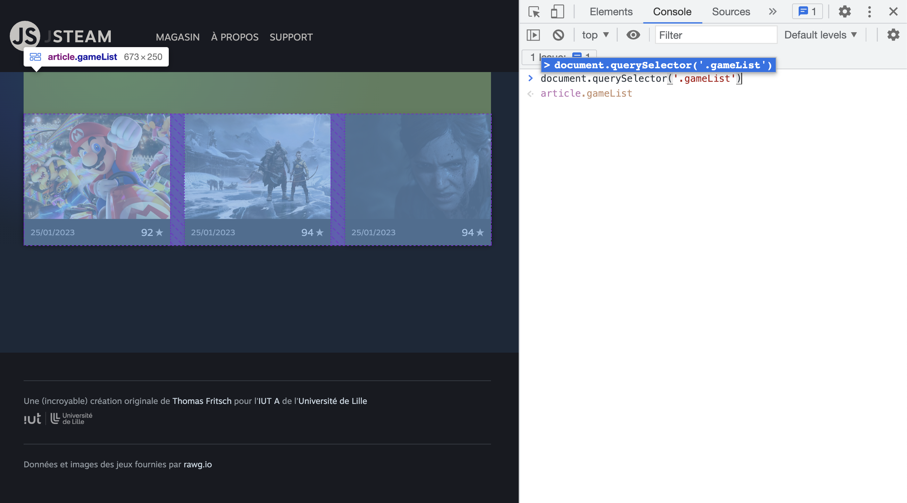
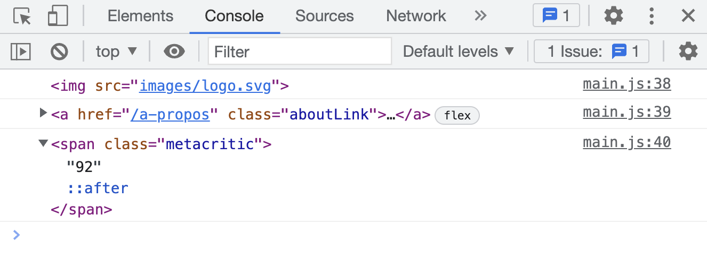
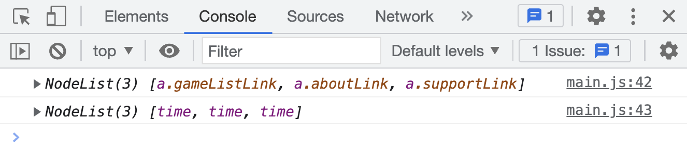
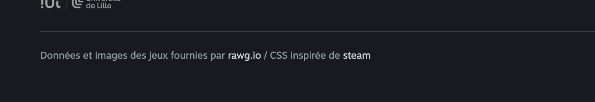
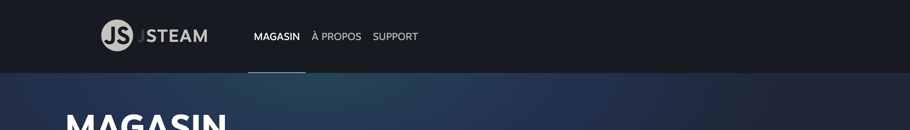

# B. Les bases de l'API DOM <!-- omit in toc -->

_**Dans cette partie du TP, nous allons prendre en main les méthodes de base de l'API DOM et notamment celles de sélection et de modification d'éléments de l'arbre DOM.**_

## Sommaire <!-- omit in toc -->
- [B.1. Sélectionner des éléments](#b1-sélectionner-des-éléments)
	- [B.1.1. querySelector()](#b11-queryselector)
	- [B.1.2. querySelectorAll()](#b12-queryselectorall)
- [B.2. Modifier des éléments](#b2-modifier-des-éléments)
	- [B.2.1. innerHTML](#b21-innerhtml)
	- [B.2.2. getAttribute/setAttribute](#b22-getattributesetattribute)


## B.1. Sélectionner des éléments

### B.1.1. querySelector()
**Comme vu en cours, la principale méthode pour sélectionner un élément de la page HTML est la méthode [`querySelector()` (_mdn_)](https://developer.mozilla.org/fr/docs/Web/API/Document/querySelector).**

`querySelector()` est une méthode de la classe [`Element` (_mdn_)](https://developer.mozilla.org/en-US/docs/Web/API/element) qui retourne une référence vers le premier élément de la page (_une balise_) qui correspond au sélecteur CSS passé en paramètre. \
Par exemple :
```js
document.querySelector('.viewContainer');
```
retourne (_si elle existe !_) une référence vers la balise ayant comme classe CSS `'viewContainer'` :
```html
<section class="viewContainer">
```

**Ouvrez les devtools de votre navigateur, et dans la console, tapez le code suivant :**
```js
document.querySelector('.gameList')
```
cette instruction vous retourne la balise qui a comme classe `"gameList"`



**Sur le même principe, affichez dans la console :**
1. La balise `` contenue dans le logo (le "JS" dans un cercle)
2. Le lien du menu "A propos"
3. la note metacritic du premier jeu de la liste



### B.1.2. querySelectorAll()
**La méthode [`querySelectorAll()`](https://developer.mozilla.org/fr/docs/Web/API/Document/querySelectorAll) permet de récupérer non pas un, mais TOUS les éléments qui correspondent au sélecteur CSS passé en paramètre** (_sous la forme d'un tableau_).

Affichez dans la console :
1. **la liste des liens (`<a href>`) du menu de navigation** (_cf. capture ci-dessous_)
2. **la liste des balises `<time>` contenant la date de sortie de tous les jeux**



## B.2. Modifier des éléments
### B.2.1. innerHTML
**La propriété [`innerHTML`](https://developer.mozilla.org/fr/docs/Web/API/Element/innertHTML) permet à la fois de lire ET de modifier le contenu d'un Element HTML** (_tout ce qui est compris **entre** les balises ouvrantes et fermantes_)

1. Affichez dans la console le **titre du troisième jeu** (_la chaîne de caractères_ `"The Last of Us Part 2"`)

	> _**NB :** pour récupérer la **troisième** vignette, souvenez vous que `querySelectorAll()` retourne un tableau et qu'il est possible d'accéder à une cellule précise du tableau à l'aide de l'opérateur `monTableau[ index ]` où `index` est la position de la cellule recherchée._
	>
	> _Il est aussi posssible pour cet exercice d'utiliser la méthode `querySelector` avec le sélecteur CSS [`nth-of-type` (mdn)](https://developer.mozilla.org/fr/docs/Web/CSS/:nth-of-type)_

2. **Dans le fichier `main.js`, ajoutez un titre dans la page :** Si vous regardez le contenu du fichier `index.html` vous remarquerez que dans la balise `<section class="viewContainer">` se trouve une balise `header`. Injectez dans ce `header` (_grâce à la propriété `innerHTML`_) la chaîne de caractères `'MAGASIN'` :

	

3. Pour que le style (et la [sémantique (_wikipedia_)](https://fr.wikipedia.org/wiki/HTML_s%C3%A9mantique)) du titre de la page soit correct, **encadrez le texte `'MAGASIN'` d'une balise `h1`.**

	Le résultat que l'on cherche à obtenir dans le code HTML est :

	```html
	<section class="viewContainer">
		<header class="viewTitle">
			<h1>MAGASIN</h1>
		</header>
	</section>
	```

	

4. **Ajoutez dans la deuxième div du footer de la page** (_en plus du texte déjà présent_) le code HTML suivant :
	```html
	 / CSS inspirée de <a href="https://store.steampowered.com/">steam©</a>
	```

	

	> _**NB :** **cet exercice est plus compliqué qu'il n'en a l'air puisque la page contient plusieurs balises `<footer>`** (1 pour chaque jeu et 1 en bas de la page - celle dans laquelle on veut écrire le texte)._
	>
	> _Malheureusement il n'y a pas de classe CSS spécifique sur cette balise qui nous permettrait de la distinguer facilement des autres._
	>
	> _Par contre il est possible dans votre sélecteur CSS d'utiliser le [sélecteur d'enfants (_mdn)](https://developer.mozilla.org/fr/docs/Web/CSS/Child_combinator) `>`. En effet, les `footer` des jeux sont tous contenus dans des balises `<a>`, ce qui n'est pas le cas du `footer` de la page qui est le seul a être un enfant direct du `body`..._ 🤔

	> _**Rappel :** innerHTML est accessible en écriture ET en lecture !_

### B.2.2. getAttribute/setAttribute
**Les méthodes [`getAttribute()`](https://developer.mozilla.org/fr/docs/Web/API/Element/getAttribute) et [`setAttribute()`](https://developer.mozilla.org/fr/docs/Web/API/Element/setAttribute) de la classe `Element` permettent de lire, d'ajouter ou de modifier des attributs HTML.**

> _**Rappel :** Les **attributs** HTML, ce sont les paires `clé="valeur"` que l'on peut trouver dans les balises ouvrantes (comme `src`, `href`, etc.)._

1. Affichez dans la console **l'url du 2e lien contenu dans le footer** (`"https://www.iut-a.univ-lille.fr/"`)
2. Dans le fichier `main.js`, toujours à l'aide de `getAttribute/setAttribute`, **ajoutez la classe CSS `"active"`** au premier lien du menu ("MAGASIN")

	

	> _**NB :** pour associer plusieurs classes CSS à une seule balise, il suffit de les séparer par un espace à l'intérieur de l'attribut `class`. Pour cet exercice on souhaite donc obtenir le code HTML suivant :_
	> ```html
	> <a href="/" class="gameListLink active">
	> ```
	> _(Notez l'espace entre "gameListLink" et "active")_


## Étape suivante <!-- omit in toc -->
Maintenant que l'on est capable de sélectionner et modifier des éléments HTML, nous allons voir dans le prochain exercice comment détecter des événements : [C. Les événements](./C-evenements.md).