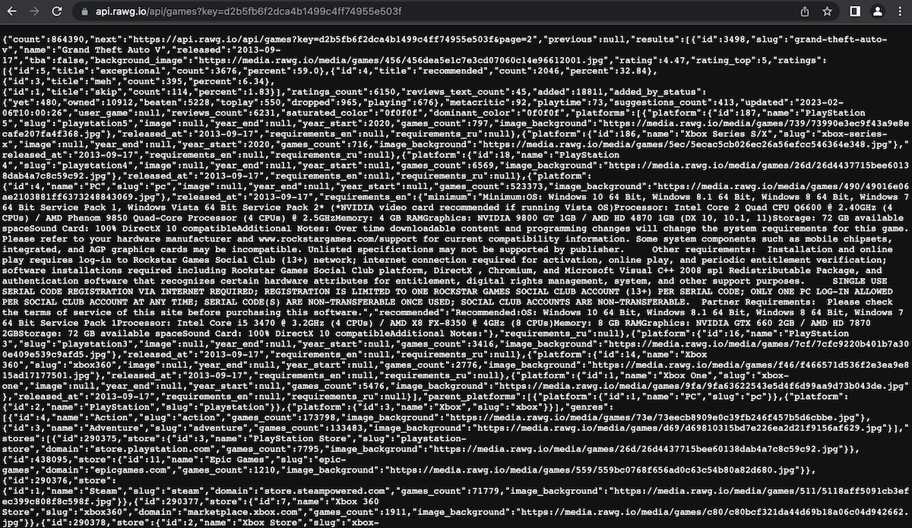
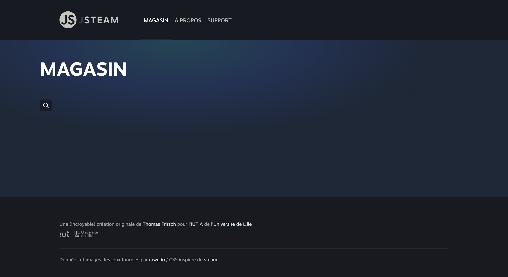
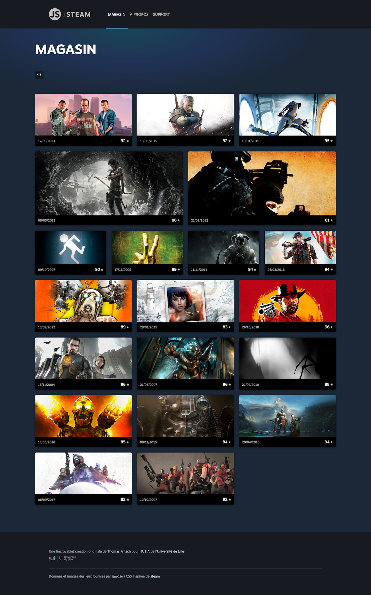
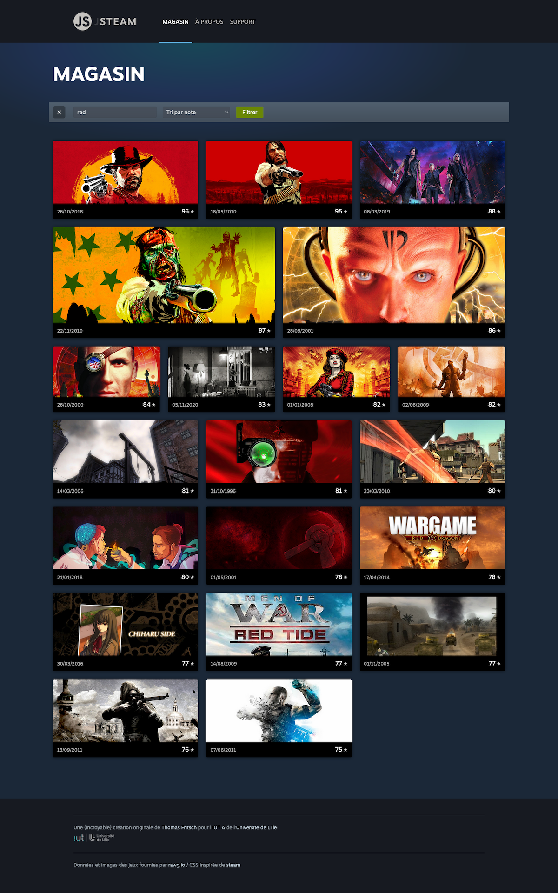
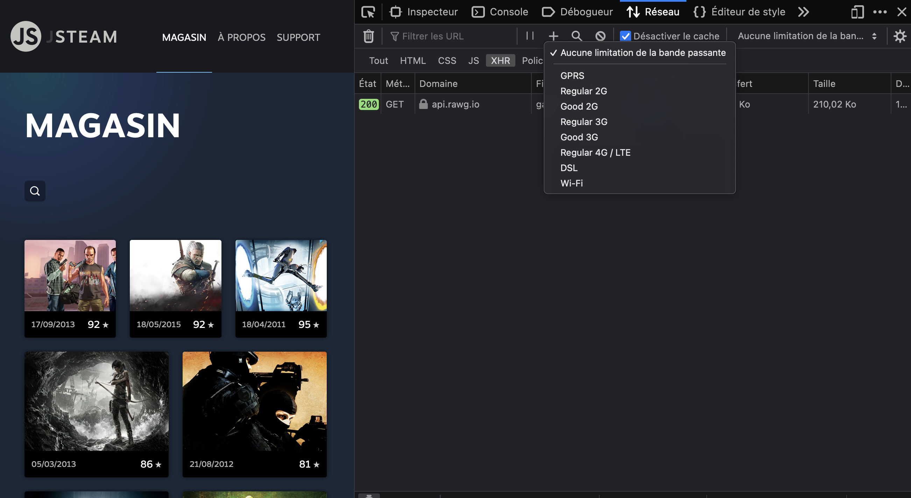

# C. Interroger une API REST <!-- omit in toc -->

**Maintenant que l'on est capables de récupérer une ressource externe en JS et d'en afficher le contenu, connectons notre application à une base de données à travers une API REST !!!**

**Dans cet exercice nous allons en effet nous attacher à faire en sorte que la liste des jeux affichés dans la `GameListView` ne soit plus une liste "en dur" dans le fichier `data.js`, mais une liste de jeux fournis par une API REST distante.**

## Sommaire <!-- omit in toc -->
- [C.1. Découverte de l'API REST de rawg.io](#c1-découverte-de-lapi-rest-de-rawgio)
- [C.2. Récupération de la liste des jeux](#c2-récupération-de-la-liste-des-jeux)
- [C.3. Recherche et tri](#c3-recherche-et-tri)
- [C.4. Feedback](#c4-feedback)

## C.1. Découverte de l'API REST de rawg.io
L'API que je vous propose d'utiliser pour la liste des jeux est l'api de [rawg.io](https://rawg.io/) et dont la documentation se trouve ici : https://api.rawg.io/docs/

Elle a l'avantage d'être gratuite, rapide et d'offrir de base **toutes les fonctionnalités dont vous aurez besoin dans ce projet**.

Pour pouvoir l'utiliser il vous faudra une **clé d'API** gratuite et que vous pouvez créer en suivant les instructions ici : https://rawg.io/apidocs.
1. Créez vous un compte sur rawg.io
2. Une fois connecté, ouvrez le menu en haut à droite (en survolant les "...")
3. Cliquez sur le lien "Get an API key" dans le menu qui s'est affiché
4. Remplissez le formulaire de demande de clé
5. Dans la page de confirmation, vous obtenez immédiatement la clé à utiliser dans chaque appel AJAX que vous ferez vers l'API
6. **Vérifiez que votre clé d'API fonctionne correctement en ouvrant dans votre navigateur la page https://api.rawg.io/api/games?key=xxxxxxxxxxxxxxxxxxxxxx** (_remplacez "xxxxxxxxxxxxxxxxxxxxxx" par votre clé d'API_)

	

> _**NB :** la version gratuite de l'API vous limite à 20 000 requêtes par mois et par clé d'API ce qui vous laisse en principe de la marge si vous ne faites pas de boucles infinies !_ 😬

## C.2. Récupération de la liste des jeux

_**Maintenant que vous avez votre clé d'API, connectons notre appli aux webservices de rawg.io :**_

1. **Supprimez toute trace de nos données en "dur" :**
	- dans le fichier `GameListView.js`, commentez le code contenu dans la méthode `renderGameList()` (_certaines choses pourraient vous être utiles pour la suite..._)
	- supprimez le fichier `data.js` et son import dans `GameListView.js`

	La page "MAGASIN" ne contient en principe maintenant plus de jeux :

	

2. Dans la méthode `renderGameList()` **lancez un appel AJAX vers l'URL https://api.rawg.io/api/games?key=xxxxxxxxxxxxxxxxxxxxxx** (_n'oubliez pas votre clé d'API_).

	> _**NB2 :** cette méthode `renderGameList() {...}` -[codée lors du précédent TP](https://gitlab.univ-lille.fr/js/tp3/-/blob/main/E-poo-avancee.md#e5-gamelist)- est appelée par la `GameListView` lorsqu'elle est affichée (méthode `show`) et quand l'utilisateur.rice soumet le formulaire de recherche (méthode `handleSearchFormSubmit()`)._
	>
	> _En plaçant notre appel AJAX dans cette méthode `renderGameList()`, la requête AJAX sera du coup déclenchée **à chaque fois que l'utilisateur arrive sur la page "MAGASIN"** mais aussi **à chaque fois qu'il fera une recherche** ! Ce qui permettra plus tard dans le TP d'avoir toujours des données à jour et de passer les critères de recherche à l'API._

3. **Une fois les données reçues, mettez à jour la page HTML avec la liste des jeux reçus en vous inspirant de ce qu'on a fait dans la partie B.**

	> _**Indices :**_
	> 1. _**Souvenez vous que `fetch` est une fonction asynchrone** et retourne une Promesse, pour chaîner des traitements il faut utiliser la méthode `.then`_
	> 2. _**L'API de rawg retourne du texte au format JSON**. Comme vu en cours il y a différents moyens pour parser cette chaîne de caractères et pour récupérer des données exploitables en JS._
	> 3. _**Utilisez l'inspecteur Réseau/Network des devtools de votre navigateur (Chrome/Firefox) pour étudier la structure de la réponse retournée par l'API de rawg :** en cherchant bien vous devriez pouvoir trouver un tableau d'objets littéraux contenant des jeux_
	> 4. _**N'utilisez PAS l'objet `document` dans votre module sans quoi il ne sera pas facilement réutilisable !**_

	

	Wow ça y est ! La page s'affiche maintenant avec une liste de jeux fournis par une API distante !! 🤘 🎉 🏆 🎮 🍻

## C.3. Recherche et tri

**Bon c'est vrai, c'est bien, on peut afficher la liste des jeux retournée par défaut par l'API, mais comme on a commenté le code de notre méthode `renderGamelist()` on a "perdu" le code qui permettait de filtrer et de trier les résultats.** 😕

En fait ceci est volontaire : notre mécanique de recherche était un peu "basique" puisqu'elle ne permettait de rechercher / trier que parmi les résultats affichés dans la page.

Par exemple, si on réactivait notre mécanique de recherche telle qu'elle existe actuellement, on ne pourra rechercher que parmi les 20 résultats fournis de base par l'API. Dommage quand on sait que la base de données de rawg.io contient plus de 350.000 jeux !!

**Par chance, l'API que l'on utilise pour récupérer la liste des jeux autorise l'envoi de paramètres GET permettant de :**
- **rechercher** : paramètre `search=...`
- **trier les résultats** : paramètre `ordering=...`

> _cf. https://api.rawg.io/docs/#operation/games_list_

À partir de ces informations faites donc en sorte que le moteur de recherche fonctionne à nouveau, par exemple si vous recherchez "red" et que vous triez par note, vous devriez avoir un résultat de ce type :

## C.4. Feedback
_**Maintenant que vous êtes un.e pro des appels AJAX, attardons nous quelques minutes sur l'expérience utilisateur (UX).**_

Contrairement aux applis web classiques, lorsqu'un appel AJAX commence, le navigateur ne donne aucun indice permettant à l'utilisateur de deviner qu'il se passe quelque chose (_la page ne s'efface pas, il n'y a pas de "loader" ou de barre de progression_), il peut donc avoir l'impression que sa demande n'a pas été prise en compte, que le site est "planté", voire cliquer frénétiquement sur un bouton pour le faire marcher (_ce qui n'aura comme autre effet que de lancer autant de requêtes HTTP supplémentaires..._).

**Il faut donc donner cette information à l'utilisateur nous même, en affichant par exemple un message ou une animation dans la page.**

Dans la `GameListView` :
1. ajoutez la classe `is-loading` à la balise `<section class="results"></section>` juste avant de lancer l'appel AJAX à l'API, puis retirez la classe `is-loading` une fois les données reçues (_**attention à l'ordre d'exécution des instructions !**_)

	> _**NB :** Il est possible que comme l'API répond parfois très rapidement, vous n'ayez pas le temps de voir le loader apparaître._
	>
	> _La solution dans ce genre de situations est d'utiliser le système de **bridage de bande passante** intégré aux devtools du navigateur. Par exemple sur Firefox :_
	>
	> 
	>
	> _Sélectionnez `Regular 2G` et lancez une recherche pour voir l'impact sur l'affichage._
	>
	> _**Astuce :** Une fois vos tests terminés, pensez à désactiver le bridage !!!_ :wink:

2. **Désactivez le bouton du formulaire de recherche pendant que l'appel AJAX est en cours** pour éviter que l'utilisateur ne soumette plusieurs fois la même recherche !

	> _**NB1 :** La désactivation d'un bouton se fait en ajoutant un attribut [`disabled` (mdn)](https://developer.mozilla.org/fr/docs/Web/HTML/Attributes/disabled)_

	> _**NB2 :** Vous remarquerez peut-être que les styles CSS appliqués au bouton lorsqu'il est désactivé permettent à l'internaute de savoir que quelque chose se passe : bouton grisé + curseur "wait"_

## Étape suivante  <!-- omit in toc -->
Maintenant que vous savez comment faire communiquer une appli JS avec un serveur distant, voyons comment réappliquer ça sur une deuxième page dans la partie [D. GameDetailView](D-gamedetail.md).