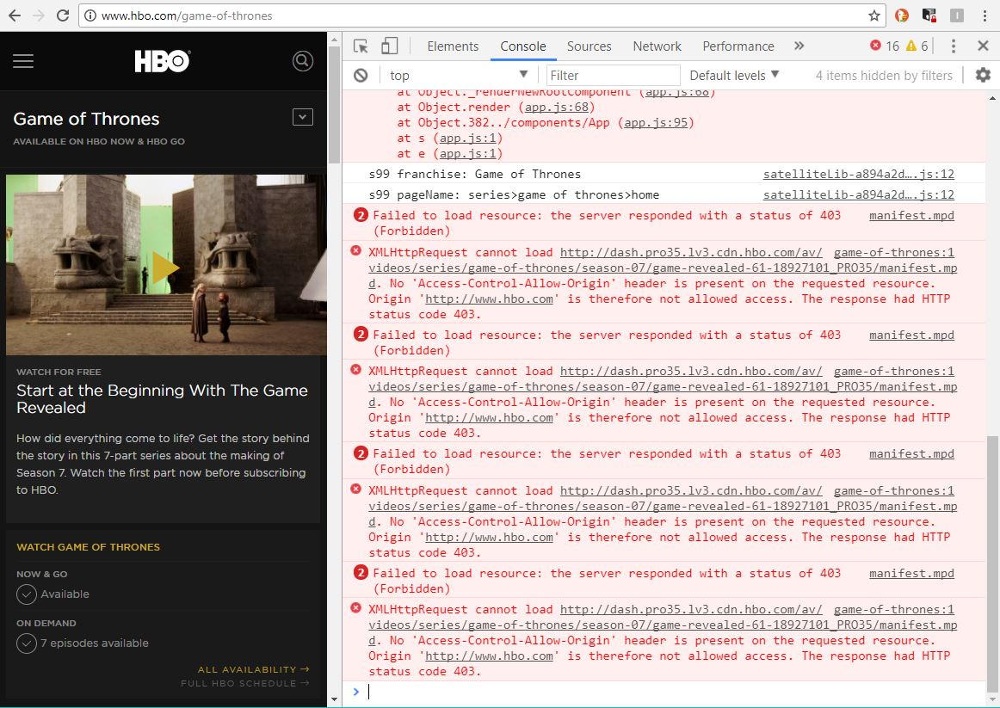
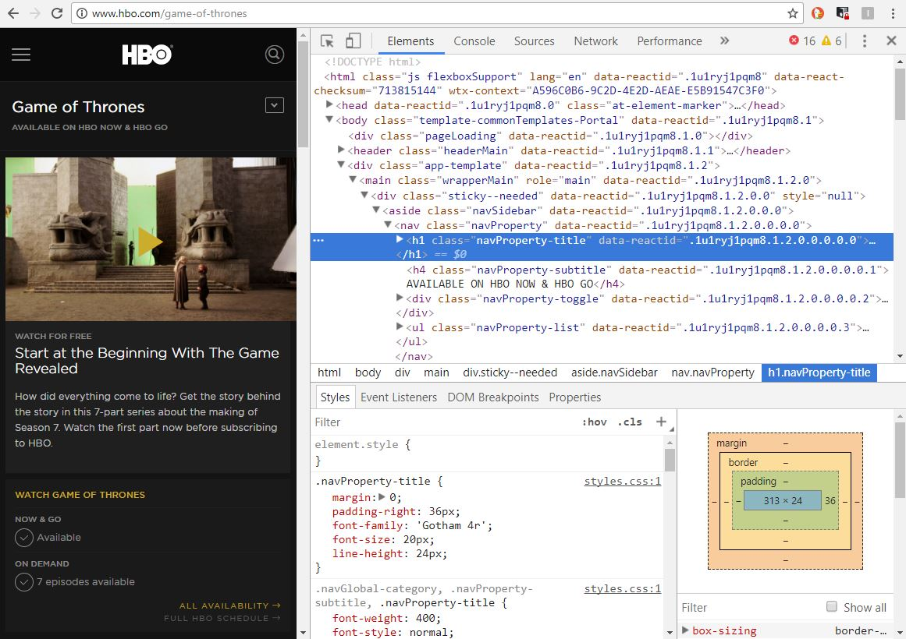
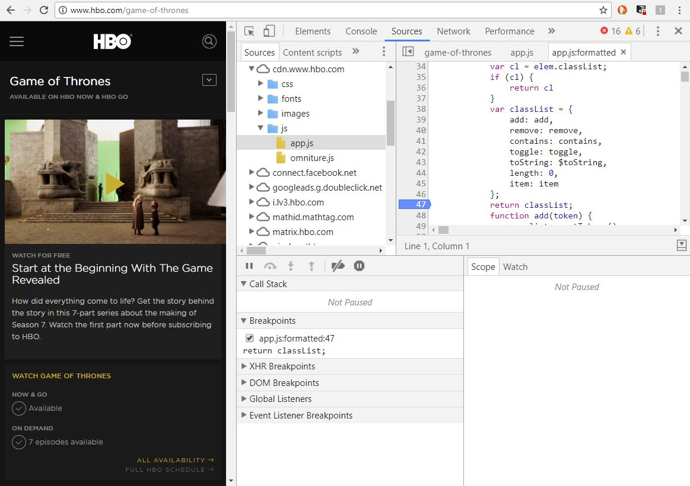

# C. les devtools <!-- omit in toc -->

_**Lorsque l'on développe en JS, les outils de debug dont on dispose nous sont fournis par le navigateur. Tous les navigateurs (même Internet Explorer...) disposent d'outils de développement. Sur Chrome, pour les afficher c'est donc, comme vu plus haut, la touche <kbd>F12</kbd>. On peut également les afficher en faisant un clic droit dans la page et en cliquant sur "Inspecter l'élément".**_

### IMPORTANT !! <!-- omit in toc -->
**Pendant les TP gardez TOUJOURS les outils de développement (_et notamment la console_) ouverts, ça vous sauvera la vie !**

## Sommaire <!-- omit in toc -->
- [C.1. La console](#c1-la-console)
- [C.2. L'inspecteur d'éléments](#c2-linspecteur-déléments)
- [C.3. L'onglet Sources](#c3-longlet-sources)

## C.1. La console
La console sert à afficher les instructions `console.log()` mais aussi les erreurs éventuelles dans votre code (vous me direz que ce n'est pas la peine, que vous ne faites jamais d'erreur, mais on sait tous les deux que c'est un mensonge, *"n'est-ce pas ?"*).



La méthode `console.log()` peut recevoir plusieurs paramètres, ils seront dans ce cas affichés les un après les autres, séparés par un espace. Remplacez le `console.log(...);` du `main.js` par :
```js
console.log('Welcome to ', {title:'PizzaLand', emoji: '🍕'});
```

En fait l'objet `console` est un objet global qui contient la méthode `.log()` mais aussi d'autres méthodes qui permettent d'avoir un rendu différent et de filtrer les messages. Essayez les méthodes suivantes et constatez le résultat dans la console :
- `console.warn('Oh oh attention')`
- `console.error('fatal error lol')`
- `console.clear()`
- `console.table([['Walter','White'],['Skyler','White'],['Saul','Goodman']])`

Enfin, **la console permet de tester rapidement du code JS grâce à un champ de saisie**. Tapez-y l'instruction `42+"12"-10` puis <kbd>Entrée</kbd>. Le résultat s'affiche directement dans la console. Incroyable !

## C.2. L'inspecteur d'éléments

L'inspecteur d'éléments permet de consulter ET de manipuler le code HTML et CSS de la page.



Il sera utile pour vérifier que le code HTML que va générer votre JS correspond bien à ce qui est attendu.

## C.3. L'onglet Sources
L'onglet sources permet d'inspecter le code JavaScript de la page, de placer des breakpoints et de stopper l'exécution du code quand une erreur survient. Quand l'exécution du JS est stoppée, on peut consulter les valeurs des variables locales et globales, voir la call-stack, etc.

C'est probablement l'onglet des devtools le plus important lorsqu'on développe en JavaScript.



Pour l'utiliser, commencez par ajouter dans le fichier `main.js`, le code suivant :
```js
const what = 'door';
console.log('Hold', 'the', what );
```

1. **Ajout d'un breakpoint**

	Rechargez la page, puis dans l'onglet "Sources" sélectionnez le fichier `main.js` (dans le panneau de gauche), puis cliquez sur le numéro de la 2e ligne :
	```js
	console.log('Hold', 'the', what );
	```

	Une flèche bleue a du s'afficher à côté du numéro de ligne ce qui signifie qu'un breakpoint a été ajouté. Comme le code en question s'est déjà exécuté (_puisque notre JS se lance au chargement de la page_), rechargez la page pour que le code s'exécute à nouveau et déclenche cette fois notre breakpoint.

	**Une fois la page rechargée, l'exécution est maintenant interrompue**, et il est possible de voir à droite, dans l'onglet "Scope", les valeurs des variables locales et notamment de la constante `what`. Vous pouvez aussi consulter la valeur des variables au survol de la variable directement dans le code !

	Pour reprendre l'exécution de la page, cliquez sur le bouton play bleu.

	Cliquez ensuite à nouveau sur le numéro de la 2e ligne pour enlever le breakpoint.

2. **L'instruction `debugger;`**

	Au lieu d'ajouter manuellement un breakpoint comme on vient de le faire, il est possible de déclarer un breakpoint directement dans le code à l'aide d'un instruction JS : `debugger;`.

	Modifiez le code de votre application comme ceci : (_notez l'instruction `debugger` qu'on a insérée entre les 2 lignes de code de notre fichier_)
	```js
	const what = 'door';
	debugger;
	console.log('Hold', 'the', what );
	```

	Rechargez la page à nouveau avec les devtools ouverts, et constatez que l'exécution s'est arrêtée automatiquement sans avoir eu besoin de mettre de point d'arrêt manuel ! Pratique !

	Voilà, vous connaissez les principales façons de mettre des breakpoints, supprimez l'instruction `debugger;` et rechargez la page.

## Étape suivante <!-- omit in toc -->
Maintenant que vous avez vu les principaux devtools offerts par les navigateurs, attaquons nous au code à proprement parler avec quelques exercices sur les chaînes de caractères : [D. Les chaînes de caractères](D-chaines.md)