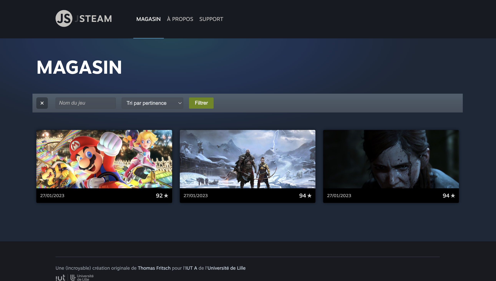
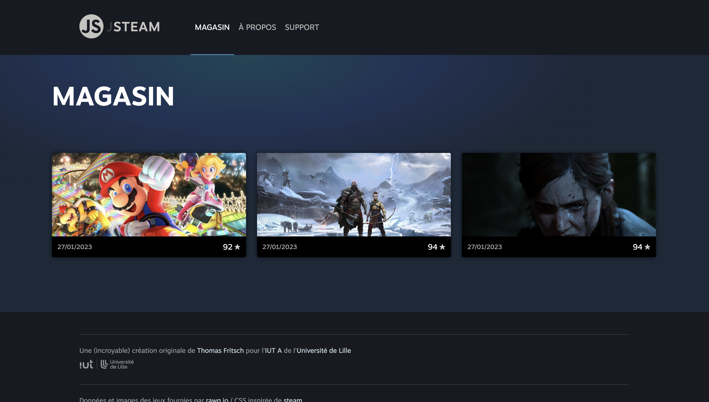

# C. Les événements de l'API DOM <!-- omit in toc -->

_**Maintenant que l'on sait sélectionner et modifier des éléments de la page HTML, voyons comment réagir aux actions de l'utilisateurs avec les événements.**_

## Sommaire <!-- omit in toc -->
- [C.1. Rappels](#c1-rappels)
- [C.2. Afficher/masquer un élément](#c2-affichermasquer-un-élément)
- [C.3. Navigation en JS : Le menu](#c3-navigation-en-js-le-menu)
	- [C.3.1. Détecter le clic](#c31-détecter-le-clic)
	- [C.3.2. Modifier le titre](#c32-modifier-le-titre)
	- [C.3.3. Activer le lien cliqué](#c33-activer-le-lien-cliqué)
	- [C.3.4. Afficher la bonne page](#c34-afficher-la-bonne-page)
	- [C.3.5. Routing](#c35-routing)
	- [C.3.6. Routing](#c36-routing)
	- [C.3.1. Le principe du Routing](#c31-le-principe-du-routing)
	- [C.3.2. Mise en oeuvre](#c32-mise-en-oeuvre)


## C.1. Rappels
**Le système d'événements en JS permet de réagir à des actions de l'utilisateur (_survol d'un élément, click sur un lien, soumission d'un formulaire, etc._) ou à des événements déclenchés par le navigateur (_fin du chargement de la page ou d'une image, etc._).**

Comme vu en cours (_cf. pdf du cours sur moodle_) on peut **associer une fonction à un événement grâce à la méthode [`addEventListener()`](https://developer.mozilla.org/fr/docs/Web/API/EventTarget/addEventListener)** de la classe `Element`.

Par exemple, pour déclencher une fonction nommée `handleClick` lors du clic sur le premier lien de la page, on peut écrire :
```js
function handleClick( event ) {
	event.preventDefault(); // empêche le rechargement de la page
	console.log(event);
}
const link = document.querySelector('a'); // sélectionne le premier lien de la page
link.addEventListener('click', handleClick); // écoute l'événement
```

**Notez que comme vu en cours :**
1. Le 2e paramètre que l'on passe à `addEventListener` est une **référence de la fonction `handleClick`** (_son nom_) et pas l'exécution de la fonction (`handleClick()` _avec les parenthèses_).
2. Cette fonction que l'on passe en paramètre c'est ce que l'on appelle une **fonction de callback**.
3. La fonction de callback qui est passée à `addEventListener()` **reçoit automatiquement en paramètre un objet de type [`Event`](https://developer.mozilla.org/en-US/docs/Web/API/Event)**
4. À l'intérieur de cette fonction de callback, il faut presque systématiquement (_sauf cas très particuliers_) **appeler en premier lieu la méthode `event.preventDefault()`** : cette méthode permet d'éviter que le navigateur n'exécute le traitement par défaut de l'événement (_par exemple rediriger l'utilisateur vers une nouvelle page lorsqu'il clique sur un lien, recharger la page lorsqu'il soumet un formulaire, etc._).

## C.2. Afficher/masquer un élément
**Il existe plusieurs façons de gérer la navigation en JS.**

**On peut soit générer du code HTML entièrement en JS et l'injecter dans la page (_comme on le fait déjà pour la liste des jeux_) soit se contenter d'afficher/masquer des portions de la page déjà présentes dans le code html.** \
**C'est cette deuxième technique que l'on va maintenant travailler en ajoutant à notre application un formulaire de recherche.**

1. **Dans le fichier `index.html`, localisez la balise suivante :**
	```html
	<article class="gameList"></article>
	```
	C'est cette balise dans laquelle on affiche la liste des jeux à l'aide de la ligne du `main.js` :
	```js
	document.querySelector('.gameList').innerHTML = html;
	```

	Ce qu'on va faire, c'est modifier le code HTML de cette balise de façon à avoir dedans à la fois la liste des jeux mais aussi, en plus, un mini formulaire de recherche.

	

	Ajoutez à l'**INTERIEUR** de cette balise `<article class="gameList">` le code HTML suivant (_à la main, en "dur" dans le fichier `index.html`, pas en JS !_) :
	```html
	<header class="searchBar">
		<button class="toggleSearchButton">Rechercher</button>
		<form class="searchForm" style="display: none;">
			<input type="text" name="search" placeholder="Nom du jeu"/>
			<select name="ordering">
				<option value="">Tri par pertinence</option>
				<option value="-metacritic">Tri par note</option>
				<option value="-released">Tri par date de sortie</option>
			</select>
			<button type="submit">Filtrer</button>
		</form>
	</header>
	<section class="results"></section>
	```

	On a rajouté dans la base `gameList` un `<header>` et une `<section class="results">`, mais si vous affichez la page dans le navigateur, rien n'a changé :

	

	Vous avez une idée de pourquoi ? Inspectez le code html généré dans les devtools du navigateur...

	En fait l'explication est "simple" : l'instruction `document.querySelector('.gameList').innerHTML = html;` dont on parlait tout à l'heure **ÉCRASE** tout le code HTML qu'on a mis en dur dans le `index.html`. 😭

	Pour résoudre ce problème il faut modifier la balise dans laquelle on affiche les jeux : ce ne doit plus être la balise `<article class="gameList">` mais `<section class="results"></section>` qui se trouve dans `gameList`.

	Corrigez donc le sélecteur passé à `querySelector` pour pointer vers la bonne balise, cette fois le rendu devrait ressembler à ceci

	


	> _**NB:** Vous noterez que seul le bouton avec la "loupe" s'affiche, il s'agit du `<button class="toggleSearchButton">Rechercher</button>`._
	>
	> _La balise `<form class="searchForm" style="display: none;">` est elle masquée "à cause" du `style="display:none"` qui lui est appliqué._
	>
	> On va voir comment l'afficher.

2. **Dans `src/main.js` commencez par détecter le clic sur le bouton "loupe" à l'aide de la méthode `addEventListener`.**

	Contentez-vous pour l'instant d'afficher un message de votre choix dans la console lorsqu'on clique sur le bouton.

3. **Si vous arrivez bien à détecter le clic, vous pouvez maintenant tenter d'afficher (_toujours au clic sur le bouton_) le formulaire de recherche** à l'aide de la méthode `setAttribute()`.

	> _**NB1 :** Pour afficher une balise qui est en `display:none`, vous pouvez remplacer la valeur du style `display` par `''` (chaîne vide)._

	> _**NB2 :** Pour manipuler les styles vous pouvez aussi utiliser la propriété [`myElement.style` _(mdn)_](https://developer.mozilla.org/en-US/docs/Web/API/CSS_Object_Model/Using_dynamic_styling_information#modify_an_element_style) qui permet d'agir sur l'attribut `style="..."` de manière un peu plus simple qu'avec `setAttribute()`._

	> _**NB3 :** Plus "bourrin" mais qui peut fonctionner aussi dans ce cas là, il existe aussi une méthode [`myElement.removeAttribute()` _(mdn)_](https://developer.mozilla.org/fr/docs/Web/API/Element/removeAttribute)..._

4. **Maintenant que vous arrivez à afficher le formulaire, ce serait pas mal si l'on pouvait, toujours au clic sur le bouton "loupe", masquer à nouveau le formulaire.**

	Modifiez la fonction déclenchée au clic sur le bouton "loupe" pour faire en sorte de masquer le formulaire s'il est affiché et inversement.

5. **Pour peaufiner tout ça, on va terminer cette partie de l'exercice en modifiant le rendu du bouton "loupe"** : quand le formulaire est affiché, on va montrer à l'utilisateur qu'il peut à nouveau cliquer sur ce bouton pour masquer le formulaire en remplaçant l'icône "loupe" par une "croix".

	Rassurez-vous, la CSS est déjà prête, tout ce que vous avez à faire c'est **d'ajouter sur le bouton la classe CSS `"opened"` quand le formulaire est affiché**, et de l'enlever quand il est masqué.\
	Facile ?

	

## C.3. Navigation en JS : Le menu

_**Pour vérifier si vous avez bien compris le principe, on va maintenant essayer d'appliquer tout ça au menu de navigation.**_

Décomposons un peu le problème

### C.3.1. Détecter le clic

1. **Commencez par détecter le clic sur deuxième lien du menu ("À PROPOS") et au clic, affichez dans la console le texte `"À PROPOS"`.**

	> _Contrairement à l'exercice C.2. où l'on cliquait sur une balise `<button>` on clique cette fois sur un lien `<a href="...">`. La conséquence c'est que lorsqu'on clique sur le lien le navigateur vous redirige vers l'URL contenue dans son `href`._
	>
	> _On n'aurait pas vu tout à l'heure une méthode pour éviter ce comportement et dire au navigateur d'ignorer le clic ???_

2. **Ajoutez sur le même modèle un écouteur de clic pour les 2 autres liens du menu : "MAGASIN" et "SUPPORT"**

	> _Bien sûr quand on clique sur le lien "MAGASIN" il faut que ce soit "MAGASIN" et pas "À PROPOS" qui s'affiche dans la console... même chose pour le lien "SUPPORT" !_

3. **Plutôt que d'avoir les chaînes à afficher dans la console en dur (_et donc 3 fonctions de click différentes_), on va optimiser un peu notre code :**
	- utilisez la **même** fonction de callback pour les 3 `addEventListener`
	- plutôt que d'avoir 3 `querySelector` différents (_1 pour chaque lien_) utilisez plutôt un seul `querySelectorAll` pour récupérer d'un coup tous les liens contenus la balise `<ul class="mainMenu">` et faites une boucle dessus pour écouter le click sur chaque lien
	- pour récupérer le texte du lien sur lequel on a cliqué, vous aurez besoin de la propriété [`event.currentTarget` _(mdn)_](https://developer.mozilla.org/fr/docs/Web/API/Event/currentTarget) et de la propriété [`element.innerHTML` _(mdn)_](https://developer.mozilla.org/fr/docs/Web/API/Element/innerHTML)_

### C.3.2. Modifier le titre

_**Maintenant que l'on est capables de détecter le clic sur chaque lien du menu, modifions le contenu de la page en fonction de là où clique l'utilisateur !**_

Pour commencer, faites en sorte que à chaque fois qu'on clique sur un lien du menu, le contenu de la balise `<header class="viewTitle"></header>` soit remplacé par un `<h1>` dans lequel figure le texte du lien sur lequel on a cliqué.

Par exemple si je clique sur le lien "À PROPOS" je m'attends à avoir cet affichage :


### C.3.3. Activer le lien cliqué


### C.3.4. Afficher la bonne page

### C.3.5. Routing
problematique = lien logo > pas le bon titre donc passer par un tableau de correspondances path > titre+classe


### C.3.6. Routing

Pour approfondir cette technique de navigation et **permettre de passer d'une page à une autre**, je vous propose de nous appuyer sur la classe `Router` que vous avez développée lors du TP2 (_[D.3. Propriétés et méthodes statiques : La classe Router](https://gitlab.univ-lille.fr/js/tp2/-/blob/master/D-poo-avancee.md#d3-propri%C3%A9t%C3%A9s-et-m%C3%A9thodes-statiques-la-classe-router)_) et dont ma version se trouve dans ce repo (_vous pouvez la consulter dans [`src/Router.js`](./src/Router.js)_).

**Si vous n'aviez pas fait cette partie du TP2, voici quelques explications sur le fonctionnement de cette classe :**

### C.3.1. Le principe du Routing

**De manière générale, en web le terme "routing" ("routage" en français) désigne la façon dont une application décide de quelle page afficher à quel moment.**

Dans [de](https://laravel.com/docs/8.x/routing) [nombreux](https://reactrouter.com/) [frameworks](https://angular.io/guide/router) [de](https://guides.emberjs.com/release/routing/) [développement](https://router.vuejs.org/) (_frontend, [backend](https://symfony.com/doc/current/routing.html) ou [mobile](https://reactnavigation.org/) !_) ce mécanisme de **"routing"** est confié à ce qu'on appelle un **"router"** (_d'où le nom de notre classe_).

**Le principe d'un `Router` est toujours le même :**
- il dispose de la liste de **toutes les pages de l'application**
- **à chaque page** de la liste est associée **une "clé"** (_un "identifiant"_)
- au clic sur un lien, on envoie au `Router` **la clé de la page que l'on veut afficher**
- le `Router` cherche alors **la page correspondant à cette clé** puis l'affiche

Dans `pizzaland` j'ai choisi d'utiliser comme **clés** des morceaux d'URL, des "chemins" (_"path" en anglais_) : \
Si l'on prend le code actuellement dans `src/main.js`, on trouve ceci :
```js
Router.routes = [
	{ path: '/', page: pizzaList, title: 'La carte' }
];
```
> _**NB :** dans votre fichier il n'y a pas de sauts de ligne à cause du formatage de Prettier, mais j'en ai ajouté ici pour faciliter la compréhension_

**`Router.routes` est donc le tableau des pages de notre application dont on parlait tout à l'heure.**
(_Vous aurez remarqué qu'actuellement il n'y a qu'une seule page -`pizzaList`- mais justement le but du TP est d'en ajouter d'autres, patience !..._)

On voit donc que pour une page, on a en fait un objet littéral (_dictionnaire_) avec **3 propriétés** : la page à afficher, son titre **et notre fameuse "clé" : la propriété `"path"`**. On voit dans ce tableau, que pour la pizzalist le `path` est en fait l'URL `"/"`.

C'est la raison pour laquelle dans `src/main.js` vous trouverez la ligne :
```js
Router.navigate('/'); // affiche la liste des pizzas
```

Une fois que cette méthode `Router.navigate('/')` est appelée, le `Router` recherche dans son tableau `Router.routes` la page correspondant au `path` `"/"` puis l'affiche elle et son `title` dans le DOM (_via les propriétés `Router.contentElement` et `Router.titleElement` qui sont envoyées au Router au début de `src/main.js`_) cf. https://gitlab.univ-lille.fr/js/tp3/-/blob/master/src/Router.js#L14-21

> _Si ces explications ne sont pas claires pour vous, n'hésitez pas à consulter directement le code de la [classe `src/Router.js`](https://gitlab.univ-lille.fr/js/tp3/-/blob/master/src/Router.js) ou à demander de l'aide à votre professeur !_


### C.3.2. Mise en oeuvre

**L'objectif de l'exercice ici est simple : faire en sorte que lorsque l'utilisateur clique sur les liens du menu, on affiche la bonne page grâce à la méthode `Router.navigate()`.**


1. **Dans `src/main.js`, on va commencer par ajouter des pages dans notre application en plus de la pizzaList.** Commencez donc par remplacer la ligne :
	```js
	const pizzaList = new PizzaList([]);
	```
	par
	```js
	import Component from './components/Component';

	const pizzaList = new PizzaList(data),
		aboutPage = new Component('section', null, 'Ce site est génial'),
		pizzaForm = new Component('section', null, 'Ici vous pourrez ajouter une pizza');
	```
	> _**NB :** pour le moment on utilise pour ces 2 nouvelles pages des `Component` très simples, "en dur", mais on les passera dans des classes spécifiques plus tard._

	Tout le code qui concernait la `pizzaList` n'est plus nécessaire, vous pouvez supprimer les lignes :
	```js
	Router.navigate('/'); // affiche une page vide
	pizzaList.pizzas = data; // appel du setter
	```

	et ne conserver que le dernier `Router.navigate` :
	```js
	Router.navigate('/'); // affiche la liste des pizzas
	```

2. **Une fois ces pages créées, ajoutez les dans le tableau `Router.routes`** (_**AVANT** l'instruction `Router.navigate('/')`_) :
	```js
	Router.routes = [
		{ path: '/', page: pizzaList, title: 'La carte' },
		{ path: '/a-propos', page: aboutPage, title: 'À propos' },
		{ path: '/ajouter-pizza', page: pizzaForm, title: 'Ajouter une pizza' },
	];
	```
	> _**NB :** Vous voyez qu'ici on associe les path **`/a-propos`** à `aboutPage` et **`/ajouter-pizza`** à `pizzaForm`._
	>
	> _Ce n'est pas un hasard car si vous regardez les **URL des différents liens du menu dans le fichier `index.html`**, vous verrez que les `"path"` qu'on a donné à nos pages, correspondent en fait aux attributs `href="..."` des liens du menu. Ça va nous être évidemment très utile pour savoir **quel lien amène sur quelle page** !_

3. **Maintenant que notre `Router` est configuré avec la liste des pages de l'application, il faut encore qu'on arrive à détecter le clic sur les liens du menu**.

	On pourrait coder la détection du clic directement dans `src/main.js`, mais pour des raison de **[séparation des responsabilités _(wikipedia)_](https://fr.wikipedia.org/wiki/S%C3%A9paration_des_pr%C3%A9occupations)** je vous propose plutôt de coder tout ça dans le `Router`.

	> _**NB :** coder ça dans le `Router` permet de **centraliser** tout ce qui concerne la navigation : la détection du clic + le mécanisme de changement de page en lui-même (`Router.navigate()`). Quelle bonne idée !_

	Pour faire ça, je vous propose de créer ce qu'on appelle **un "setter"**. \
	Comme vu dans le [TP2 / D. POO avancée](https://gitlab.univ-lille.fr/js/tp2/-/blob/master/D-poo-avancee.md#d42-rappels-getterssetters) un setter est en fait **une méthode "déguisée" en propriété** ! Au lieu de faire `obj.setter(value)` on écrit `obj.setter = value`. Ça ne change pas grand chose au fonctionnement final, mais c'est une question de "design" de code.

	Dans le `src/main.js`, ajoutez donc la ligne suivante :
	```js
	Router.menuElement = document.querySelector('.mainMenu');
	```
	> _**NB :** grâce à cette ligne on envoie au Router une **référence vers la balise `<ul class="mainMenu">`**. C'est cette balise qui contient tout le menu de navigation. Cela permettra au Router de faire ses querySelector sur cette balise plutôt que sur `document` (risque d'écouter le clic sur les mauvais liens), en plus c'est cohérent avec le fonctionnement des autres propriétés `Router.titleElement` et `Router.contentElement`_

	Puis **collez dans le corps de la classe `Router`** le code de base du setter :
	```js
	static #menuElement; // propriété statique privée
	/**
	 * Setter qui indique au Router la balise HTML contenant le menu de navigation.
	 * Écoute le clic sur chaque lien et déclenche la méthode navigate.
	 * @param element Élément HTML qui contient le menu principal
	 */
	static set menuElement(element) { // setter
		this.#menuElement = element;
		// au clic sur n'importe quel lien (<a href>) contenu dans "element"
		// déclenchez un appel à Router.navigate(path)
		// où "path" est la valeur de l'attribut `href=".."` du lien cliqué
	}
	```

	À l'aide de ce setter, **détectez maintenant le clic sur n'importe quel lien du menu** (_actuellement il n'y a en a que 3, mais votre code doit fonctionner quelque soit le nombre de liens : il faudra donc une boucle_) et lorsqu'un clic est détecté **affichez dans la console l'attribut `href` du lien qui a été cliqué**. \
	Par exemple si l'utilisateur clique sur le lien **"À propos"**, la console doit afficher la chaîne de caractères **`"/a-propos"`** (_l'URL du lien_)

	> _**NB1 :** vous aurez besoin pour cela de la propriété [`event.currentTarget` _(mdn)_](https://developer.mozilla.org/fr/docs/Web/API/Event/currentTarget) et de la méthode [`element.getAttribute()` _(mdn)_](https://developer.mozilla.org/fr/docs/Web/API/Element/getAttribute)_

	> _**NB2 :** en cas de **problème de scope**, rappelez vous que dans un callback d'événement, la valeur de `this` est parfois modifiée ! Relisez donc la fin du paragraphe [C.1. Rappels](#c1-rappels), juste au cas où..._

4. **Pour terminer, maintenant que vous avez récupéré le `href` du lien cliqué, il ne vous reste plus qu'à invoquer la méthode `Router.navigate()` en lui passant en paramètre le `href` en question !**

	> _**NB :** Là aussi, si vous avez des difficultés à appeler `Router.navigate()` pour des questions **de scope**, relisez la fin du paragraphe [C.1. Rappels](#c1-rappels)..._

	Vérifiez que votre code fonctionne : quand l'utilisateur clique sur un lien du menu, **le contenu de la route correspondante doit s'afficher dans la page !**


## Étape suivante <!-- omit in toc -->
Maintenant que l'on est capable de détecter les actions de l'utilisateur et de modifier la page HTML en conséquence, attaquons nous à la gestion des formulaires : [D. Les formulaires](./D-formulaires.md).