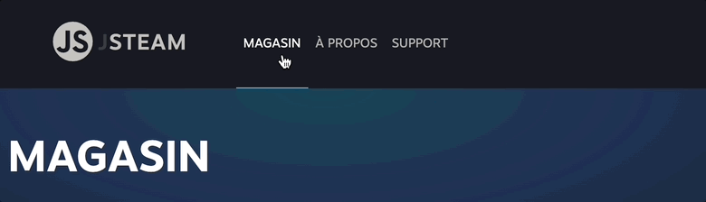
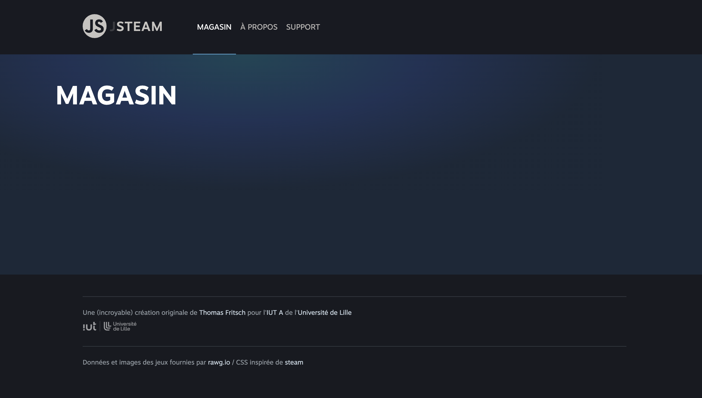
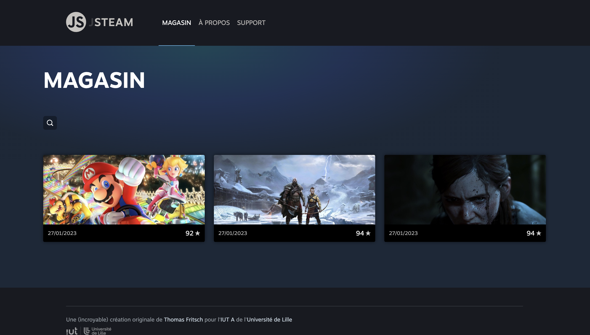

# C. Les événements de l'API DOM <!-- omit in toc -->

_**Maintenant que l'on sait sélectionner et modifier des éléments de la page HTML, voyons comment réagir aux actions de l'utilisateur avec les événements.**_

## Sommaire <!-- omit in toc -->
- [C.1. Rappels](#c1-rappels)
- [C.2. Afficher/masquer un élément](#c2-affichermasquer-un-élément)
- [C.3. Navigation en JS : le menu](#c3-navigation-en-js-le-menu)
	- [C.3.1. Détecter le clic](#c31-détecter-le-clic)
	- [C.3.2. Modifier le titre](#c32-modifier-le-titre)
	- [C.3.3. Activer le lien cliqué](#c33-activer-le-lien-cliqué)
	- [C.3.4. Afficher la bonne page](#c34-afficher-la-bonne-page)


## C.1. Rappels
**Le système d'événements en JS permet de réagir à des actions de l'utilisateur (_survol d'un élément, click sur un lien, soumission d'un formulaire, etc._) ou à des événements déclenchés par le navigateur (_fin du chargement de la page ou d'une image, etc._).**

Comme vu en cours (_cf. pdf du cours sur moodle_) on peut **associer une fonction à un événement grâce à la méthode [`addEventListener()`](https://developer.mozilla.org/fr/docs/Web/API/EventTarget/addEventListener)** de la classe `Element`.

Par exemple, pour déclencher une fonction nommée `handleClick` lors du clic sur le premier lien de la page, on peut écrire :
```js
function handleClick( event ) {
	event.preventDefault(); // empêche le rechargement de la page
	console.log(event);
}
const link = document.querySelector('a'); // sélectionne le premier lien de la page
link.addEventListener('click', handleClick); // écoute l'événement
```

**Notez que comme vu en cours :**
1. Le 2e paramètre que l'on passe à `addEventListener` est une **référence de la fonction `handleClick`** (_son nom_) et pas l'exécution de la fonction (`handleClick()` _avec les parenthèses_).
2. Cette fonction que l'on passe en paramètre c'est ce que l'on appelle une **fonction de callback**.
3. La fonction de callback qui est passée à `addEventListener()` **reçoit automatiquement en paramètre un objet de type [`Event`](https://developer.mozilla.org/en-US/docs/Web/API/Event)**
4. À l'intérieur de cette fonction de callback, il faut presque systématiquement (_sauf cas très particuliers_) **appeler en premier lieu la méthode `event.preventDefault()`** : cette méthode permet d'éviter que le navigateur n'exécute le traitement par défaut de l'événement (_par exemple rediriger l'utilisateur vers une nouvelle page lorsqu'il clique sur un lien, recharger la page lorsqu'il soumet un formulaire, etc._).

## C.2. Afficher/masquer un élément
**Il existe plusieurs façons de gérer la navigation en JS.**

**On peut soit générer du code HTML entièrement en JS et l'injecter dans la page (_comme on le fait déjà pour la liste des jeux_) soit se contenter d'afficher/masquer des portions de la page déjà présentes dans le code html.** \
**C'est cette deuxième technique que l'on va maintenant travailler en ajoutant à notre application un formulaire de recherche.**

1. **Dans le fichier `index.html`, localisez la balise suivante :**
	```html
	<article class="gameList"></article>
	```
	C'est cette balise dans laquelle on affiche la liste des jeux à l'aide de la ligne du `main.js` :
	```js
	document.querySelector('.gameList').innerHTML = html;
	```

	Ce qu'on va faire, c'est modifier le code HTML de cette balise de façon à avoir dedans à la fois la liste des jeux mais aussi, en plus, un mini formulaire de recherche.

	

	Ajoutez à l'**INTERIEUR** de cette balise `<article class="gameList">` le code HTML suivant (_à la main, en "dur" dans le fichier `index.html`, pas en JS !_) :
	```html
	<header class="searchBar">
		<button class="toggleSearchButton">Rechercher</button>
		<form class="searchForm" style="display: none;">
			<input type="text" name="search" placeholder="Nom du jeu"/>
			<select name="ordering">
				<option value="">Tri par pertinence</option>
				<option value="-metacritic">Tri par note</option>
				<option value="-released">Tri par date de sortie</option>
			</select>
			<button type="submit">Filtrer</button>
		</form>
	</header>
	<section class="results"></section>
	```

	On a rajouté dans la balise `gameList` un `<header>` et une `<section class="results">`, mais si vous affichez la page dans le navigateur, rien n'a changé, le formulaire n'apparaît pas :

	

	Est-ce que vous avez une idée de pourquoi ? Inspectez le code html généré dans les devtools du navigateur pour voir si le formulaire se trouve toujours là ou pas...

	<br/>
	<br/>
	<br/>

	En fait l'explication est "simple" : l'instruction `document.querySelector('.gameList').innerHTML = html;` dont on parlait tout à l'heure **ÉCRASE** tout le code HTML qu'on vient de mettre en dur dans le `index.html` et donc elle efface aussi notre formulaire de recherche. 😭

	Pour résoudre ce problème il faut modifier la balise dans laquelle on affiche les jeux : ce ne doit plus être la balise `<article class="gameList">` mais la balise ...

	```html
	<section class="results"></section>
	```
	... qui se trouve dans `gameList`.

	**Corrigez donc le sélecteur passé à `querySelector` pour pointer vers la bonne balise, cette fois le rendu devrait ressembler à ceci :**

	


	> _**NB:** Vous noterez que seul le bouton avec la "loupe" s'affiche, il s'agit de la balise :_
	> ```html
	> <button class="toggleSearchButton">Rechercher</button>
	> ```
	>
	> _La balise `<form class="searchForm" style="display: none;">` est en revanche masquée "à cause" du `style="display:none"` qui lui est appliqué._
	>
	> On va voir comment l'afficher au clic sur le bouton.

2. **Dans `src/main.js` commencez par détecter le clic sur le bouton "loupe" à l'aide de la méthode `addEventListener`.**

	Contentez-vous pour l'instant d'afficher un message de votre choix dans la console lorsqu'on clique sur le bouton.

3. **Si vous arrivez bien à détecter le clic, vous pouvez maintenant tenter d'afficher (_toujours au clic sur le bouton_) le formulaire de recherche** à l'aide de la méthode `setAttribute()`.

	> _**NB1 :** Pour afficher une balise qui est en `style="display: none;"`, vous pouvez simplement vider l'attribut style en remplaçant `display: none` par `''` (chaîne vide)._

	> _**NB2 :** Pour manipuler les styles vous pouvez aussi utiliser la propriété [`myElement.style` (mdn)](https://developer.mozilla.org/en-US/docs/Web/API/CSS_Object_Model/Using_dynamic_styling_information#modify_an_element_style) qui permet d'agir sur l'attribut `style="..."` de manière un peu plus simple qu'avec `setAttribute()`._

	> _**NB3 :** Plus "bourrin" mais qui peut fonctionner aussi dans ce cas là, il existe aussi une méthode [`myElement.removeAttribute()` (mdn)](https://developer.mozilla.org/fr/docs/Web/API/Element/removeAttribute)..._

4. **Maintenant que vous arrivez à afficher le formulaire, ce serait pas mal si l'on pouvait, toujours au clic sur le bouton "loupe", masquer à nouveau le formulaire.**

	Modifiez la fonction déclenchée au clic sur le bouton "loupe" pour faire en sorte de masquer le formulaire s'il est affiché et inversement.

5. **Pour peaufiner tout ça, on va terminer cette partie de l'exercice en modifiant le rendu du bouton "loupe"** : quand le formulaire est affiché, on va montrer à l'utilisateur qu'il peut à nouveau cliquer sur ce bouton pour masquer le formulaire en remplaçant l'icône "loupe" par une "croix".

	Rassurez-vous, la CSS est déjà prête, tout ce que vous avez à faire c'est **d'ajouter sur le bouton la classe CSS `"opened"` quand le formulaire est affiché**, et de l'enlever quand il est masqué.\
	Facile ?

	

## C.3. Navigation en JS : le menu

_**Pour vérifier si vous avez bien compris le principe, on va maintenant essayer d'appliquer tout ça au menu de navigation.**_

Décomposons un peu le problème

### C.3.1. Détecter le clic

1. **Commencez par détecter le clic sur deuxième lien du menu ("À PROPOS") et au clic, affichez dans la console le texte `"À PROPOS"`.**

	> _Si vous avez une erreur 404 quand vous cliquez sur le lien, pensez que contrairement à l'exercice C.2. où l'on cliquait sur une balise `<button>`, on clique cette fois sur un lien `<a href="...">`. La conséquence c'est que lorsqu'on clique sur le lien le navigateur vous redirige vers l'URL contenue dans son `href`..._
	>
	> _On n'aurait pas vu tout à l'heure une méthode pour **éviter ce comportement et dire au navigateur d'ignorer le clic** ???_

2. **Ajoutez sur le même modèle un écouteur de clic pour les 2 autres liens du menu : "MAGASIN" et "SUPPORT"**

	> _Bien sûr quand on clique sur le lien "MAGASIN" il faut que ce soit "MAGASIN" et pas "À PROPOS" qui s'affiche dans la console... même chose pour le lien "SUPPORT" !_

3. **Plutôt que d'avoir les chaînes à afficher dans la console en dur (_et donc 3 fonctions de click différentes_), on va optimiser un peu notre code :**
	- plutôt que d'avoir 3 `querySelector` différents (_1 pour chaque lien_) utilisez plutôt un seul `querySelectorAll` pour récupérer d'un coup tous les liens contenus la balise `<ul class="mainMenu">` et faites une boucle dessus pour écouter le click sur chaque lien
	- utilisez donc la **même** fonction de callback pour les 3 liens
	- pour récupérer le texte du lien sur lequel on a cliqué, vous aurez besoin de la propriété [`event.currentTarget` _(mdn)_](https://developer.mozilla.org/fr/docs/Web/API/Event/currentTarget) et de la propriété [`element.innerHTML` _(mdn)_](https://developer.mozilla.org/fr/docs/Web/API/Element/innerHTML)_

### C.3.2. Modifier le titre

_**Maintenant que l'on est capables de détecter le clic sur chaque lien du menu, modifions le contenu de la page en fonction de là où clique l'utilisateur !**_

Pour commencer, faites en sorte qu'à chaque fois qu'on clique sur un lien du menu, le contenu de la balise `<header class="viewTitle"></header>` soit remplacé par un `<h1>` dans lequel figure le texte du lien sur lequel on a cliqué.

Par exemple si je clique sur le lien "À PROPOS" je m'attends à avoir cet affichage :


### C.3.3. Activer le lien cliqué

**On a vu dans la partie [B.2.2. getAttribute/setAttribute](./B-les-bases.md#b22-getattributesetattribute) que lorsqu'on ajoutait une classe "active" sur les liens du menu, le style du lien changeait** (_changement de couleur + ajout d'un souligné bleu_)

L'idée maintenant c'est d'ajouter cette classe "active" sur les liens lorsqu'on clique dessus.

1. **Ajoutez la classe CSS "active"** sur la balise `<a>` sur laquelle l'utilisateur a cliqué.

	> _**NB :** Pour simplifier le travail, plutôt que d'utiliser l'instruction `setAttribute('class', ...)` **je vous recommande plutôt la propriété [`element.classList` (mdn)](https://developer.mozilla.org/fr/docs/Web/API/Element/classList) et ses méthodes `element.classList.add()` et `element.classList.remove()`** qui permettent de ne pas se soucier des autres classes CSS déjà présentes sur les balises en plus de la classe `"active"`_

2. **enlevez la classe `"active"` sur le précédent lien actif** (de manière à n'avoir qu'un seul lien actif à la fois)




### C.3.4. Afficher la bonne page

Notre navigation fonctionne presque totalement, le lien cliqué s'active, le titre change : il ne reste plus qu'à faire en sorte que le contenu de la page change aussi !

Dans le fichier `index.html`, inspectez le contenu de la balise `<div class="viewContent">` :

```html
<div class="viewContent">
	<article class="gameList">
		<header class="searchBar">
			<!-- ... -->
		</header>
		<section class="results"></section>
	</article>
	<article class="gameDetail"></article>
	<article class="about"></article>
	<article class="help"></article>
</div>
```

Vous voyez qu'on a, en plus de la `gameList`, 3 autres balises `<article>` : on en a notamment une pour la page "À PROPOS" (`<article class="about">`) et une autre pour la page "SUPPORT" (`<article class="help">`).

Ce qu'on va faire maintenant c'est modifier notre pour que :
- Seule une des 4 balises `<article>` soit visible à la fois
- Quand on clique sur un lien du menu, la balise `<article>` correspondante s'affiche et les autres se masquent


1. **Commencez par modifier le fichier `index.html` (_à la main, pas en JS_) pour ajouter la classe CSS "activeOnly" à la balise `<div class="viewContent">`** :

	```html
	<div class="viewContent activeOnly">
	```

	> _Cette classe CSS est configurée dans le fichier `css/main.css` et permet de masquer toutes les balises `<article>` enfants_

	Ajoutez aussi du texte dans les autres balises `<article>` pour qu'on ait un contenu qui s'affiche dans la page lorsque tout fonctionnera.\
	**Toujours en dur dans le fichier `index.html` ajoutez du texte dans ces balises `<article>` :**

	```html
	<article class="gameDetail">Contenu de la vue "Détail"</article>
	<article class="about">Contenu de la vue "À propos"</article>
	<article class="help">Contenu de la vue "Support"</article>
	```

	A ce stade, la `gameList` et les 3 autres balises `<article>` doivent avoir disparu :

	

2. **Pour ré-afficher la gameList, ajoutez maintenant _EN JS_ (_dans le `main.js` donc_) la classe CSS `"active"` sur la balise `<article class="gameList">`.**

	> _**NB :** Comme pour les liens du menu de navigation (cf. [C.3.3. Activer le lien cliqué](#c33-activer-le-lien-cliqué)) **je vous recommande d'utiliser la propriété [`element.classList` (mdn)](https://developer.mozilla.org/fr/docs/Web/API/Element/classList)** et ses méthodes `element.classList.add()` et `element.classList.remove()`_

	La gameList est en principe à nouveau visible :

	

3. **Lorsqu'on clique sur un lien du menu de navigation affichez dans la console l'attribut `href` du lien qui a été cliqué**. \
	Par exemple si l'utilisateur clique sur le lien **"À PROPOS"**, la console doit afficher la chaîne de caractères **`"/about"`** (_l'URL du lien_)

	> _**NB :** vous aurez besoin pour cela de la méthode [`element.getAttribute()` (mdn)](https://developer.mozilla.org/fr/docs/Web/API/Element/getAttribute)_

4. **Maintenant que vous avez récupéré le `href` du lien cliqué, vous devez être capable de trouver la balise `article` qui lui correspond.**

	En effet, si on regarde bien, **l'attribut `href`** du lien "À PROPOS" est **`/about`**.

	Comme par hasard, **la classe CSS** de la balise `article` à afficher est justement **`class="about"`** (_idem pour la page "Support" / "help"_)

	Une fois que vous avez réussi à trouver la balise correspondant au lien cliqué, il ne vous reste plus qu'à lui ajouter la classe CSS `"active"` comme on l'a fait il y a quelques instants pour la `gameList`.

5. **Pour terminer retirez la classe `"active"` de la balise `<article>` qui était précédemment affichée !**

	Vérifiez que votre code fonctionne : quand l'utilisateur clique sur un lien du menu, **le contenu de la vue correspondante doit s'afficher dans la page !**

	

## Étape suivante <!-- omit in toc -->
Maintenant que l'on est capable de détecter les actions de l'utilisateur et de modifier la page HTML en conséquence, attaquons nous pour terminer à la gestion des formulaires : [D. Les formulaires](./D-formulaires.md).