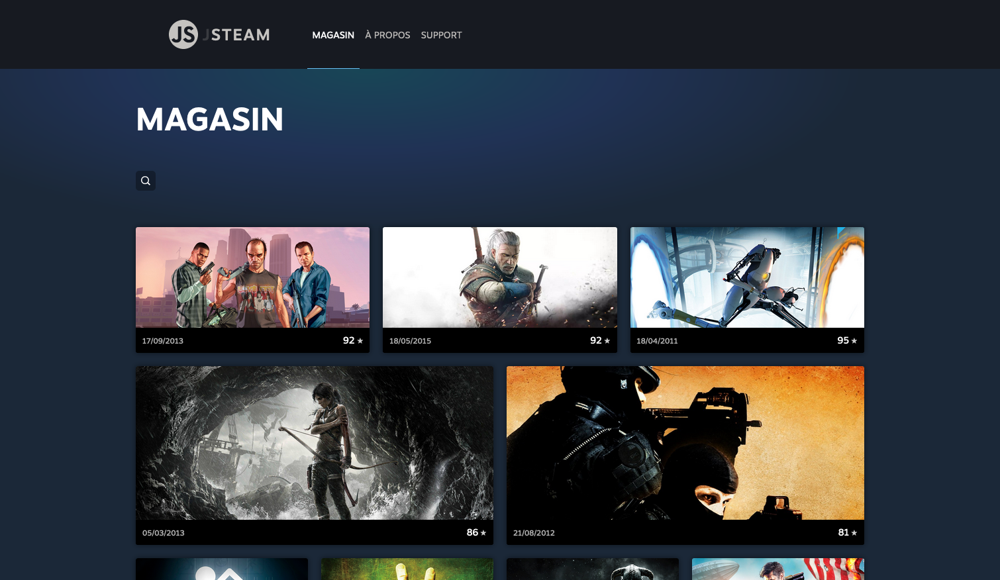
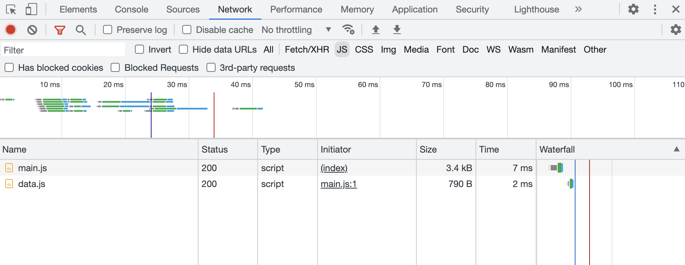
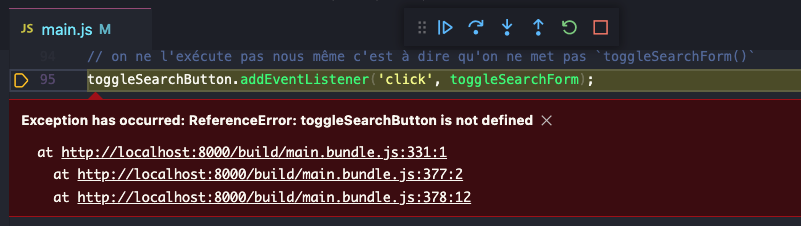
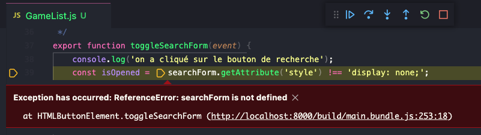
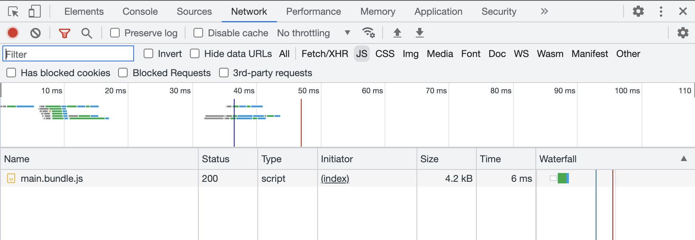
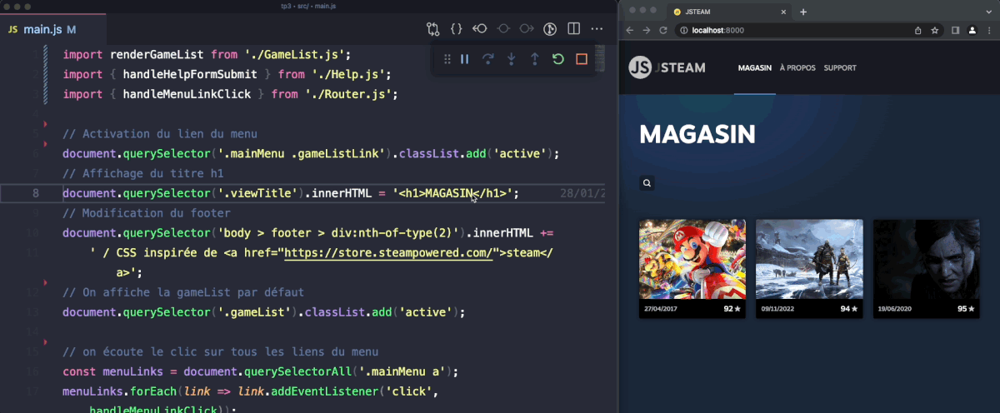
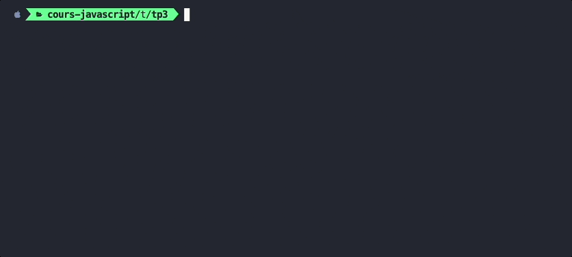

# C. Les modules <!-- omit in toc -->

_**Notre application JSteam a pas mal progressé lors du précédent TP (navigation entre plusieurs pages, formulaire de contact, formulaire de recherche et de tri des jeux, ...).**_

Malheureusement toutes ces fonctionnalités ont été rajoutées dans le seul fichier `main.js` : **ça commence par conséquent à être un peu le "bazar" puisque tout est mélangé.**

**L'objectif de ce chapitre va être de nous permettre de mieux organiser notre code en le répartissant dans plusieurs fichiers grâces aux modules ES6.**

## Sommaire <!-- omit in toc -->
- [C.1. Rappels](#c1-rappels)
- [C.2. Support natif dans les navigateurs modernes](#c2-support-natif-dans-les-navigateurs-modernes)
- [C.3. Réorganisation du code](#c3-réorganisation-du-code)
- [C.4. Webpack : Utiliser un bundler](#c4-webpack-utiliser-un-bundler)
- [C.5. Webpack : mode dev vs mode prod](#c5-webpack-mode-dev-vs-mode-prod)
- [C.6. Webpack : Live reload](#c6-webpack-live-reload)

## C.1. Rappels
**Comme vu en cours, le système de modules ES6 permet de répartir son code dans plusieurs fichiers et de gérer les dépendances de l'application fichier par fichier** (_plutôt que d'avoir à maintenir une longue liste de balises `<script>` dans le fichier html_).

Par exemple, si l'on a deux fichiers `main.js` et `vehicle.js`, on peut partager une variable de l'un à l'autre grâce aux instructions `import` et `export` :
```js
// vehicle.js
const vehicle = 'the RV';
export default vehicle;
```
```js
// main.js
import vehicle from './vehicle.js';
console.log( vehicle ); // 'The RV'
```

Le [support navigateur des modules ES6](https://caniuse.com/#feat=es6-module) est plutôt bon mais encore un peu juste pour des applications grand public *(absence de support sur IE et android 4.4)*.

<a href="http://caniuse.com/#feat=es6-module">
	<picture>
		<source type="image/webp" srcset="https://caniuse.bitsofco.de/image/es6-module.webp">
		<source type="image/png" srcset="https://caniuse.bitsofco.de/image/es6-module.png">
		
	</picture>
</a>

Dans un premier temps nous ferons abstraction de ces questions de compatibilité et nous nous appuierons sur le fait que **les dernières versions de Chromium/Chrome et de FireFox supportent nativement les modules ES6**.

Nous verrons plus tard dans le TP comment rendre nos modules compatibles avec les vieux navigateurs grâce à Webpack.

## C.2. Support natif dans les navigateurs modernes
1.  **Avant d'utiliser le système de modules et les instructions `import`/`export`, il faut d'abord indiquer au navigateur que notre fichier `main.js` est lui-même un module.** Pour cela, ajoutez un attribut `type="module"` dans la balise `<script>` du fichier `index.html` :
	```html
	<script type="module" src="build/main.js"></script>
	```
	> _**NB :** Vous noterez que l'attribut `"defer"` n'est plus nécessaire car il est implicite pour les modules !_

2. **Il faut ensuite configurer Babel.** En effet, par défaut Babel va chercher à compiler toutes les instructions `import` et `export` qu'il trouvera pour les transformer en code compatible ES5. Ici on veut utiliser le support natif du navigateur pour les modules ES6, par conséquent il faut indiquer à Babel de ne pas compiler les `import`/`export`.<br>
	Modifiez le fichier `.babelrc` comme suit (**attention: notez bien le tableau dans un tableau !**) :
	```json
	{
		"presets": [
			["@babel/env", {"modules": false}]
		]
	}
	```
	Pour prendre en compte la nouvelle configuration de Babel, **stoppez (<kbd>CTRL</kbd>+<kbd>C</kbd>) puis relancez** la compilation à l'aide de la commande `npm run watch`

3. Si pour les modules avec webpack (cf. suite du TP) on peut omettre l'extension du fichier qu'on importe, ce n'est pas le cas avec les modules "dans le navigateur" comme on s'apprête à le faire : il faut obligatoirement préciser à chaque `import ... from ...` l'extension `.js` après le nom du fichier.

	Pour que vscode vous aide à créer les instructions import correctement, ajoutez la clé `"javascript.preferences.importModuleSpecifierEnding"` dans votre fichier `.vscode/settings.json` (_créé au précédent TP_) comme ceci (_attention à la virgule sur la ligne précédente_) :

	```diff
	{
		"[javascript]": {
			"editor.formatOnSave": true,
	-		"editor.defaultFormatter": "esbenp.prettier-vscode"
	+		"editor.defaultFormatter": "esbenp.prettier-vscode",
	+		"javascript.preferences.importModuleSpecifierEnding": "js"
		}
	}
	```


4.  **Créez votre premier module en externalisant la constante `data` dans un module ES6 distinct `src/data.js`.**

	> _**NB1 :** Rappelez vous : tout ce qui est défini dans un module (variables, fonctions, classes), n'existe qu'à l'intérieur de ce module **SAUF** s'il est exporté, puis importé dans un autre fichier._

	> _**NB2 :** Exporter **par défaut** une constante sur la même ligne que sa création est interdit (cf. la Bible : [stackoverflow](https://stackoverflow.com/a/36261387)):_
	> ```js
	> export default const data = [...]; // ERREUR !
	> ```
	> _Il faut obligatoirement faire cela en deux étapes :_
	> ```js
	> const data = [...];
	> export default data; // OK !
	> ```

	> _**NB3 :** Un export simple (pas par défaut) d'une const est en revanche autorisé :_
	> ```js
	> export const data = [...]; // OK !
	> ```

	> _**NB4 :** Cette restriction ne s'applique pas aux fonctions et aux classes ; on peut tout à fait faire :_
	> ```js
	> export default class Component {...} // OK !
	> ```
	> ```js
	> export default function checkValue(value){...} // OK aussi !
	> ```

5. **Compilez votre code et testez la page dans le navigateur** : le résultat doit être identique à celui obtenu précédemment :

	

6. **Ouvrez l'onglet Réseau/Network des devtools, vous devez normalement voir le chargement automatique des différents modules** (_une ligne par fichier JS_)

	

## C.3. Réorganisation du code

Maintenant que vous avez réussi à passer `data` dans un module distinct, on va pouvoir répartir le reste de notre code dans différents modules.

Passez successivement (_pensez à tester à chaque étape que tout fonctionne toujours !_) :
1. **la fonction `handleMenuLinkClick` dans un module `src/Router.js`** (_export nommé ie. sans le mot clé `défault`_)

	> _**NB :** On ne déplace ici que la **déclaration** de la fonction, **PAS** le `addEventListener` qui y fait référence !_
	>
	> _Même principe pour les prochaines fonctions à déplacer ci-dessous_
2. **la fonction `handleHelpFormSubmit` dans un module `src/Help.js`** (_export nommé ie. sans le mot clé `défault`_)
3. **la fonction `renderGameThumbnail` dans un module `src/renderGameThumbnail.js`** (_export default_)
4. **la fonction `renderGameList` (_export default_) dans un module `src/GameList.js`**

		> _la fonction renderGameList utilise des informations issues d'autres modules (notamment le tableau `data` et la fonction `renderGameThumbnail`) pensez donc à utiliser les bons import et à faire le ménage des imports désormais inutiles dans le `main.js` !_

5. **Passez enfin les fonctions `toggleSearchForm` et `handleSearchFormSubmit` dans le module `src/GameList.js`** créé précédemment.

	Rechargez la page dans votre navigateur et tentez d'afficher le formulaire de recherche : **une erreur se déclenche :**

	

	> _**NB :** si cette erreur n'est pas captée par vscode comme dans la capture ci-dessus, vérifiez que vous avez bien coché la case "Uncaught Exceptions" comme indiqué dans le point [B.2.2. Les points d'arrêt](./B-debug-vscode.md#b22-les-points-darrêt)_)

	En fait cette erreur est logique : on a déplacé dans `GameList.js` nos 2 fonctions sans remarquer que toutes les deux utilisaient des constantes définies dans le `main.js` : `searchForm` et `toggleSearchButton` (_qui sont 2 Element HTML_)

	On pourrait être tenté d'exporter ces 2 constantes depuis le `main.js` puis de les importer dans `GameList.js` mais on créerait alors des dépendances croisées entre ces deux fichiers (_`main.js` aurait besoin de `GameList.js`, et `GameList.js` aurait besoin de `main.js`_).

	Plutôt que de créer ce genre ["d'inception"](https://fr.wikipedia.org/wiki/Inception), déplacez ces 2 constantes dans le module `GameList` puis rechargez la page.

	

	😕

	Notre code continue de planter, la faute aux deux lignes suivantes du `main.js` :

	```js
	toggleSearchButton.addEventListener('click', toggleSearchForm);
	```
	et
	```js
	searchForm.addEventListener('submit', handleSearchFormSubmit);
	```

	**En effet ces deux lignes utilisent les constantes qu'on vient de déplacer.** On pourrait résoudre le problème en les exportant depuis `GameList.js` pour les importer ensuite dans le `main.js` mais je vous propose ici plutôt de passer ces deux lignes directement dans le module `GameList.js` ainsi pas besoin de rajouter des export/import supplémentaires et par ailleurs ça va nous arranger pour la suite des exercices.

	> ⚠️⚠️ _**Attention :**_ ⚠️⚠️ _un module ne devrait normalement contenir que des déclarations de fonctions, de classes ou des constantes "simples", et c'est le code qui "importe" le module qui décide de déclencher ou non, et à quel moment, les fonctions ou méthodes importées._
	>
	> _Ici on ajoute dans notre module des instructions qui vont s'exécuter automatiquement dès qu'on va l'importer, sans que le module appelant (celui dans lequel on a le `import`) ne fasse quoique ce soit : **c'est une mauvaise pratique qu'il ne faut surtout pas réitérer dans la vraie vie et qu'on essaiera de résoudre grâce à la POO dans le prochain chapitre**._


	Une fois tous déplacé, ne devraient rester dans votre `main.js` que les lignes suivantes :

	```js
	import renderGameList from './GameList.js';
	import { handleHelpFormSubmit } from './Help.js';
	import { handleMenuLinkClick } from './Router.js';

	// Activation du lien du menu
	document.querySelector('.mainMenu .gameListLink').classList.add('active');
	// Affichage du titre h1
	document.querySelector('.viewTitle').innerHTML = '<h1>MAGASIN</h1>';
	// Modification du footer
	document.querySelector('body > footer > div:nth-of-type(2)').innerHTML +=
		' / CSS inspirée de <a href="https://store.steampowered.com/">steam</a>';
	// On affiche la gameList par défaut
	document.querySelector('.gameList').classList.add('active');

	// on écoute le clic sur tous les liens du menu
	const menuLinks = document.querySelectorAll('.mainMenu a');
	menuLinks.forEach(link => link.addEventListener('click', handleMenuLinkClick));

	// rendu initial de la liste des jeux
	renderGameList();

	// on écoute la soumission du formulaire de contact
	const helpForm = document.querySelector('.helpForm');
	helpForm.addEventListener('submit', handleHelpFormSubmit);
	```

**On vient de le voir, répartir son code dans des modules, si on a pas pensé en amont aux dépendances des différentes fonctions les unes par rapport aux autres peut être parfois compliqué ! La partie sur la POO devrait nous aider à améliorer un peu tout ça.**

## C.4. Webpack : Utiliser un bundler


**Pour rendre nos modules compatibles avec les anciens navigateurs, il faut utiliser un "bundler".**

Le but d'un "bundler" est de rassembler tous les scripts de notre application (toutes les dépendances) en un seul gros fichier JS. Le navigateur n'ayant plus alors qu'un seul fichier à charger, il n'a plus à se soucier de charger lui-même les modules.

Comme vu en cours, le bundler le plus employé en JS est [Webpack](https://webpack.js.org/), c'est donc cet outil que l'on va installer et configurer.

1. **Dans le fichier `index.html`, retirez l'attribut `type="module"` de la balise script et remettez l'attribut `defer`.**

2. **Toujours dans `index.html`, remplacez le chemin vers le fichier `build/main.js` par `build/main.bundle.js`** (_c'est en effet assez courant de mettre "bundle" dans le nom des fichiers générés par un bundler comme webpack_).

3. **Installez webpack** : stoppez la commande `npm run watch` (<kbd>CTRL</kbd>+<kbd>C</kbd>) et tapez la commande suivante (_prenez garde à la lancer à la racine de votre TP, là où se trouve le fichier `package.json`_):
	```bash
	npm install --save-dev webpack webpack-cli babel-loader
	```
4. **Créez à la racine de votre TP un fichier `webpack.config.js`** (au même niveau que le `package.json` et le `.babelrc`) et placez y le code suivant :
	```js
	const path = require('path');

	module.exports = {
		// Fichier d'entrée :
		entry: './src/main.js',
		// Fichier de sortie :
		output: {
			path: path.resolve(__dirname, './build'),
			filename: 'main.bundle.js'
		},
		// compatibilité anciens navigateurs (si besoin du support de IE11 ou android 4.4)
		target: ['web', 'es5'],
		// connexion webpack <-> babel :
		module: {
			rules: [
				{
					test: /\.js$/, // tous les fichiers js ...
					exclude: /node_modules/, // ... sauf le dossier node_modules ...
					use: { // ... seront compilés par babel !
						loader: 'babel-loader',
					}
				}
			]
		},
		devtool: 'source-map'
	}
	```

5. **Modifiez les scripts `"build"` et `"watch"` du fichier `package.json` pour remplacer babel par webpack** (_notez quand même que **babel sera toujours utilisé mais en arrière plan** par webpack grâce au `webpack.config.js` que l'on vient d'écrire_):
	```json
	"build": "webpack --mode=production",
	"watch": "webpack --mode=development --watch"
	```
6. **Re-lancez la compilation** à l'aide de la commande `npm run watch` (*qui lancera cette fois webpack et non plus Babel puisqu'on a modifié le script du package.json*)

7. **Enfin, vérifiez dans le navigateur que la page s'affiche toujours** et que dans l'onglet "Réseau"/"Network" vous n'avez maintenant bien plus qu'un seul fichier JS téléchargé par le navigateur : le `build/main.bundle.js`

	

## C.5. Webpack : mode dev vs mode prod

Vous l'aurez peut-être remarqué, les deux scripts que l'on vient d'ajouter au fichier `package.json` utilisent un paramètre "mode" avec une valeur différente. Voyons l'impact de ce paramètre :

1. **Renommez** le fichier `build/main.bundle.js` en `build/main.bundle.dev.js`
2. Stoppez la commande `npm run watch` (<kbd>CTRL</kbd>+<kbd>C</kbd>) et **lancez à la place la commande `npm run build`**.
3. **Comparez** le fichier `main.bundle.js` généré avec le mode "production" et le `main.bundle.dev.js` qui avait été généré en mode "development". A votre avis, quelle est l'utilité du mode "production" ?
4. **Demandez au formateur qui encadre votre séance TP si vous avez vu juste avant de passer à la suite.**

## C.6. Webpack : Live reload
**Pour terminer ce chapitre sur les modules et puisqu'on vient d'installer webpack, je vous propose d'utiliser une fonctionnalité de webpack qui va nous simplifier la vie à savoir le ["webpack dev server" _(documentation)_](https://webpack.js.org/configuration/dev-server/).**

Jusque là pour lancer JSteam on avait besoin de 2 terminaux :
1. Un premier pour faire office de serveur http : `npx serve -l 8000`
2. Un deuxième pour lancer la compilation en arrière plan de notre  code ES6+ en ES5 : `npm run watch` (_qui fait en fait appel à webpack + babel_)

Avec **webpack dev server** on va pouvoir lancer les 2 à la fois, en une seule commande. Mais surtout ce serveur va être capable de **rafraîchir la page automatiquement dès qu'un fichier sera modifié** ! Plus besoin de faire vous-même F5 dans votre navigateur, c'est webpack qui va le faire pour vous !! C'est le principe du "Live reload". 😎




1. **Stoppez les 2 commandes `npx serve -l 8000` et `npm run watch`** avec <kbd>CTRL</kbd>+<kbd>C</kbd>.

	Vous pouvez fermer un des 2 terminaux splittés.

2. **Commencez par installer le paquet npm de webpack dev server** :
	```bash
	npm i -D webpack-dev-server
	```

	> _**NB1 :** `npm i ...` est un raccourci pour `npm install ...`_

	> _**NB2 :** `-D` est un raccourci pour l'option `--save-dev` qu'on avait utilisé jusque là_

3. **Modifiez le fichier `webpack.config.js` en y ajoutant les lignes suivantes :**

	- dans `output` juste après `filename: 'main.bundle.js'` :
		```js
			publicPath: '/build/',
		```
	- à la fin du fichier, entre la clé `devtool: 'source-map',` et la dernière accolade, insérez :
		```js
		devServer: {
			static: './',
			port: 8000,
		},
		```

3. **Enfin, créez un script npm dans le `package.json` pour nous permettre de lancer webpack en mode "dev server" plus facilement** :
	```json
	"start": "webpack serve --mode=development"
	```

	> _**NB :** la clé "start" pour les scripts npm est une clé "spéciale" qui permet de se passer du mot `run` lorsqu'on lance la commande : pas besoin de faire `npm run start`, on peut écrire juste `npm start` (cf. point suivant)_
4. **Lancez maintenant la commande :**
	```bash
	npm start
	```

	

	Rechargez maintenant la page sur http://localhost:8000, puis modifiez votre code JS (_la fonction `renderGameThumbnail()` par exemple_) et constatez avec émerveillement que le contenu se met à jour tout seul sans que vous n'ayez besoin de rafraîchir votre navigateur ! 🙌

	Ça va nous faire gagner pas mal de temps pour la suite du TP !


## Étape suivante <!-- omit in toc -->
Maintenant que les modules sont en place, et qu'on a un système de live reload, on est prêts à passer à un peu de POO : [D. La POO](D-poo.md)
