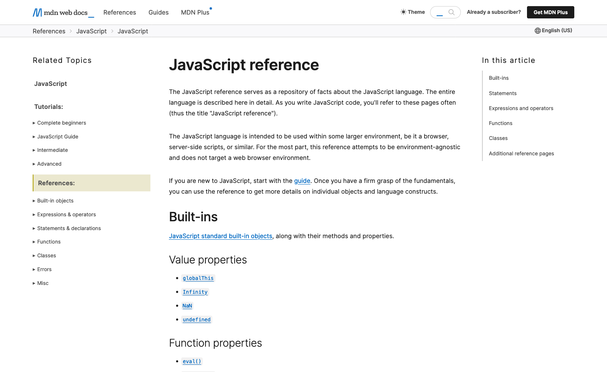
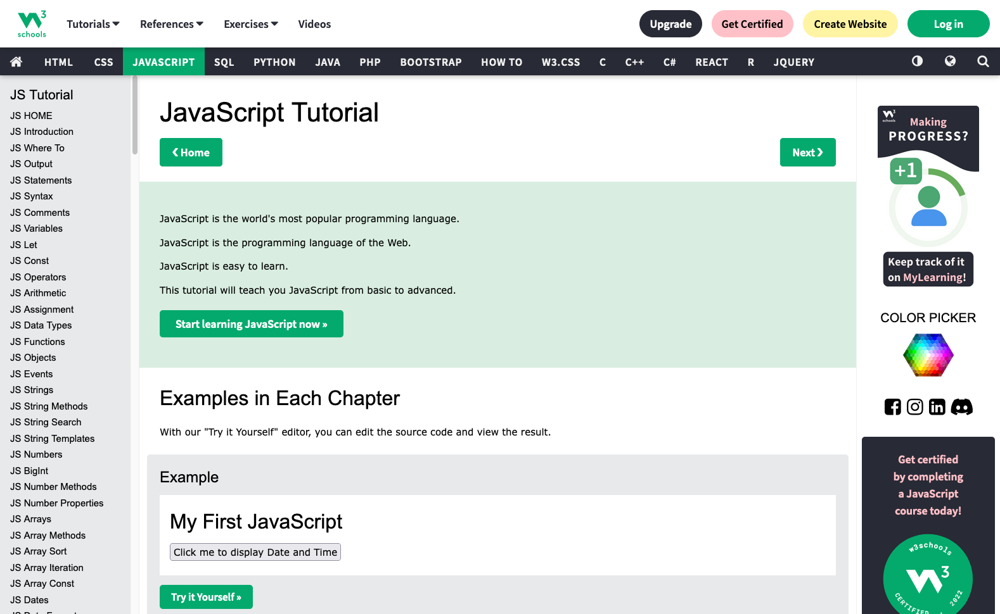

# D. Les chaînes de caractères <!-- omit in toc -->

## Sommaire <!-- omit in toc -->
- [D.1. Sites de référence pour le JS](#d1-sites-de-référence-pour-le-js)
- [D.2. Théorie des Chaînes](#d2-théorie-des-chaînes)
	- [D.2.1. Déclaration](#d21-déclaration)
	- [D.2.2. Concaténation](#d22-concaténation)
	- [D.2.3. Principales propriétés et méthodes](#d23-principales-propriétés-et-méthodes)
- [D.3. Manipulations simples](#d3-manipulations-simples)
- [D.4. Injection dans la page HTML](#d4-injection-dans-la-page-html)
- [D.5. Affichage dynamique](#d5-affichage-dynamique)
	- [D.5.1. window.prompt](#d51-windowprompt)
	- [D.5.2. Rappels sur les fonctions](#d52-rappels-sur-les-fonctions)
	- [D.5.3. Mise en oeuvre](#d53-mise-en-oeuvre)


## D.1. Sites de référence pour le JS

**Avant de commencer à coder voici quelques ressources qui vous seront probablement utiles en plus du pdf du cours (_si vous ne l'avez pas récupéré, c'est le moment d'aller le télécharger sur moodle !_)**

Il n'existe pas de documentation "officielle" de JavaScript (_hormis la spec ECMAScript : https://262.ecma-international.org/_), cependant je vous recommande deux sites :

### Le MDN (Mozilla Developer Network) <!-- omit in toc -->

https://developer.mozilla.org/en-US/docs/Web/JavaScript/Reference



La documentation rédigée par Mozilla est la plus complète et la plus à jour, c'est clairement pour moi le site le plus fiable.

Si vous préférez, vous pouvez passer en français en cliquant sur le bouton "English (US)" en haut à droite ou en utilisant le lien https://developer.mozilla.org/fr/docs/Web/JavaScript/Reference

### W3Schools <!-- omit in toc -->

https://www.w3schools.com/js/



Ce site est souvent remonté dans les moteur de recherche quand il est question de JS, c'est aussi une bonne référence dans le dev JS même s'il est moins complet que le MDN.

> _**A savoir :** contrairement à ce qu'on pourrait penser, w3schools n'a rien à voir avec le W3C (le consortium qui est chargé de la spec HTML, CSS, etc.). W3Schools est géré par une boîte privée totalement indépendante._
>
> _source: https://www.w3schools.com/about/_
>
> _"W3Schools was created in 1998, and derives its name from the World Wide Web (WWW) **but is not affiliated with the W3C**."_


## D.2. Théorie des Chaînes

_**Avant de travailler sur les chaînes de caractères, voyons comment on les utilise en JS.**_


### D.2.1. Déclaration

_**Il existe 3 manières de déclarer des chaînes de caractères en JS :**_
```js
/* guillemets simples */
const s1 = 'je suis une chaîne avec des single quotes';

/* ou guillemets doubles */
const s2 = "je suis une chaîne avec des double quotes";

/* ou accent grave (template strings ES6) */
const s3 = `Je suis une chaîne avec des accents graves`;
```

Pour les 2 premières syntaxes, le choix entre guillemets simples ou doubles est une question de préférences (_les goûts et les couleurs..._) car il n'y a pas de différence, la seule contrainte est qu'une fois qu'on a fait un choix, il faut s'y tenir sur l'ensemble du projet (conventions de code).

> _**NB :** Entre guillemets doubles ou simples, ma préférence va aux **guillemets simples** qui permettent de ne pas avoir à échapper les double quotes (souvent utilisées lorsqu'on génère du code HTML)._

**La 3e syntaxe utilise les accents graves**. Ils permettent de créer ce qu'on appelle des [**"template strings"** (_mdn_)](https://developer.mozilla.org/en-US/docs/Web/JavaScript/Reference/Template_literals). Ces "template strings" apportent plusieurs fonctionnalités dont ne disposent pas les guillemets simples et doubles :
- la possibilité de déclarer des chaînes de caractères **multi-lignes**
- **mais surtout la possibilité d'injecter dedans des valeurs** sans avoir besoin de faire de la concaténation (cf. prochain paragraphe)


### D.2.2. Concaténation

Pour concaténer 2 chaînes de caractères on utilise l'opérateur `+`.

```js
const lawyer = 'Saul';
const serieName = 'Better Call ' + lawyer;
```

**Lorsqu'on doit injecter une valeur dans une chaîne on a plusieurs solutions :**

1. Utiliser la **concaténation** :
	```js
	const lawyer = 'Saul';
	const critic = 'better';
	console.log('Better call ' + lawyer + ' is ' + critic + ' than Breaking Bad')
	```
	> _On voit un peu ici les limites de cette technique : il faut systématiquement fermer la chaîne, ajouter le `+`, la valeur, puis remettre un `+` et rouvrir la chaîne. C'est pénible._
2. Utiliser les **"template strings"** (_chaînes déclarées avec des accents graves_) :
	```js
	const lawyer = 'Saul';
	const critic = 'better';
	console.log(`Better call ${lawyer} is ${critic} than Breaking Bad')
	```

**De manière générale, je vous recommande vivement de préférer dans vos projets les template strings plutôt que la concaténation !**


### D.2.3. Principales propriétés et méthodes

Les chaînes de caractères disposent de beaucoup de propriétés et méthodes (_cf. [le mdn](https://developer.mozilla.org/en-US/docs/Web/JavaScript/Reference/Global_Objects/String)_), mais voici quelques exemples de propriété et méthodes qui pourront vous être utiles.

A votre avis, quelles sont les valeurs qui vont être retournées pour chaque ligne du console.log suivant ?

```js
const serie = 'Better Call Saul';
console.log(
    serie.length, // ??

    serie.search( 'Saul' ), // ??
    serie.search( 'Breaking' ), // ??

    serie.split( ' ' ), // ??

    serie.substring( 7, 11 ), // ??

    serie.toUpperCase(), // ??

	serie.replace('e', 'u'), // ??

	serie.replaceAll('e', 'u'), // ??
);
```

Vérifiez si vous aviez vu juste en tapant le code dans la console !


## D.3. Manipulations simples

**Maintenant que la théorie est au clair, commençons à coder notre SPA :**

1. **Effacez le code contenu dans le fichier `main.js`** pour repartir d'un fichier vide.
2. **Créez une constante appelée `name`** et assignez lui la chaîne de caractères `Mario Kart 8 Deluxe`

3. **Créez une constante nommée `url`.** Sa valeur initiale sera la concaténation de :
	- la chaîne de caractères `'images/'`,
	- la valeur de la variable `name` transformée en minuscules à l'aide de la méthode `.toLowerCase()` (_cf. [la doc de `toLowerCase()`](https://developer.mozilla.org/en-US/docs/Web/JavaScript/Reference/Global_Objects/String/toLowerCase)_) et dont les espaces sont remplacés par des tirets (`-`)
	- et de la chaîne de caractères `'.jpg'`

	Affichez la valeur de `url` dans la console, à l'aide de l'instruction `console.log(url);`, vous devez obtenir :
	```js
	'images/mario-kart-8-deluxe.jpg'
	```

	> _**NB :** Vous verrez que vscode vous **"barre" la constante name en vous disant qu'elle est dépréciée**._
	>
	> _En effet vscode croit qu'on utilise ici la variable globale [`window.name` (mdn)](https://developer.mozilla.org/en-US/docs/Web/API/Window/name) qu'il considère comme dépréciée. Hors vscode se trompe car nous utilisons une constante `name` déclarée localement. Vous pouvez donc ignorer ce warning pour le moment (on va bientôt changer tout ça de toute façon)_

4. **Sur la ligne suivante, créez une variable nommée `html`** :

	Votre code devra permettre d'assigner dans la variable `html` une chaîne qui corresponde au code HTML d'une balise `<a>` (*lien hypertexte*) :
	- L'URL du lien (*attribut `href`*) devra correspondre à la valeur de la constante `url`.
	- Le contenu de la balise `<a>` correspondra lui à la valeur de la constante `url`

	> _**NB:** pour ça, les template strings sont parfaitement adaptées !_

	Affichez dans la console la valeur de la variable html, on doit obtenir la chaîne de caractères suivante :
	```bash
	'<a href="images/mario-kart-8-deluxe.jpg">images/mario-kart-8-deluxe.jpg</a>'
	```

## D.4. Injection dans la page HTML

**C'est le moment d'afficher le contenu de la variable `html` dans la page.**

1. Même si nous n'avons pas encore vu comment manipuler la page html grâce à l'API DOM (_prochain cours_), vous trouverez ci-dessous le code qui va permettre d'injecter notre balise `<a>` dans la page. **A la fin de votre code, ajoutez donc l'instruction suivante :**
	```js
	document.querySelector('.gameList').innerHTML = html;
	```
	Cette instruction va injecter le code HTML contenu dans la variable `html` à l'intérieur de la balise de classe CSS `"pageContent"`.

	Si tout s'est bien passé, vous devriez désormais :
	- voir le texte 'images/mario-kart-8-deluxe.jpg' dans la page de votre navigateur.
	- pouvoir cliquer sur ce texte et être redirigé vers une image de Mario Kart !

	

2. **Modifiez encore la variable html avant son affichage** en remplaçant le texte contenu dans la balise `<a>` par
	- **une balise ``** dont la source (_attribut `src`_) sera la chaîne `images/mario-kart-8-deluxe.jpg`
	- **une balise `<footer>`** contenant la constante `name`

	Contrôlez dans l'inspecteur d'éléments que le résultat obtenu est bien :
	```html
	<a href="images/mario-kart-8-deluxe.jpg">
		
		<footer>Mario Kart 8 Deluxe</footer>
	</a>
	```

	Le rendu doit être celui-ci :

	

## D.5. Affichage dynamique

_**Maintenant qu'on a réussi à faire un traitement qui permet d'afficher une vignette de jeu vidéo dans la page, essayons de rendre ce traitement réutilisable pour afficher n'importe quel jeu.**_

### D.5.1. window.prompt

La fonction globale [`window.prompt()` (_mdn_)](https://developer.mozilla.org/en-US/docs/Web/API/Window/prompt) permet de demander à l'internaute de saisir une chaîne et de la récupérer ensuite en JS.

Essayez par exemple d'ajouter dans votre `main.js` le code suivant :

```js
const value = window.prompt('Que voulez vous afficher dans la console ?');
console.log(`Voici ce que vous avez saisi : ${value}`);
```

Vérifiez que la chaîne que vous saisissez dans la popup s'affiche bien ensuite dans la console.

Maintenant faites en sorte que la valeur de la constante `name` ne soit plus `'Mario Kart 8 Deluxe'` en dur, mais récupérée à l'aide de `window.prompt()`.

> _**NB :** si vous regardez le contenu du dossier `/images` du TP, vous trouverez quelques noms de jeux vidéos que vous pouvez utiliser pour qu'une image s'affiche bien dans la page_ 😎

### D.5.2. Rappels sur les fonctions

En JS, on a plusieurs façons de déclarer des fonctions :

```js
function makeEpisode(hero) { // fonction nommée
	return `${hero} is dead !`;
}
// ou
const makeEpisode = function(hero) { //fonction anonyme
	return `${hero} is dead !`;
}
// ou
const makeEpisode = (hero) => { // arrow function ("lambda")
	return `${hero} is dead !`;
}
```

Les 3 déclarations ont exactement le même effet : elles créent en mémoire une constante qui a le nom `"makeEpisode"` et qui contient une valeur de type [`Function` (_mdn_)](https://developer.mozilla.org/en-US/docs/Web/JavaScript/Guide/Functions).

Elles s'utilisent donc toutes les 3 de la même manière :

```js
const newEpisode = makeEpisode('Benjen Stark');
```

> _**NB :** A propos des arrow functions, notez qu'il est dans certains cas possible de simplifier l'écriture :_
> - _si le corps de la fonction ne contient qu'un return, on peut retirer les accolades et le mot clé return :_
> 	```js
> 	const makeEpisode = (hero) => `${hero} is dead !`;
>	```
> - _si la fonction ne prend qu'un seul paramètre, on peut retirer les parenthèses autour :_
> 	```js
> 	const makeEpisode = hero => `${hero} is dead !`;
>	```
> _A nouveau, aucun changement sur la façon d'appeler la fonction. C'est totalement transparent lors de l'appel : `const newEpisode = makeEpisode('Benjen Stark');`_

### D.5.3. Mise en oeuvre

A l'aide de ce qu'on vient de voir, créez une fonction `renderGameThumbnail` (_avec la syntaxe que vous préférez, nommée, anonyme ou arrow_) qui :
- prend en paramètre le `name` d'un jeu
- retourne le code HTML à afficher dans la page

Le code de votre `main.js` devra ressembler à ceci :
```js
const name = window.prompt('Quel jeu voulez vous ?');
const html = renderGameThumbnail(name);
document.querySelector('.gameList').innerHTML = html;
```


Une fois que ça fonctionne, pour éviter d'avoir un prompt à chaque rechargement de page, commentez la ligne du prompt et remettez une valeur en dur dans la constante `name` :

```js
// const name = window.prompt('Quel jeu voulez vous ?');
const name = 'Mario Kart 8 Deluxe';
```


## Étape suivante <!-- omit in toc -->
Si tout fonctionne, vous pouvez passer à l'étape suivante : [E. Les tableaux et les objets littéraux](E-tableaux-objets.md)