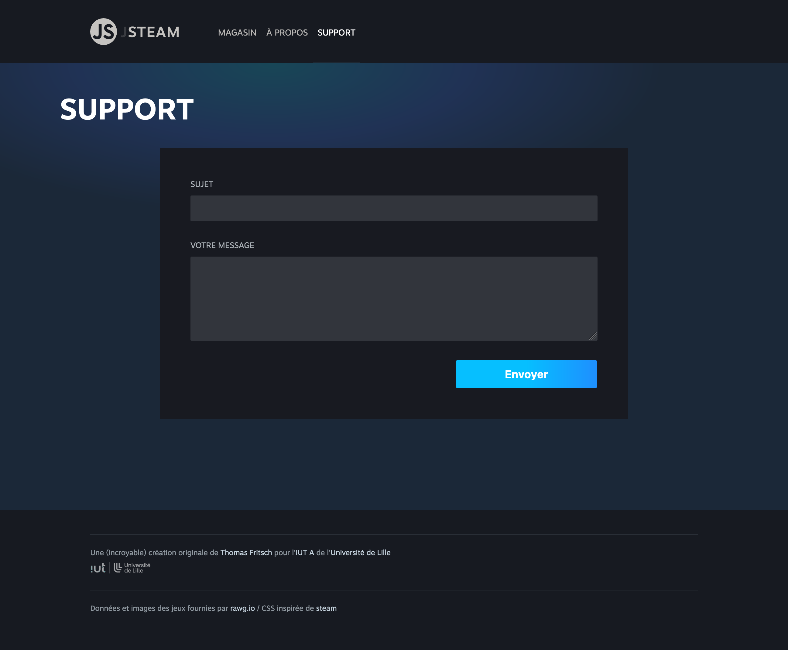

# D. La gestion des formulaires <!-- omit in toc -->

_**Dans cette partie du TP, nous allons travailler sur les formulaires et notamment construire un formulaire pour notre page "Support"**_

## Sommaire <!-- omit in toc -->
- [D.1. Un peu de théorie](#d1-un-peu-de-théorie)
- [D.2. Le formulaire de contact (Support)](#d2-le-formulaire-de-contact-support)
- [D.3. La validation de la saisie](#d3-la-validation-de-la-saisie)

## D.1. Un peu de théorie
_**Comme vu en cours, on utilise généralement l'API DOM avec les formulaires pour 2 choses :**_
1. **Récupérer les valeurs saisies par l'utilisateur** (_et afficher des messages d'erreur par exemple_)
2. **Détecter la soumission du formulaire** (_pour envoyer des données en AJAX à un webservice par exemple_)

En imaginant le formulaire suivant :
```html
<form>
    <input type="text" name="message">
    <input type="submit" value="Valider">
</form>
```
On peut lire la valeur tapée par l'utilisateur dans le champ `"message"` avec la propriété [`.value`](https://developer.mozilla.org/fr/docs/Web/HTML/Element/Input#value) de l'élément `<input type="text">`, et l'événement [`submit`](https://developer.mozilla.org/fr/docs/Web/API/HTMLFormElement/submit_event_) de la balise `<form>` :
```js
const form = document.querySelector('form'), // balise form
	input = form.querySelector('input[name=message]'); // balise <input name="message">

form.addEventListener('submit', event => { // détection de la soumission
	event.preventDefault(); // on empêche la page de se recharger
	console.log('Le formulaire a été soumis avec la valeur :'+input.value);
});
```

## D.2. Le formulaire de contact (Support)

_**Ces rappels étant faits, attaquons nous à la création d'un formulaire de contact pour la vue "Support"**_

1. **Commencez par ajouter le code HTML suivant dans la balise `<article class="help">`** (_en dur dans le fichier `index.html` en remplacement du texte `Contenu de la vue "Support"`_) :

	```html
	<form class="helpForm">
		<label>
			Sujet
			<input type="text" name="subject" />
		</label>
		<label>
			Votre message
			<textarea name="body" rows="5"></textarea>
		</label>
		<button type="submit">Envoyer</button>
	</form>
	```

	Si vous cliquez sur le lien "Support" dans le menu, vous devez normalement voir apparaître le formulaire de contact :

	

2. **Dans le fichier `main.js`, détectez la soumission du formulaire à l'aide des méthodes `querySelector()` et `addEventListener`**. Pour le moment affichez juste un message dans la console.

	> _**NB1 :** Souvenez vous de la méthode `event.preventDefault()` et vérifiez que la soumission du formulaire n'entraîne pas un rechargement de page en utilisant l'onglet "Network"/"Réseau" des devtools_

	> _**NB2 :** Si vous en avez marre de cliquer sur le bouton "SUPPORT" dans le menu à chaque fois que vous rafraîchissez la page, vous pouvez modifier le code de votre `main.js` pour afficher la page "SUPPORT" par défaut !_

3. Au submit, **affichez dans la console la valeur saisie par l'utilisateur dans l'input "subject"** (_"Sujet"_).

	> _**NB :** pour sélectionner un champ de formulaire, en général on s'appuie sur le [sélecteur d'attributs](https://developer.mozilla.org/en-US/docs/Web/CSS/Attribute_selectors) pour sélectionner le champ en fonction de son attribut `name="..."` (comme dans l'exemple vu au chapitre [D.1. Un peu de théorie](#d1-un-peu-de-théorie))._

## D.3. La validation de la saisie
1. **Si le champ "subject" est vide, affichez un message d'erreur** à l'aide de la fonction [`alert()`](https://developer.mozilla.org/fr/docs/Web/API/Window/alert)

	> _**NB :** dans la vraie vie on ajouterait plutôt un attribut [`required` (mdn)](https://developer.mozilla.org/fr/docs/Web/HTML/Attributes/required) à la balise `<input >`. Ici on fait cette vérification en JS pour s'entraîner, mais ne faites pas ça chez vous !_

2. **Faites de même pour le champ "body"** (_"Votre message"_).

3. **Si les 2 champs ne sont pas vides, lancez la rédaction d'un email avec l'instruction suivante :**
	```js
	window.location.href = 'mailto:help@jsteam.fr';
	```

	En principe, cette instruction doit ouvrir une fenêtre de rédaction d'email avec le client mail par défaut de votre système.

4. **Complétez le mailto avec le sujet et le message saisis par l'utilisateur**

	Pour ajouter des informations au mailto, il faut modifier l'instruction comme ceci :

	```js
	window.location.href = 'mailto:help@jsteam.fr?subject=xxxxxx&body=yyyyyyy';
	```

	où `xxxxxx` et `yyyyyyy`  sont les valeurs saisies par l'utilisateur **mais "encodées"** à l'aide de la fonction [`encodeURIComponent()` _(mdn)_](https://developer.mozilla.org/fr/docs/Web/JavaScript/Reference/Global_Objects/encodeURIComponent).

	Une fois l'email ouvert, videz les 2 champs de saisie pour permettre à l'utilisateur de saisir un nouveau message.

	> _**NB :** pour modifier la valeur d'un champ, sachez que la propriété [`.value`](https://developer.mozilla.org/fr/docs/Web/HTML/Element/Input#value) de l'élément input est accessible aussi en écriture !_

## Étape suivante <!-- omit in toc -->
Pour terminer ce TP, voyons comment exploiter notre formulaire de recherche : [E. Formulaire de recherche](./E-formulaire-recherche.md).