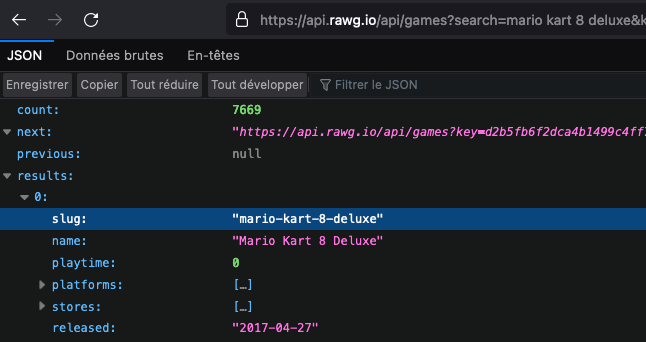
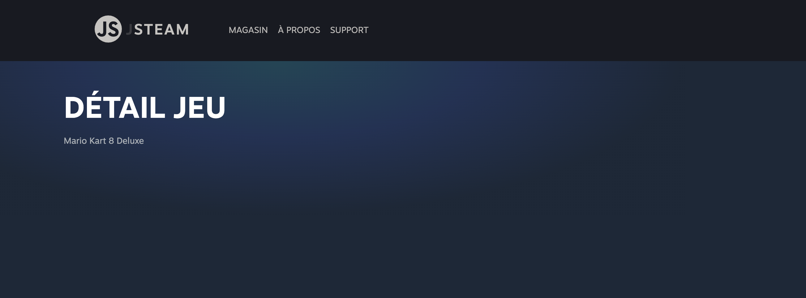
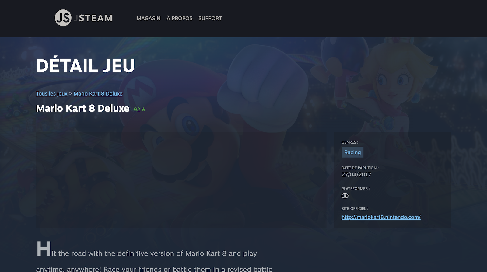
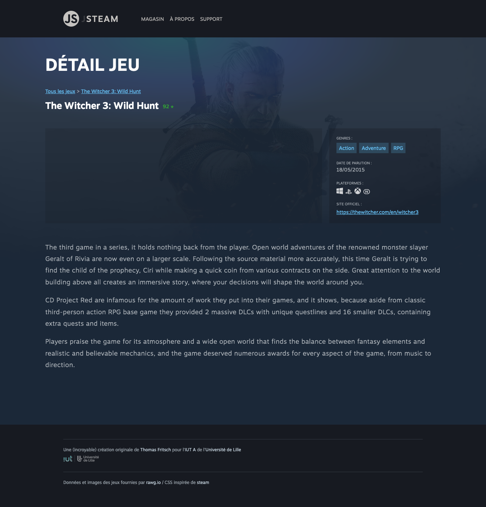

# D. GameDetail <!-- omit in toc -->

**Voilà notre application est connectée à une base de données distante à travers une API REST, c'est super.**

**Pour voir si vous avez bien tout assimilé, voyons dans cet exercice si vous êtes capables de développer une page de détail pour les jeux de notre liste !**


## Sommaire <!-- omit in toc -->
- [D.1. Création de GameDetailView](#d1-création-de-gamedetailview)
- [D.2. Récupération du jeu à afficher](#d2-récupération-du-jeu-à-afficher)
- [D.3. Appel webservice et affichage](#d3-appel-webservice-et-affichage)
- [D.4. Lien GameList / GameDetail et modification du Router](#d4-lien-gamelist-gamedetail-et-modification-du-router)
- [D.5. Screenshots](#d5-screenshots)


Le principe de cet exercice est simple : faire en sorte que quand on clique sur une vignette de jeu dans la liste, on soit redirigé vers une page de "détail" du jeu qu'on a choisi, avec des informations supplémentaires (_screenshots, plateformes supportées, description, etc._).

> _Pour cet exercice vous pouvez choisir de faire tout.e seul.e comme un.e grand.e ou bien suivre les instructions ci-dessous._
>
> _À vous de choisir !_

## D.1. Création de GameDetailView
Pour commencer cet exercice, regardez un peu le code HTML contenu dans le fichier `index.html` : on a ligne 56 une balise "gameDetail" :
```html
<article class="gameDetail">Contenu de la vue "Détail"</article>
```

Cette balise est contenue dans la balise `<div class="viewContent activeOnly">`, à côté des autres balises qui contiennent les différentes vues de notre application (_`gameList`, `help`, `about`_).

La première étape que je vous propose est donc de faire en sorte qu'on soit capables d'afficher cette balise "gameDetail" :

1. **Créez une classe `GameDetailView`** qui hérite de la classe `View` dans un module `src/GameDetail.js`.

	> _pour le moment on n'a pas de comportement particulier à ajouter à cette classe, faites la juste étendre de `View`._
2. **Dans le fichier `main.js` créez une instance de cette classe `GameDetailView` nommée `gameDetailView` (_avec un "g" minuscule_)** et passez en paramètre du constructeur la balise (Element) `<article class="gameDetail">`
3. **Pour afficher cette vue, il faut dire au Router quelle URL lui correspond.** Cela se fait en modifiant le tableau `routes` qui ressemble actuellement à ceci :

	```js
	const routes = [
		{ path: '/', view: gameListView, title: 'Magasin' },
		{ path: '/about', view: aboutView, title: 'À propos' },
		{ path: '/help', view: helpView, title: 'Support' },
	];
	```

	Ajoutez donc une nouvelle `route` (_un nouvel objet littéral_) dans le tableau `routes` avec :
	- dans le paramètre `view` votre instance `gameListView`.
	- dans la propriété `title` ce que vous voulez (_par exemple `'Détail jeu'`_)
	- dans la propriété `path` mettons pour le moment une adresse temporaire pour nous permettre de tester notre page : `/detail`

		> _on dit "temporaire" car à un moment donné il faudra bien mettre dans l'URL l'id du jeu que la page détail doit afficher_
		>
		> _Mais pour le moment on va faire simple, on va déjà essayer juste d'afficher la page, on verra par la suite comment passer l'id_

4. **Maintenant que la route est créée, rendez-vous sur l'adresse http://localhost:8000/detail** normalement la balise `<article class="gameDetail">` doit s'afficher  :

	

## D.2. Récupération du jeu à afficher

La première étape est terminée : notre `GameDetailView` s'affiche. Mais par contre elle est pour le moment incapable de savoir quel jeu afficher.

Pour lui indiquer le jeu à afficher on va passer dans l'URL de la page un ["`slug`" _(wikipedia)_](https://fr.wikipedia.org/wiki/Slug_(journalisme)#En_informatique). Chaque jeu de l'API de rawg dispose en effet d'un slug unique. Si vous inspectez la réponse du webservice https://api.rawg.io/api/games?key=votre-cle-d-api vous verrez qu'on a bien pour chaque jeu une propriété `slug` :



On va donc maintenant essayer de faire en sorte que lorsque l'on va sur http://localhost:8000/detail-mario-kart-8-deluxe ou sur http://localhost:8000/detail-red-dead-redemption :
- le Router soit capable de savoir que c'est la route qui correspond à `GameDetailView` qu'il doit afficher
- le Router envoie à la `GameDetailView` la partie de l'URL qui se trouve **après** les caractères `"detail-"` (_par exemple en paramètre de l'appel à la méthode `show`_)

Il y a plein de techniques pour faire ça, mais je vous propose de procéder comme ceci :
1. Dans le tableau `routes` du `main.js` remplacez le `path` de votre route `/detail` par `/detail-*`
2. Dans la méthode `Router.navigate()`, au moment où le `Router` parcourt toutes les routes pour trouver celle qui correspond à l'URL demandée (`const route = this.routes.find(...)`), testez si le `path` de la route **termine** par une `*` et si l'URL demandée (_dans notre exemple `/detail-mario-kart-8-deluxe`_) **commence** par la même chose que ce qui se trouve avant l'`*` dans la route.

	> _**NB :** la classe String dispose justement de méthodes pour tester si une chaîne **commence** ou **termine** par une autre..._

	> _**Exemple :** pour bien comprendre :_
	> - _si la `route.path` est `/detail-*`, comme elle termine par `*` on prend tout ce qui se trouve "avant" le `*` donc `/detail-`_
	> - _une fois cette chaîne sans le `*` calculée (`/detail-`) on vérifie si l'URL demandée (`path`) commence par `/detail-`. Dans le cas de  `/detail-mario-kart-8-deluxe` c'est bien le cas, c'est donc cette route là (`{path:'/detail-*', view:gameDetailView, title: 'Détail jeu'}`) qui est la bonne et que doit retourner le `this.routes.find`_

	Une fois que vous avez modifié votre Router, essayez de charger la page http://localhost:8000/detail-mario-kart-8-deluxe : si tout va bien c'est la page détail qui doit s'afficher. Idem si vous vous rendez sur http://localhost:8000/detail-red-dead-redemption

		

3. **le Router doit envoyer à la vue le reste de l'URL** (_ce qui correspond au caractère `*` dans l'URL courante_), ici ce sera tout ce qui se trouve après `/detail-` soit `mario-kart-8-deluxe`

4. **Dans la `GameDetailView` récupérez cette information dans la méthode `show`** (_pensez que c'est un override et qu'il faut donc faire appel à `super.show()`_) et affichez la dans la page, par exemple avec une instruction `this.element.innerHTML = ...`

	

## D.3. Appel webservice et affichage
_**A partir de maintenant le plus dur est fait !**_

Notre classe GameDetail connaît le slug du jeu à afficher, elle va dont pouvoir interroger l'API REST pour récupérer tous les détails du jeu :

1. **En vous inspirant de l'appel AJAX qu'on a fait dans la `GameListView`, appelez le webservice** https://api.rawg.io/api/games/&lt;slug&gt;?key=xxxxxxxxxxx (_cf. https://api.rawg.io/docs/#operation/games_read_)

2. **Une fois la réponse du webservice reçue, affichez le nom du jeu dans la page** (_toujours dans `this.element`_) :

	

3. **Maintenant que vous avez récupéré le contenu du jeu, affichez des informations supplémentaires dans la page**, par exemple :
	- note metacritic / date de parution
	- plateformes supportées (parent_platform)
	- genres
	- site web officiel
	- description
	- image de fond

	Si vous voulez un exemple de code HTML qui fonctionne avec les styles CSS qui vous sont fournis, en voici un (_notez que les genres et les plateformes sont des listes, vous aurez donc potentiellement plusieurs balises `<li>`, notez aussi que vous n'êtes pas obligé.e.s de tout coder, vous pouvez laisser certaines parties en dur si vous le souhaitez_) :

	```html
	<div class="backgroundImage">
		
	</div>
	<header>
		<div class="breadcrumb">
			<a href="/">Tous les jeux</a>
			&gt;
			<a href="#" class="currentGameLink">Mario Kart 8 Deluxe</a>
		</div>
		<h2>
			<span class="name">Mario Kart 8 Deluxe</span>
			<span class="metacritic">92</span>
		</h2>
	</header>
	<section class="content">
		<div class="screenshots"></div>
		<div class="infos">
			<p class="label">Genres :</p>
			<ul class="genres">
				<li>Racing</li>
			</ul>
			<p class="label">Date de parution :</p>
			<time datetime="2017-04-27">27/04/2017</time>
			<p class="label">Plateformes :</p>
			<ul class="platforms">
				<li>
					
				</li>
			</ul>
			<p class="label">Site officiel :</p>
			<a class="website" href="http://mariokart8.nintendo.com/">http://mariokart8.nintendo.com/</a>
		</div>
	</section>
	<section class="description">
		Hit the road with the definitive version of Mario Kart 8 and play anytime,
		anywhere! Race your friends or battle them in a revised battle mode on new and
		returning battle courses...
	</section>
	```

Le rendu devrait ressembler à ceci :


## D.4. Lien GameList / GameDetail et modification du Router

_**Maintenant que la `GameDetailView` fonctionne, ne reste plus qu'à faire en sorte qu'on puisse passer de la page liste à la page détail en cliquant sur une vignette.**_

Pour faire ça, il va falloir écouter le clic sur les vignettes dans la `GameListView`, puis appeler `Router.navigate()` avec l'URL correspondant à la page détail du jeu sur lequel on a cliqué.

1. **Pour simplifier le travail de la `GameListView` commencez par modifier dans la fonction `renderGameThumbnail()` le `href` de la balise `<a>` des vignettes** :

	```js
	return `<a href="${background_image}">
	```

	au lieu de faire un lien vers `image_background` faites donc un lien vers `/detail-slug-du-jeu` (_en remplaçant bien sûr `slug-du-jeu` par ... le `slug` du jeu !_ 😅)

2. **Une fois le href modifié, dans la classe `GameListView` écoutez le clic sur les liens des vignettes**, récupérez le href du lien cliqué, et appelez la méthode `Router.navigate`.

	Par exemple si l'on clique sur la vignette de Mario Kart 8 Deluxe, le href du lien doit être `/detail-mario-kart-8-deluxe` et donc la GameListView doit faire appel à `Router.navigate('/detail-mario-kart-8-deluxe')`

	> _**Indice :** comme on a plusieurs liens à écouter, il vous faudra probablement un querySelectorAll, une boucle et appeler addEventListener pour chaque vignette._

	> _**Indice 2 :** pour récupérer la valeur du `href` vous pouvez utiliser la propriété `event.currentTarget` qui contient le lien sur lequel on a cliqué, et la méthode `getAttribute` pour récupérer la valeur du `href`_

	> _**Indice 3 :** faites attention à faire vos addEventListener à un moment où les liens existent dans la page..._

Si on clique sur la vignette du jeu "The Witcher 3: Wild Hunt", la page de détail doit s'afficher **SANS RECHARGEMENT DE PAGE !!** (_vérifiez bien dans l'onglet network des devtools que la page n'est pas rechargée complètement quand vous cliquez sur le lien_) :




## D.5. Screenshots
**Pour terminer cet exercice je vous propose d'afficher des screenshots dans la page détail.**

Il se trouve en effet que l'API de rawg dispose d'un endpoint spécial pour ça : https://api.rawg.io/docs/#operation/games_screenshots_list

Dans la `GameDetailView`, **interrogez ce webservice**, puis une fois les résultats reçus, générez pour chaque screenshot le code HTML suivant :

```html
<a href="..."></a>
```

Puis insérez le code HTML ainsi généré dans la balise `<div class="screenshots"></div>`.

Le rendu doit être le suivant :


Voilà !

**Si vous le souhaitez vous pouvez encore améliorer la page :**
- détecter le clic sur le lien "Tous les jeux" pour rediriger vers la page liste sans rechargement de page
- faire en sorte que les critères de recherche ne soient pas perdus lors du passage liste -> detail -> liste