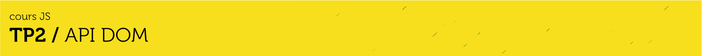
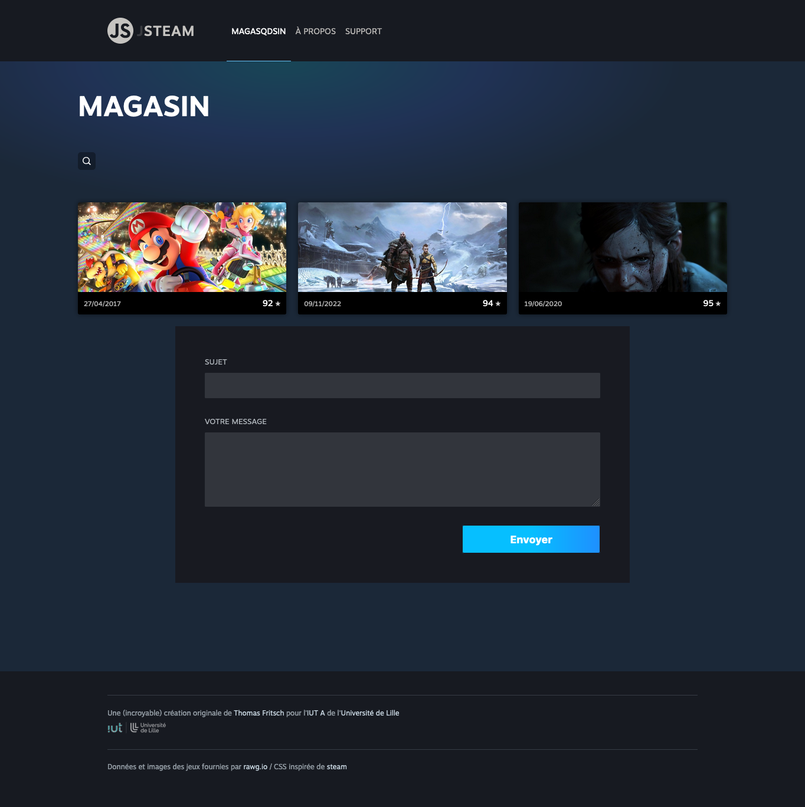
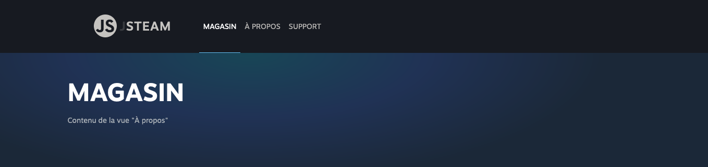

# D. POO <!-- omit in toc -->

_**Dans cette partie du TP nous allons faire un peu de POO pour essayer d'améliorer l'organisation de notre code.**_


## Sommaire <!-- omit in toc -->
- [D.1. Notre problème](#d1-notre-problème)
- [D.2. Rappels de syntaxe](#d2-rappels-de-syntaxe)
	- [D.2.1. class \& propriétés publiques](#d21-class-propriétés-publiques)
	- [D.2.2. méthodes](#d22-méthodes)
- [D.3. La classe HelpView](#d3-la-classe-helpview)
- [D.4. Héritage : La classe View](#d4-héritage-la-classe-view)
- [D.5. _Propriétés et méthodes statiques :_ La classe Router](#d5-propriétés-et-méthodes-statiques-la-classe-router)
	- [D.5.1. Principe du Routing](#d51-principe-du-routing)
	- [D.5.2 Rappels de syntaxe](#d52-rappels-de-syntaxe)
	- [D.5.3. La classe `Router`](#d53-la-classe-router)
- [D.5.4. Router et viewTitle](#d54-router-et-viewtitle)


## D.1. Notre problème
_**Dans la partie B. du TP qu'on vient de terminer, on a beaucoup amélioré l'organisation de notre code en le répartissant dans différents fichiers, mais quel est le problème ?**_

En fait, le principe des modules est normalement d'avoir **des fichiers JS qui puissent être réutilisables facilement** sur d'autres projets.

Or, dans notre projet ce n'est pas vraiment le cas car plusieurs de nos modules :
- font référence à la variable globale `document` (_pour faire des `document.querySelector`_) et vont donc chercher eux-même les balises n'importe où dans la page.

	C'est un problème car si on importe par exemple notre module `Help.js` (_formulaire de contact/support_) dans un autre projet, et que ce projet contient, dans son code HTML, plusieurs formulaires différents en plus du formulaire de contact, on ne peut pas garantir que les 2 lignes suivantes iront bien chercher les bonnes balises, celles du formulaire de contact, et pas celles d'un autre formulaire de la page :
	```js
	// src/Help.js
	const subjectInput = document.querySelector('input[name=subject]');
	const bodyTextarea = document.querySelector('textarea[name=body]');
	```
- Par ailleurs, comme vu au précédent chapitre, on a un autre problème : le module `GameList.js` déclenche des traitements dès qu'on l'importe : le seul fait d'importer le module va ajouter -_automatiquement et dès l'import_- plusieurs écouteurs d'événements `addEventListener` sans qu'on le sache.

**On va donc voir dans ce chapitre comment on peut répondre à ces deux problèmes à l'aide de la POO.**

## D.2. Rappels de syntaxe
### D.2.1. class & propriétés publiques
Comme vu dans le cours (*procurez vous le support pdf !*) ES6 a introduit une nouvelle syntaxe pour la création de classes. Finis les `prototypes`, désormais le mot clé `class` fait son apparition et permet d'utiliser une syntaxe plus proche de ce qui se fait dans les autres langages objets :
```js
class Character {
	constructor(firstName) { // constructeur de la classe
		this.firstName = firstName; // création de propriété
	}
}
const heisenberg = new Character('Walter');
```
La création de propriétés d'instances se fait par l'utilisation du mot clé `this` dans le constructeur : `this.firstName = firstName;` permet de créer une propriété `firstName` sur l'instance en cours de création et de lui assigner la valeur passée au constructeur via l'instruction `new Character('Walter');`.

On peut ensuite accéder aux propriétés de l'objet en utilisant la notation pointée :
```js
console.log( heisenberg.firstName );
```
Il est possible également de déclarer les propriétés d'instance en dehors du constructeur de cette manière :
```js
class Character {
	firstName;
	constructor(firstName) {
		this.firstName = firstName;
	}
}
```
Cette notation a été intégrée tout récemment dans la spec officielle d'ECMAScript (_la spec suivie par JavaScript_) : elle fait partie des fonctionnalités incluses dans ES2022 (ES13) sortie en juin 2022 : cf. https://github.com/tc39/proposals/blob/master/finished-proposals.md et https://github.com/tc39/notes/blob/HEAD/meetings/2021-04/apr-19.md#class-fields-private-methods-and-static-class-features-for-stage-4

Ceci dit, cela fait plusieurs années que Babel permet de l'utiliser !

### D.2.2. méthodes
La création de méthodes d'une classe se fait de la manière suivante :
```js
class Character {
	firstName;
	lastName;
	constructor(firstName, lastName) {
		this.firstName = firstName;
		this.lastName = lastName;
	}
	fullName(){ // déclaration de méthode
		return `${this.firstName} ${this.lastName}`;
	}
}
```
Pour appeler la méthode, on utilise simplement la notation pointée :
```js
heisenberg.fullName();
```


## D.3. La classe HelpView
Pour commencer cette amélioration de notre code avec la POO, travaillons un peu sur le module `src/HelpView.js`.

Actuellement il contient uniquement une fonction `handleHelpFormSubmit` qui fait référence à la variable globale `document` :

```js
// récupération des 2 champs du formulaire
const subjectInput = document.querySelector('input[name=subject]');
const bodyTextarea = document.querySelector('textarea[name=body]');
```

Pour résoudre ce problème, vous allez créer dans ce module une classe `HelpView` qu'on utilisera dans le `main.js` de la manière suivante :
```js
const helpView = new HelpView(document.querySelector('.viewContent .help'));
```

Le principe sera le suivant :
- on enverra à notre classe `HelpView` l'élément HTML (_la balise_) dans laquelle se trouve le formulaire `<article class="help">` (_[l. 56 du fichier `index.html`](https://gitlab.univ-lille.fr/js/tp3/-/blob/main/index.html#L56)_).
- c'est le constructeur de la classe qui ajoutera l'écouteur d'événement submit sur le formulaire

**Si le principe est compris passons à la pratique** (_dans le cas contraire, demandez  de l'aide à votre encadrant.e de TP_) :

1. **Dans `HelpView.js`, créez une classe nommée `HelpView`** (_à côté de la fonction `handleHelpFormSubmit`_)
2. **Ajoutez-y un constructeur** qui recevra un paramètre nommé `element`
3. **Ajoutez ensuite une propriété publique nommée elle aussi `element`**. Dans le constructeur, stockez la valeur du paramètre `element` dans cette propriété publique `element`.
4. **Créez dans la classe `HelpView` une méthode `handleSubmit(event)`** et mettez-y le code contenu dans la fonction `handleHelpFormSubmit` (_vous pouvez ensuite supprimer la fonction `handleHelpFormSubmit`_)

	Remplacez y toutes les références à l'objet `document` par la propriété publique `element`

	> _**Rappel :** notre paramètre `element` contient une instance de la classe `Element` (un élément HTML) il est donc possible d'appeler dessus la méthode `querySelector()`_

	> _**Rappel :** dans une classe en JS, le mot clé `this` est toujours obligatoire pour accéder à une propriété ou une méthode_

5. **Dans le constructeur de la classe, ajoutez un écouteur d'événement `'submit'` sur le formulaire contenu dans la balise `this.element` et qui déclenche la méthode `handleSubmit`**

	Vous pouvez vous inspirer des deux lignes du `main.js` suivantes :_

	```js
	// on écoute la soumission du formulaire de contact
	const helpForm = document.querySelector('.helpForm');
	helpForm.addEventListener('submit', handleHelpFormSubmit);
	```

	Une fois l'écouteur d'événement ajouté, vous pouvez supprimer ces 2 lignes du `main.js`.

	> _**Attention 1 :** la classe `HelpView` ne doit plus utiliser la variable globale `document` !_

	> _**Attention 2 :** lorsqu'on utilise `addEventListener()` dans une classe on se retrouve confrontés à des problèmes de scope de `this` : dans la méthode déclenchée lorsque l'événement se produit, la valeur de `this` est "transformée" : ce n'est plus notre instance mais ça devient l'élément HTML qui a déclenché l'événement (dans notre cas la balise `<form>`)._
	>
	> Pour éviter ces problèmes quand on travaille avec des classes le plus simple est de préférer l'emploi de **arrow functions** :
	> ```js
	> // Au lieu d'écrire ceci :
	> myElement.addEventListener('click', this.maMethode); // pas bien
	>
	> // on écrira plutôt ceci :
	> myElement.addEventListener('click', event => this.maMethode(event)); // bien !
	> ```


6. **Si vous ne l'aviez pas déjà fait ajoutez dans le fichier `mains.js` la ligne suivante :**
	```js
	const helpView = new HelpView(document.querySelector('.viewContent .help'));
	```

	Vérifiez que la `HelpView` fait correctement son travail et détecte bien les champs vides puis ouvre bien la fenêtre de rédaction d'un email.

	Du point de vue de l'utilisateur ou de l'utilisatrice, notre application fonctionne donc exactement comme avant mais au niveau du code on a maintenant 2 gros avantages :
	- notre module `HelpView` n'a plus besoin d'accéder à la variable globale `document`
	- on a pu simplifier le code du `main.js` en écoutant le `submit` directement dans la classe `HelpView` elle-même

## D.4. Héritage : La classe View
_**Je vous propose maintenant de créer une classe `View` qui va servir de base à toutes nos vues**_ (_`GameList`, `HelpView` et les futures "pages" de notre application JSteam_).

1. **Dans un nouveau module nommé `View.js` créez une classe `View` avec :**
	- une propriété publique `element`
	- un constructeur qui reçoit un paramètre `element` et le stocke dans la propriété publique `element`
	- une méthode `show()` qui ajoute la classe CSS `"active"` sur la balise HTML contenue dans `element`
	- une méthode `hide()` qui retire la classe CSS `"active"` sur la balise contenue dans `element`

2. **Faites hériter la classe `HelpView` de la classe `View`**

	> _**NB :** vous pouvez supprimer la déclaration de la propriété publique `element` puisqu'elle est maintenant héritée_

	> _**Souvenez-vous :** pour appeler le constructeur de la classe parente, c'est la fonction `super()` qu'il faut invoquer. Par ailleurs cette instruction `super` doit obligatoirement être la première instruction du constructeur de votre classe enfant._

3. **Pour vérifier si votre classe fonctionne correctement**, faites appel à la méthode `show` de votre instance `helpView`, dans le `main.js` ajoutez à la fin :
	```js
	helpView.show();
	```

	Le formulaire de "support" doit s'afficher en dessous de la gameList :

	

	S'il s'affiche bien, c'est gagné ! Vous pouvez supprimer l'instruction `helpView.show()`.


## D.5. _Propriétés et méthodes statiques :_ La classe Router

Dans cet exercice, je vous propose maintenant de développer une classe `Router` qui, à l'aide des **propriétés et méthodes statiques**, va gérer l'affichage à la fois du titre de la vue, et de son contenu.

C'est une classe qui nous servira dans les prochains TP et qui nous permettra de
naviguer d'une vue à l'autre sans rechargement de page (_principe de base des [SPA](https://en.wikipedia.org/wiki/Single-page_application)_).


### D.5.1. Principe du Routing

**En web le terme de "routing" ("routage" en français) désigne la façon dont une application décide de quelle vue afficher à quel moment.**

Dans [de](https://laravel.com/docs/8.x/routing) [nombreux](https://reactrouter.com/) [frameworks](https://angular.io/guide/router) [de](https://guides.emberjs.com/release/routing/) [développement](https://router.vuejs.org/) (_frontend, [backend](https://symfony.com/doc/current/routing.html) ou [mobile](https://reactnavigation.org/) !_) ce mécanisme de **"routing"** est confié à ce qu'on appelle un **"Router"** (_d'où le nom de notre classe_).

**Le principe d'un `Router` est toujours le même :**
- on lui donne la liste de **toutes les vues de l'application**
- **à chaque vue** de la liste est associée **une "clé"** (_un "identifiant"_)
- au clic sur un lien, on envoie au `Router` **la clé de la vue que l'on veut afficher**
- le `Router` cherche alors dans sa liste de vues **celle qui correspond à cette clé** puis l'affiche

Bien souvent, les **clés** qui sont choisies pour identifier les vues sont des morceaux d'URL, des "chemins" (_"path" en anglais_). Par exemple, dans JSteam on associera à HelpView la "clé" `"/help"` (_le `href` du lien "Support"_).

On a déjà plus ou moins un fonctionnement de ce type dans la fonction `handleMenuLinkClick`, mais on va essayer de faire quelque chose de plus propre (_tout en travaillant de nouvelles syntaxes de POO_).

Ajoutez donc à la fin de votre fichier `main.js` (_après la déclaration de `helpView`_):
```js
const gameListView = new View(document.querySelector('.viewContent > .gameList'));
const aboutView = new View(document.querySelector('.viewContent > .about'));
const routes = [
	{ path: '/', view: gameListView },
	{ path: '/about', view: aboutView },
	{ path: '/help', view: helpView },
];
```

Vous voyez qu'on a créé 3 routes pour chacune des vues de notre menu (_et 2 instances de la classe `View` pour la page "Magasin" et "A propos"_).

Pour tester notre Router au fur et à mesure, commencez par commenter la ligne suivante (_c'est le Router qui va maintenant se charger ça_) :
```js
// On affiche la gameList par défaut
document.querySelector('.gameList').classList.add('active');
```

Testez votre code, la gameList ne doit plus apparaître :


### D.5.2 Rappels de syntaxe
**Dans une application il n'y a (en général) qu'un seul Router. Pour ça on pourrait utiliser le design pattern [Singleton _(wikipedia)_](https://fr.wikipedia.org/wiki/Singleton_(patron_de_conception)) mais je vous propose ici plutôt de travailler avec les propriétés et méthodes statiques.**

Pour rappel les propriétés et méthodes statiques se déclarent à l'aide du mot clé `static`. Ces propriétés/méthodes n'existent qu'au niveau de la classe (et pas de l'instance) et s'utilisent comme ceci :

```js
class Counter {
    static counter = 0;
    static getCounter() {
        return this.counter++;
    }
}

// Les méthodes et propriété statiques s'appellent sans avoir besoin d'instancier la classe
// (pas de `new Counter()` nécessaire)
console.log(
    Counter.getCounter(),   // 0
    Counter.counter,        // 1
    Counter.getCounter(),   // 1
    Counter.counter,        // 2
);
```

### D.5.3. La classe `Router`

1. **Dans le module `src/Router.js` créez une classe `Router`** avec une propriété statique `routes`
2. **Dans le `src/main.js`, renseignez la valeur de `routes` comme ceci :**
	```js
	Router.routes = routes;
	```

	Où `routes` est le tableau de routes créé à l'étape [D.5.1. Principe du Routing](#d51-principe-du-routing)

3. **Développez une méthode statique `Router.navigate(path)` qui permette d'afficher la `view` sélectionnée.**

	Cette méthode va devoir parcourir le tableau de routes à la recherche de celle qui correspond au paramètre `path` envoyé dans `Router.navigate(path)`, appeler la méthode `.show()` sur la view correspondant à la route, et appeler la méthode `.hide()` sur la vue précédente (s'il y en avait une).

	Pour tester cette méthode ajoutez dans votre fichier `main.js` la ligne suivante :
	```js
	Router.navigate('/about');
	```
	Le rendu attendu est le suivant :

	

4. **Enfin, modifiez le contenu de la fonction `handleMenuLinkClick` pour faire en sorte qu'elle utilise la méthode `Router.navigate()`.** Normalement vous devriez gagner pas mal de lignes !


## D.5.4. Router et viewTitle
Notre module `src/Router.js` permet de passer d'une vue à l'autre mais il reste un problème avec l'affichage du  titre de la page : quand on appelle `Router.navigate('/about')` dans le `main.js`, le titre de la page reste "MAGASIN" au lieu de "À PROPOS". Notre titre ne change qu'au clic.

Pour résoudre ce problème, ajoutez à chaque route une propriété `title` comme ceci :
```js
const routes = [
	{ path: '/', view: gameListView, title: 'Magasin' },
	{ path: '/about', view: aboutView, title: 'À propos' },
	{ path: '/help', view: helpView, title: 'Support' },
];
```
Dans le `main.js` supprimez la ligne :
```js
document.querySelector('.viewTitle').innerHTML = '<h1>MAGASIN</h1>';
```
Dans la fonction `handleMenuLinkClick` supprimez aussi la ligne :
```js
document.querySelector('.viewTitle').innerHTML = `<h1>${linkText}</h1>`;
```

Ajoutez maintenant une nouvelle propriété statique `titleElement` au Router qu'on va renseigner dans le `main.js` comme ceci :
```js
Router.titleElement = document.querySelector('.viewTitle');
```

Utilisez maintenant la propriété `title` de chaque route dans la méthode `navigate` du `Router` pour lui permettre d'afficher le titre de la vue sélectionnée !

Une fois que tout est OK, remettez la gameList comme page initiale en remplaçant `Router.navigate('/about')` par `Router.navigate('/')`.


## Étape suivante <!-- omit in toc -->
Si vous avez terminé cette partie sur la POO, allons un peu plus loin dans la partie : [E. POO avancée](E-poo-avancee.md).