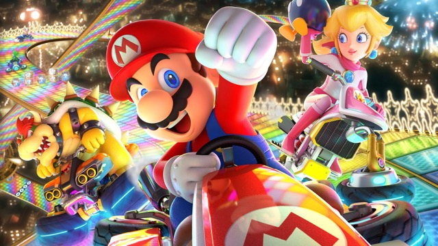
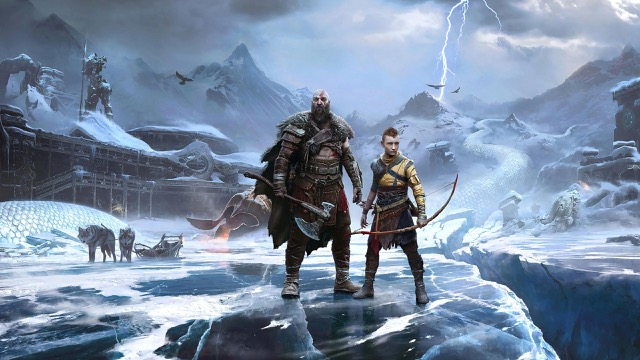

# E. Les tableaux et les objets littéraux <!-- omit in toc -->

## Sommaire <!-- omit in toc -->
- [E.1. Les tableaux en JS](#e1-les-tableaux-en-js)
- [E.2. Manipulation des tableaux](#e2-manipulation-des-tableaux)
- [E.2. Les Objets littéraux](#e2-les-objets-littéraux)

## E.1. Les tableaux en JS

**En JavaScript, les tableaux se déclarent avec des crochets :**

```js
const emptyArray = []; // tableau vide
const ingredients = ['methanol', 'red phosphorus'];
```

Comme en Java, on accède à une valeur du tableau avec l'opérateur `[x]` où `x` est l'index de la cellule qu'on veut récupérer (_démarre à 0_) :
```js
const firstIngredient = ingredients[0];
```

Enfin essayez un peu de deviner ce que peuvent retourner ces propriétés et méthodes :
```js
const ingredients = ['methanol', 'red phosphorus'];
console.log(
    ingredients.length, // ?

	ingredients.push( 'pseudo' ), // ?

	ingredients, // ?

	ingredients.join(' and '), // ?
);
```

Vérifiez à l'aide de la console de votre navigateur si vous aviez vu juste !

## E.2. Manipulation des tableaux

**Maintenant qu'on a fait le point sur les tableaux, voyons comment exploiter ça dans notre appli :**

Dans une constante nommée `data`, initialisez un tableau avec 3 cellules contenant les chaines de caractères suivantes : `'Mario Kart 8 Deluxe'`, `'The Last of Us Part 2'` et `'God of War Ragnarok'`.
```js
const data = ['Mario Kart 8 Deluxe', 'God of War Ragnarok', 'The Last of Us Part 2'];
```


Parcourez ensuite ce tableau afin d'injecter dans la page (_à l'aide de la fonction `renderGameThumbnail()` développée juste avant_) 3 liens sur le modèle de celui réalisé à l'étape [D. les chaînes de caractères](./D-chaines.md) :

```html
<a href="images/mario-kart-8-deluxe.jpg">
	
	<section>Mario Kart 8 Deluxe</section>
</a>
<a href="images/god-of-war-ragnarok.jpg">
	
	<section>God of War Ragnarok</section>
</a>
<a href="images/the-last-of-us-part-2.jpg">
	
	<section>The Last of Us Part 2</section>
</a>
```

Utilisez pour cela **au moins 2 techniques parmi les 4 suivantes** :
1. une boucle **`for`** classique  (https://developer.mozilla.org/fr/docs/Web/JavaScript/Reference/Instructions/for)
2. la méthode **`Array.forEach`** (https://developer.mozilla.org/fr/docs/Web/JavaScript/Reference/Objets_globaux/Array/forEach)
3. la méthode **`Array.map`** (https://developer.mozilla.org/fr/docs/Web/JavaScript/Reference/Objets_globaux/Array/map) associée à la méthode **`Array.join`** (https://developer.mozilla.org/fr/docs/Web/JavaScript/Reference/Objets_globaux/Array/join)
4. la méthode **`Array.reduce`** (https://developer.mozilla.org/fr/docs/Web/JavaScript/Reference/Objets_globaux/Array/reduce)

Le résultat obtenu sera identique dans les 4 cas :


## E.2. Les Objets littéraux

**Maintenant que l'on sait manipuler les chaînes de caractères et les tableaux, attaquons-nous aux [objets littéraux (_mdn_)](https://developer.mozilla.org/fr/docs/Web/JavaScript/Guide/Grammar_and_types#les_litt%C3%A9raux_dobjets) !**

Pour rappel, les objets littéraux sont des objets qu'on crée sans passer par une classe, donc sans passer par un constructeur. C'est en quelque sorte un espèce d'objet "vierge" dans lequel on peut ajouter des propriétés un peu comme on veut.

En JS ces objets littéraux sont souvent utilisés comme source de données, un peu comme des "dictionnaires" ou des "hashmap" dans d'autres langages. \
C'est ce qu'on va faire ici : utiliser des objets littéraux pour "décrire" chaque jeu qu'on veut afficher dans la page.

1. **Modifiez le tableau `data` :** au lieu de 3 chaînes de caractères, on va maintenant y mettre 3 objets littéraux :

	```js
	const data = [
		{
			name: 'Mario Kart 8 Deluxe',
			released: '2017-04-27',
			metacritic: 92,
			background_image: 'images/mario-kart-8-deluxe.jpg'
		},
		{
			name: 'God of War: Ragnarök',
			released: '2022-11-09',
			metacritic: 94,
			background_image: 'images/god-of-war-ragnarok.jpg',
		}
		{
			name: 'The Last of Us Part II',
			released: '2020-06-19',
			metacritic: 94,
			background_image: 'images/the-last-of-us-part-2.jpg'
		},
	];
	```

2. **Modifiez ensuite la boucle pour passer à la fonction `renderGameThumbnail` le `name` de chaque jeu** (_à cette étape vous ne devez PAS toucher à la fonction `renderGameThumbnail`_).

	Si tout s'est bien passé, le rendu doit rester inchangé.

3. **Maintenant, modifiez votre boucle ET la fonction `renderGameThumbnail` pour lui passer non plus juste le nom du jeu mais l'objet complet !**

	`renderGameThumbnail` va donc maintenant recevoir un objet littéral avec 4 propriétés : name, released, metacritic et background_image.

	Faites en sorte que le code de renderGameThumbnail continue de fonctionner comme avant. Là aussi pas de changement de rendu.

4. **Pour terminer, modifiez la fonction `renderGameThumbnail` pour utiliser toutes les propriétés de l'objet qu'elle reçoit afin de générer un code HTML de ce type :**
	```html
	<a href="images/mario-kart-8-deluxe.jpg">
		
		<section>
			<h4>Mario Kart 8 Deluxe</h4>
			<div class="infos">
				<time datetime="2017-04-27">2017-04-27</time>
				<span class="metacritic">92</span>
			</div>
		</section>
	</a>
	```

	> _**NB :** notez que maintenant qu'on a une propriété "background-image", il n'est plus nécessaire de calculer nous-même l'url de l'image !_

	Le rendu final devra correspondre à ceci :

	

## Étape suivante <!-- omit in toc -->
Si tout fonctionne, vous pouvez passer à l'étape suivante : [F. Compiler avec Babel](./F-babel.md)