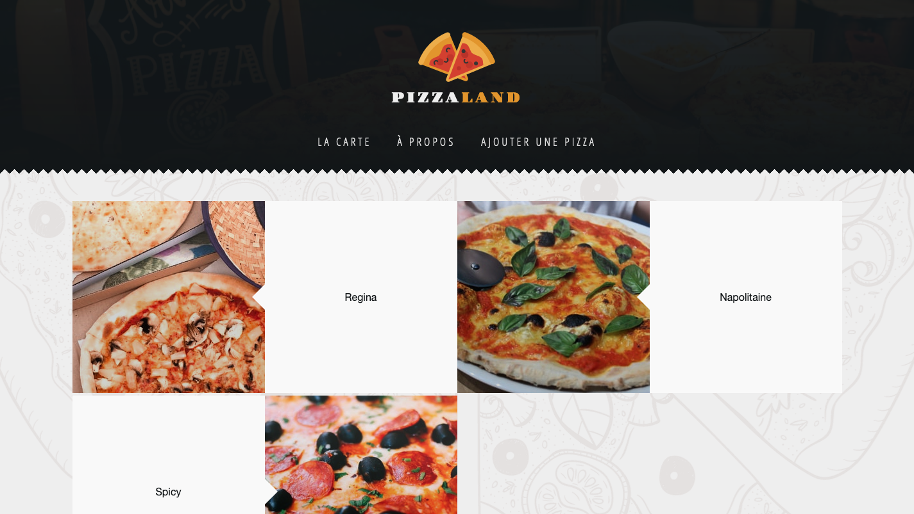
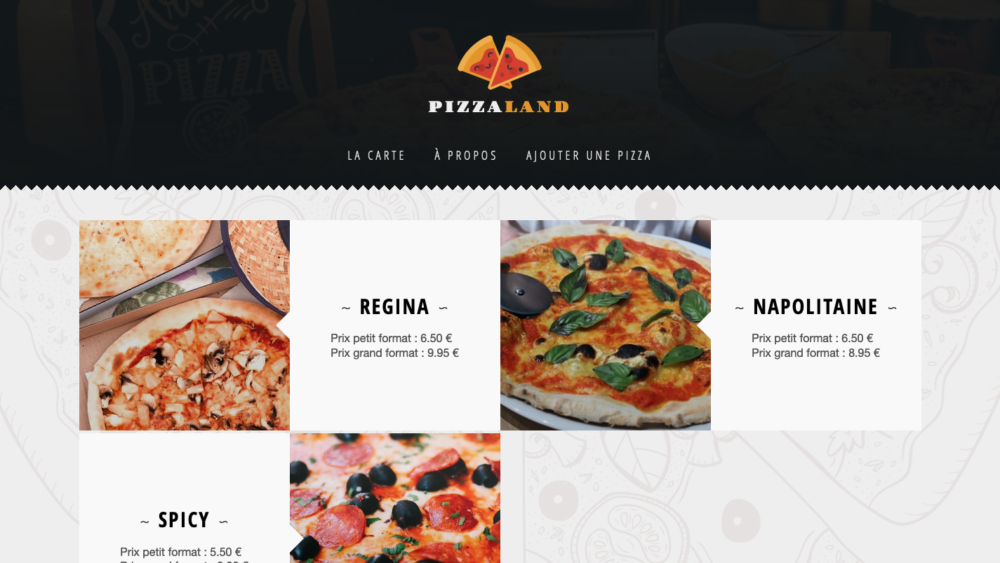

# E. Les tableaux et les objets littéraux <!-- omit in toc -->

## Sommaire <!-- omit in toc -->
- [E.1. Manipulation des tableaux](#e1-manipulation-des-tableaux)
- [E.2. Les Objets littéraux](#e2-les-objets-littéraux)

## E.1. Manipulation des tableaux

Dans une constante nommée `data`, initialisez un tableau avec 3 cellules contenant les chaines de caractères suivantes : `'Regina'`, `'Napolitaine'` et `'Spicy'`.
```js
const data = ['Regina', 'Napolitaine', 'Spicy'];
```


Parcourez ensuite ce tableau afin d'injecter dans la page 3 liens sur le modèle de celui réalisé à l'étape [D. les chaînes de caractères](./D-chaines.md) :

```html
<article class="pizzaThumbnail">
	<a href="images/regina.jpg">
		
		<section>Regina</section>
	</a>
</article>
<article class="pizzaThumbnail">
	<a href="images/napolitaine.jpg">
		
		<section>Napolitaine</section>
	</a>
</article>
<article class="pizzaThumbnail">
	<a href="images/spicy.jpg">
		
		<section>Spicy</section>
	</a>
</article>
```

Utilisez pour cela **au moins 2 techniques parmi les 4 suivantes** :
1. une boucle **`for`** classique  (https://developer.mozilla.org/fr/docs/Web/JavaScript/Reference/Instructions/for)
2. la méthode **`Array.forEach`** (https://developer.mozilla.org/fr/docs/Web/JavaScript/Reference/Objets_globaux/Array/forEach)
3. la méthode **`Array.map`** (https://developer.mozilla.org/fr/docs/Web/JavaScript/Reference/Objets_globaux/Array/map) associée à la méthode **`Array.join`** (https://developer.mozilla.org/fr/docs/Web/JavaScript/Reference/Objets_globaux/Array/join)
4. la méthode **`Array.reduce`** (https://developer.mozilla.org/fr/docs/Web/JavaScript/Reference/Objets_globaux/Array/reduce)

> _**NB :** pour `forEach`, `map` et surtout `reduce` pensez à utiliser les arrow functions !_

Le résultat obtenu sera identique dans les 4 cas :



## E.2. Les Objets littéraux

**Maintenant que l'on sait manipuler les chaînes de caractères et les tableaux, attaquons-nous pour terminer aux [objets littéraux](https://developer.mozilla.org/fr/docs/Web/JavaScript/Guide/Grammar_and_types#les_litt%C3%A9raux_dobjets) !**

1. **Modifiez le tableau `data` :** au lieu de 3 chaînes de caractères, on va maintenant y mettre 3 objets littéraux :

	```js
	const data = [
		{
			name: 'Regina',
			base: 'tomate',
			price_small: 6.5,
			price_large: 9.95,
			image: 'https://images.unsplash.com/photo-1532246420286-127bcd803104?fit=crop&w=500&h=300'
		},
		{
			name: 'Napolitaine',
			base: 'tomate',
			price_small: 6.5,
			price_large: 8.95,
			image: 'https://images.unsplash.com/photo-1562707666-0ef112b353e0?&fit=crop&w=500&h=300'
		},
		{
			name: 'Spicy',
			base: 'crème',
			price_small: 5.5,
			price_large: 8,
			image: 'https://images.unsplash.com/photo-1458642849426-cfb724f15ef7?fit=crop&w=500&h=300',
		}
	];
	```

2. **Modifiez ensuite la boucle pour générer un code de ce type :**
	```html
	<article class="pizzaThumbnail">
		<a href="https://images.unsplash.com/photo-1532246420286-127bcd803104?fit=crop&w=500&h=300">
			
			<section>
				<h4>Regina</h4>
				<ul>
					<li>Prix petit format : 5.50 €</li>
					<li>Prix grand format : 7.50 €</li>
				</ul>
			</section>
		</a>
	</article>
	```

	Le rendu final devra correspondre à ceci :

	

	_**Attention au formatage des prix** (examinez bien la capture d'écran) !_

## Étape suivante <!-- omit in toc -->
Si tout fonctionne, vous pouvez passer à l'étape suivante : [F. Compiler avec Babel](./F-babel.md)