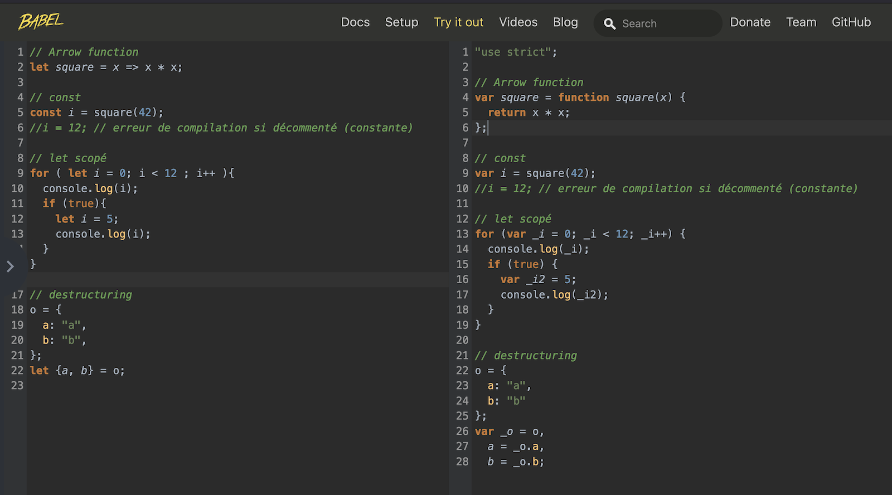
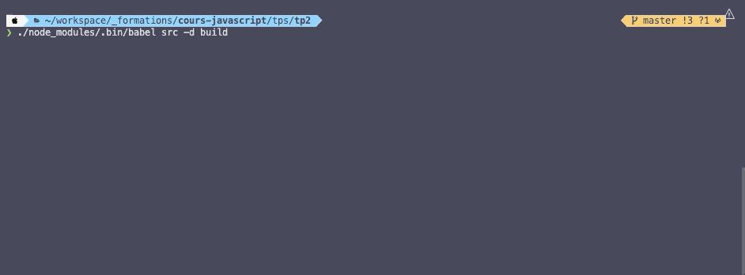

# F. Compiler avec Babel <!-- omit in toc -->

## Sommaire <!-- omit in toc -->
- [F.1. Note à propos d'EcmaScript](#f1-note-à-propos-decmascript)
- [F.2. Le problème de la compatibilité](#f2-le-problème-de-la-compatibilité)
- [F.3. Le sauveur : Babel](#f3-le-sauveur-babel)
- [F.4. Installation et configuration](#f4-installation-et-configuration)
- [F.5. Compilation](#f5-compilation)

## F.1. Note à propos d'EcmaScript

**Comme vu en cours, ECMAScript est la spec suivie par JavaScript.**

**Cette Spec a connu un tournant avec la version ES6 (_sortie en 2015_) qui a révolutionné le développement JS en apportant tout un tas de nouveautés** (_c'est en partie ce qui fait qu'aujourd'hui, non **JS n'est PAS un langage "merdique"**_)

Depuis cette version ES6 (aussi appelée ES2015), une nouvelle version d'ECMAScript sort **tous les ans** ! Par exemple, cette année nous aurons en juin ES14/ES2023 !

## F.2. Le problème de la compatibilité

_**Le problème de ce rythme effréné de nouveautés c'est que les différents navigateurs ne comprennent pas tous les nouvelles syntaxes qui sortent !**_ 😬

Par exemple Internet Explorer 11, sorti en 2013, n'est pas capable d'interpréter la plupart des fonctionnalités de ES6/ES2015 (_logique puisque en 2013, ES2015 n'existait pas encore_ 🧠). \
Vous me direz que ce n'est pas grave puisque [IE est enfin mort](https://blogs.windows.com/windowsexperience/2022/06/15/internet-explorer-11-has-retired-and-is-officially-out-of-support-what-you-need-to-know/)...

**Malheureusement le problème se pose aussi avec des navigateurs plus récents** si l'on utilise des syntaxes encore plus récentes. \
Par exemple les [propriétés privées (_mdn_)](https://developer.mozilla.org/fr/docs/Web/JavaScript/Reference/Classes/Private_class_fields) qui sont sorties en juin 2022 avec ES13 (_et que l'on abordera dans le chapitre sur la POO_) ne sont prises en charge qu'à partir de la version 84 de Chrome : https://caniuse.com/mdn-javascript_classes_private_class_fields


Jusque là dans ce TP vous n'avez pas eu de soucis car toutes les syntaxes ECMAScript qu'on a utilisé sont **supportées** par les dernières versions de chrome/firefox/safari. \
**Mais si on publiait votre site en ligne, il y a fort à parier qu'il plantera LAMENTABLEMENT chez des internautes qui auraient des navigateurs plus anciens !** 😢

> _**NB :** pour savoir quelles fonctionnalités ECMAScript sont supportées sur quel navigateur, jetez un oeil aux sites suivants :_
> - _pour ES6 : http://kangax.github.io/compat-table/es6/_
> - _pour ES7, ES8, ES9, etc. (ES2016+) : http://kangax.github.io/compat-table/es2016plus/_
> - _pour les features en cours de spécification (parfois supportées par les navigateurs avant qu'elles ne soient officielles) : http://kangax.github.io/compat-table/esnext/_


## F.3. Le sauveur : Babel


_**Heureusement pour nous, il existe un outil "magique" : c'est [Babel](https://babeljs.io)**_ ✨


**Babel est un compilateur de JS en... JS !** 🤔 \
En fait, il compile du code JS **ES6+** (_tout beau tout neuf, avec toutes les fonctionnalités ECMAScript qu'on souhaite_), en code JS **ES5** (_tout vieux, tout moche mais qui a l'avantage de fonctionner sur presque tous les navigateurs_) !

<a href="https://caniuse.com/es5"></a>\
<small>_Le support de ES5 est quasi total_ 👆</small>

Grâce à Babel on peut donc **coder avec toutes les syntaxes qu'on souhaite sans se préoccuper du support navigateur** car Babel va se charger de rendre notre code compatible avec les vieux navigateurs ! Merci Babel !

Pour avoir un aperçu de comment fonctionne Babel, je vous invite à vous rendre sur [cette page : babeljs.io/repl#?browsers=&build=&builtIns=false&c...](https://babeljs.io/repl#?browsers=&build=&builtIns=false&corejs=3.6&spec=false&loose=false&code_lz=PTAEEECdIewd1AMwK4DsDGAXAljVAoAGwFNNQBnAR2QENJjQBeUADyYD5XQAqVgblD58IUOjzlM-MagmhsTCtTrEAFABYATAEo-w4POYBGDQJHFoxZJFAATBmIC2AB2yEaOPBXk2Al44fEqJg-oCrSEjRBxFpCIiRk5GJOPviIMNYqoPFyCgAMAvIAPKDGoAUA1OWgWgDe-KCi4jAkAHSEMADmKtg69XKIoZiQyNF1DQ3ZBqAArLrjjTLNxG2d3b0NAL74W3q2xBLDWFbYqB34MApjoDQAXKAARDT3ADR9AEZ3928v27rZNTRnqA3hsFDBdEA&debug=false&forceAllTransforms=false&shippedProposals=false&circleciRepo=&evaluate=false&fileSize=false&timeTravel=false&sourceType=module&lineWrap=false&presets=env&prettier=false&targets=&version=7.20.12&externalPlugins=&assumptions=%7B%7D). Vous verrez à gauche un exemple de code ES6+ et à droite sa version compilée par Babel en ES5 !




## F.4. Installation et configuration
**Babel est un programme qui s'utilise en ligne de commande.** \
Pour l'installer on va utiliser npm (_Node Package Manager - l'outil fourni avec Node et qui permet de télécharger des utilitaires JS_).

1. **Tout d'abord, ouvrez un nouveau terminal intégré dans VSCodium** (_vous en avez normalement déjà un qui exécute le serveur http `npx serve -l 8000`_).

	Je vous recommande d'utiliser ici [un terminal splitté](https://code.visualstudio.com/docs/editor/integrated-terminal#_terminal-splitting) pour afficher deux terminaux côte à côte : tapez <kbd>CTRL</kbd>+<kbd>SHIFT</kbd>+<kbd>P</kbd> puis **`Terminal: split terminal`** ou **cliquez sur l'icône suivante** :

	

	L'avantage du terminal splitté, c'est que vous pouvez garder un oeil sur les deux terminaux en parallèle. Pratique !

2. **Initialisez votre projet npm :** dans le terminal de VSCodium tapez la commande :
	```bash
	npm init
	```
	Répondez alors aux questions qui vous sont posées (_donnez le nom "jsteam" au projet, vous pouvez ensuite taper <kbd>Entrée</kbd> pour toutes les autres questions_). À la fin du questionnaire vous verrez qu'un fichier `package.json` a été créé. Celui-ci nous sera utile par la suite.

3. **Installez babel :**
	```bash
	npm install --save-dev @babel/core @babel/cli
	```
	Ouvrez le fichier `package.json` dans VSCodium (<kbd>CTRL</kbd>+<kbd>P</kbd>). Vous noterez que les paquets `@babel/core` et `@babel/cli` ont été rajoutés dans les dépendances du projet !

	Vous pourrez aussi remarquer qu'un dossier `node_modules` a également été créé. C'est lui qui contient le code de toutes les dépendances du projet (toutes les librairies js qu'on a installé avec npm).

4. **Installez le preset `env` :**

	Un **preset** est une sorte de dictionnaire qui indique à babel la syntaxe à compiler (_sans preset, Babel n'applique aucune modification au code source_). Le preset `env` permet de transpiler **toutes les features officielle ES6+ en ES5** (c'est une sorte de dictionnaire de traduction ES6+ -> ES5) :
	```bash
	npm install --save-dev @babel/preset-env
	```

5. **Enfin, créez un fichier `.babelrc` à la racine de votre projet** (_au même niveau que le `index.html` et le `package.json`_) pour dire à Babel d'utiliser le preset `env` que l'on vient d'installer :
	```json
	{
		"presets": ["@babel/env"]
	}
	```
	> _**NB :** le nom du fichier à créer est bien **`.babelrc`**. Si vous êtes sous windows vous ne pourrez pas créer ce fichier avec l'explorateur de fichiers (windows vous oblige à choisir un nom de fichier de la forme `nom-du-fichier.extension`) utilisez donc VSCodium pour ça : <kbd>CTRL</kbd>+<kbd>N</kbd> puis <kbd>CTRL</kbd>+<kbd>S</kbd>_

## F.5. Compilation
1. **Vous pouvez maintenant compiler votre code ES6+ en ES5 à l'aide de la commande** :
	```bash
	./node_modules/.bin/babel src -d build
	```

	

	Cette commande va créer un dossier `build` dans lequel sera placé le fichier `main.js` compilé !

	Vérifiez que le fichier `build/main.js` est bien compilé et qu'il ne reste plus de traces de code ES6 (const, let, ...). Si ce n'est pas le cas (s'il reste des `const`, des template strings ou des arrow functions), c'est que le `.babelrc` est mal configuré ou que vous avez raté une étape !

	Enfin, ajoutez le dossier build à votre `.gitignore` (tout fichier qui peut être généré à partir des fichiers déjà présents dans le repo git ne doit pas être versionné) cf. https://git-scm.com/docs/gitignore

2. **Une fois le fichier `build/main.js` créé, modifiez le fichier `index.html` pour charger ce fichier à la place du `src/main.js`.** Rechargez la page pour vérifier que tout fonctionne toujours correctement !


3. **Pour simplifier le travail et éviter d'avoir à compiler manuellement à chaque modification**, vous pouvez utiliser à partir de maintenant la commande suivante :
	```bash
	./node_modules/.bin/babel src -d build --verbose --watch --source-maps
	```

	Cette commande lance la compilation avec Babel en tâche de fond et recompile automatiquement à chaque fois que le fichier `src/main.js` est modifié ! Pratique !

## Étape suivante <!-- omit in toc -->
Si tout fonctionne, vous pouvez passer à la dernière étape : [G. Destructuring, filtres et tris](./G-filtres-tri.md)